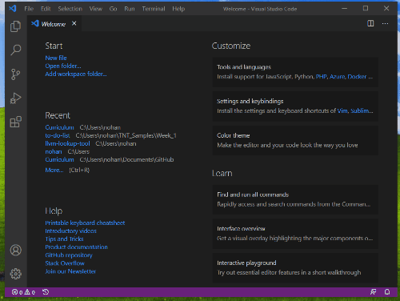

# Setup Checklist

## Install the code editor VS Code

1. [Install VS Code](https://code.visualstudio.com/)

## Install the toolchain for React development

1. [Install node.js and node package manager](https://nodejs.org/en/download/)
   
     
2. [Install yarn](https://legacy.yarnpkg.com/en/)
3. [Install create-react-app](https://create-react-app.dev/docs/adding-typescript/)
    * Open Visual Studio Code (VS Code).
    * From the top command bar, open the file menu "Terminal". Select "New Terminal".
    * In the terminal, enter the command `npm install -g create-react-app`.

    

Test setup:

1. Create a JavaScript project
    * Open VS Code.
    * From the top command bar, open the file menu "Terminal". Select "New Terminal".
    * In the terminal, enter the command `yarn create react-app test-app`

    
2.  Open the project and see what's there
    * From the terminal change directory (CD), move to the folder, of the test app with the command `cd test-app`.
    * The current working directory, folder, is now in the folder where the app files live. Use the command `code .` to open the folder in the new VS Code window.

    

## Version control

1. [Install Git](https://git-scm.com/downloads)
2. Create a [GitHub account](http://github.com/join) if you don't already have one
3. For security reasons, you can no longer push to Github with just a username and password.
   - Login to Github
   - Go to ‘Settings’ under your profile.
        - Under ‘Access’, click the ‘SSH and GPG keys’ section. Follow the guide [Generating a new SSH key](https://docs.github.com/en/authentication/connecting-to-github-with-ssh/generating-a-new-ssh-key-and-adding-it-to-the-ssh-agent) to generate a key.
        - Save the key in a file for later use.
    - Adding a new SSH key to your GitHub account
      - [Follow the guide](https://docs.github.com/en/authentication/connecting-to-github-with-ssh/adding-a-new-ssh-key-to-your-github-account) to navigate back to Github ‘SSH and GPG keys’ section.
      -  Click ‘Add new SSH key’. Using the keys just generated, add that to your Github account.