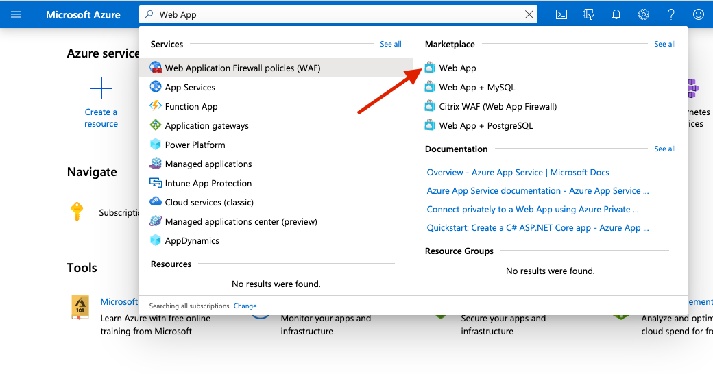
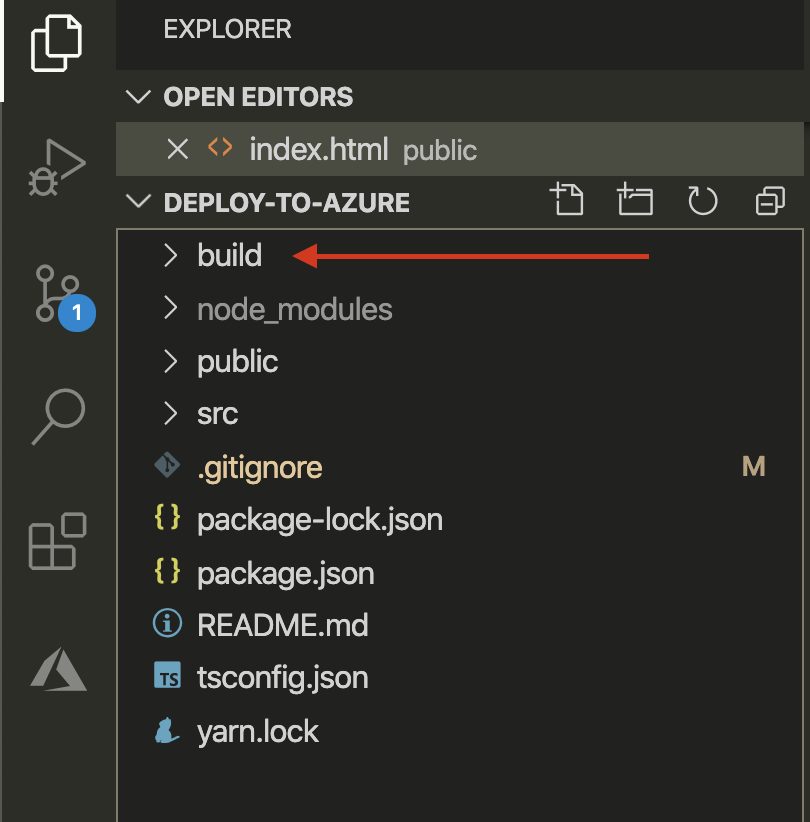

# Deploy Your React App To Azure

A React app can't be used by others without deploying your website to a hosting service. This lesson explores hosting and deploying to Azure App Service using a VS Code extension called Azure App Service.

## Learning objectives

* TNTs will create a free Azure account
* TNTs will build their React app for production
* TNTs will learn how to deploy their React app to Azure

## Time required and pace

Total time: 1 hour

* 10 minutes - explain: Azure App Services
* 20 minutes - elaborate: how to deploy
* 30 minutes - evaluate: deploy a React app

## Background / review

Creating a free Azure account: LINK HERE

## Lesson details

## Azure App Services (10 minutes)

* What is Azure App Services

## How To Deploy (20 minutes)

Prerequisites: A github repo with a React app ready to be deployed to Azure

### Create a Azure subscription

1. Go to the Azure portal: [https://portal.azure.com/#home](https://portal.azure.com/#home)
2. In the search bar enter "Web App" and let it autocomplete until you see "Web App" under the Marketplace heading. Click on "Web App" to start creating an Azure App Service Subscription.

    

3. Fill out the fields with these values:
    * Resource Group - Create a new one and call it *"default"*
    * Name - Give your web app a unique name like {NAME}-react-app e.g. *bob-react-app*
    * Runtime stack - Select *"Node 10.0"*
    * Region - Select *"Central US"*

    
4. Click on *"Review + create"* button at the bottom
5. If no errors are displayed click on the *"Create"* button at the bottom.
    * If an error occurs help troubleshoot. An existing subscription may already exist.

### Create Azure Web App using Azure App Service extension in VS Code

1. Install Azure App Service extension here: [https://marketplace.visualstudio.com/items?itemName=ms-azuretools.vscode-azureappservice](https://marketplace.visualstudio.com/items?itemName=ms-azuretools.vscode-azureappservice)
2. Once installed restart VS Code
3. In the activity bar you will now see a new tab

    
4. Click on the new Azure App Service tab and sign in
    * If the Azure subscription was setup correctly in the steps above you will see your subscription

5. Click on the (+) icon to add a new Web App

    
6. When the prompt is displayed enter a globally unique name for your web app and hit Enter
7. Now select *Windows* as the OS to create a new web app. You should see a window in VS Code that says a web app is being created.
8. Once the web app has been created successfully you should see it in the left panel

    

### Deploying To Azure

We are now ready to deploy to Azure Web Service

1. `npm run build` your application to create a *build* folder that will be used to deploy

    

2. Right click on the *build* folder to see a list of options, with one being *Deploy to Web App*

    

3. Select *Deploy to Web App* and select your Azure Web App you created to deploy to
    * It may present a message saying it will overwrite existing files. Click *Deploy* to proceed.

    

4. Once deployment is complete you will see a dialog window with a button to "Browse Website"

    

5. Click on "Browse Website" button to see your newly deployed React app on Azure Web Service

## Practice: Deploy your React App to Azure (30 minutes)

Using the steps above and help from the coaches instructors deploy either a newly created React app or an existing app to Azure Web Service.
