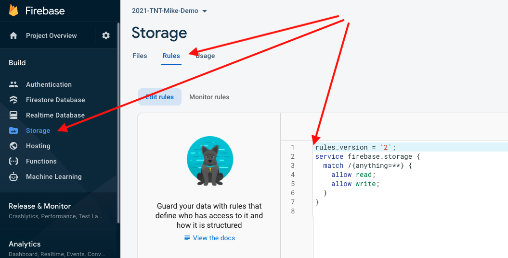

# Using Firebase's Online File Storage Feature

## Learning objectives

* TNTs will be able to upload, create a link to download, and list all the files stored in their Firebase Cloud [file] Storage
* TNTs will be able to use .env files to avoid checking their API keys into GitHub
* TNTs will be able to demonstrate an understanding of how one might use .env files to switch between development, test, and production environments.

## Resources

- There isn't a ton of documentation about the Firebase Cloud Storage, [other than this](https://firebase.google.com/docs/storage/web/start).
- The documentation page for create-react-app [has some good information about the environment variables file (.env)](https://create-react-app.dev/docs/adding-custom-environment-variables).

## Cloud (File) Storage

It's possible to store files directly into databases but we typically don't do this.  For example, one could store images or videos directly in a database but we rarely do.  There's (at least) two major reasons for this:

1. The files themselves aren't queried directly, but instead served up wholesale to whoever needs them.
   In other words, we typically use databases to ask questions about our data (to "run queries") such as "What are all the videos that were requested in the last 24 hours?".  Information *about* files is both smaller and a more natural fit for a database (we might store the "last access date" for all our video files) while the file is huge and we normally don't change or modify the contents of the files themselves.
   Thus, it makes sense to store information *about* the files in the database (where it's easy to look up), and we typically store the files themselves in a separate storage system.
2. Images and especially videos take up a huge amount of space in a database and it's easier for databases to perform well when they're tracking less information.

We'll look at storing files in Firebase Cloud [File] Storage in this lesson.

### How to set up Cloud [File] Storage for your app

There are [instructions on the Firebase site](https://firebase.google.com/docs/storage/web/start/), with some additional notes here:

#### Using 'public' security rules:

You'll have to create the Storage with security rules that prevent public access.  For now we're going to allow anyone read and write access to the Cloud Storage.

In the 'Storage' tab (in the left column), click on the 'Rules' tab, and replace what's there with the following:

```
rules_version = '2';
service firebase.storage {
  match /{anything=**} {
    allow read;
    allow write;
  }
}
```

When you're done it should look like this:


#### Setting up the 'storageBucket' configuration option:

This appears to already be done for us so we do NOT need to do this.  When we [copied the configuration information into our myFirebase.js file](https://github.com/tnt-summer-academy/Curriculum/blob/main/Week%203/firebase/Firebase.md#how-do-we-access-the-database-from-code) the storageBucket field was already present and set up correctly.

### Uploading a file manually (through the Firebase console/website)

First, create a new folder for your image (in case you want to upload multiple 'categories' of files) in your Cloud Storage ('Storage' in the left column, then 'Files' tab, then look for a blue button on the right that says "Upload File" - there's an 'Add a folder' icon right next to it).  Next, upload an image into that new folder. Obviously this should be safe for work; if you're looking for ideas perhaps I might suggest [a cute cat picture](https://www.bing.com/images/search?q=Free+Picture+of+Cat+Sleeping&mmreqh=eloNSaBu%2brTBkuPZ%2bBcpxuCzPWYJHkIf4vt7OW6WBP0%3d&first=1&tsc=ImageBasicHover)?

### Showing the image in our web page.

Because many Firebase functions are asynchronous, we'll need to start the request when the page loads (when our component is first placed on the page (aka when it's "mounted")) and then when the URL for the image is actually available we'll update the state (which will trigger a re-render, at which point we can actually add in the correct URL)

Make sure to actually check the console for errors (or put a breakpoint in the .catch)!

Here's the code that we'll use in the myFirebase.js file:

```javascript
export class MyFirebase {
    // constructor left out - it's unchanged

    getImage(imageName, fnxToRunWhenWeHaveTheUrl) {
        var starsRef = firebase
            .storage()
            .ref()
            .child("images/" + imageName);

        starsRef
            .getDownloadURL()
            .then((url) => {
                fnxToRunWhenWeHaveTheUrl(url);
            })
            .catch((error) => {
                // A full list of error codes is available at
                // https://firebase.google.com/docs/storage/web/handle-errors
                switch (error.code) {
                    case "storage/object-not-found":
                        console.log("File doesn't exist");
                        break;
                    case "storage/unauthorized":
                        console.log(
                            "User doesn't have permission to access the object"
                        );
                        break;
                    case "storage/canceled":
                        console.log("User canceled the upload");
                        break;
                    default:
                    case "storage/unknown":
                        console.log(
                            "Unknown error occurred, inspect the server response"
                        );
                        break;
                }
            });
    }
```

Here's the new code that we're adding to the App.js file:

```jsx
class App extends React.Component {

    constructor(props) {
        super(props);
        this.nameRef = React.createRef();
        this.emailRef = React.createRef();
        this.updateNameRef = React.createRef();
        this.state = {
            imgUrl: "#",  ////////////// THIS LINE IS NEW //////////////
            user1: {
                username: "NO NAME YET",
                email: "No email yet",
                profile_picture: "No profile picture yet",
            },
            allUsers: [],
        };
    }

		////////////// THIS METHOD IS NEW //////////////
    componentDidMount() {
        // Create a reference to the file (to the image) that we want to embed in our page
        let db = new MyFirebase();
        const functionToRunWhenUrlIsGotten = (url) => {
            this.setState({ imgUrl: url });
        };
        db.getImage("gray-tabby-cat.jpg", functionToRunWhenUrlIsGotten);
    }
    // <snip - remove about a  million lines of code>
    
     render() {
        let db = new MyFirebase();

        return (
            <div className="App">
                <header className="App-header">
       							{/* Lots junk left out to emphasize the new stuff */}
                </header>
                <div>
                    
                </div>
            </div>
        );
```

### Letting the user upload a file:

In the App.js file's class component:

```javascript
    constructor(props) {
        super(props);
				// <snip>

        this.state = {
            imgUrl: "#",
            fileToUpload: null, //////// This line is new
						// <snip>
        };
    }
```

We also need to add a new method:

```javascript
    onChangeFile = (event) => {
        event.stopPropagation();
        event.preventDefault();
        var file = event.target.files[0];
        console.log(file);
        this.setState({ fileToUpload: file }); /// to upload later
    };
```

In the App.js file's JSX:

```jsx
                    <h2>Upload a new picture here:</h2>
                    <input
                        type="file"
                        id="input"
                        onChange={this.onChangeFile}
                    ></input>
                    <button
                        onClick={() => {
                            if (this.state.fileToUpload) {
                                db.storeFile(this.state.fileToUpload);
                            } else console.log("No file selected!");
                        }}
                    >
                        Click here to upload file!
                    </button>
```

In the myFirebase.js file, we'll add this method:

```javascript
 storeFile(file, fnxToCall) {
        // The file param would be a File object from a file selection event in the browser.
        // See:
        // - https://developer.mozilla.org/en-US/docs/Web/API/File/Using_files_from_web_applications
        // - https://developer.mozilla.org/en-US/docs/Web/API/File

        const metadata = {
            contentType: file.type,
        };

        // [START storage_on_complete]
        const storageRef = firebase.storage().ref();
        storageRef
            .child("images/" + file.name)
            .put(file, metadata)
            .then((snapshot) => {
                console.log("Uploaded", snapshot.totalBytes, "bytes.");
                console.log("File metadata:", snapshot.metadata);
                // Let's get a download URL for the file.
                snapshot.ref.getDownloadURL().then((url) => {
                    console.log("File available at", url);

                    // if we were given a function to call, then call it now:
                    if (fnxToCall) {
                        fnxToCall(url);
                    }
                    // ...
                });
            })
            .catch((error) => {
                console.error("Upload failed", error);
                // ...
            });
    }
```

### Showing the user all the files:

Our basic approach is to store an array of files' URLs in the App's state and use some JSX to put  elements on the page for each URL.  If we want to update the list of images (for example, if we add another image) then we'll set the array to be empty and add each image's URL to the array as Firebase's .then() method actually get the information back from the DB.

The JSX to actually show the URLs that are in the array:

```jsx
 								<h3>All the images that have been uploaded:</h3>
                    <ol>
                        {this.state.allImages.map((nextImgUrl) => (
                            <li>
                                
                            </li>
                        ))}
                    </ol>
```

First step is to create the array of URLs:

```javascript
constructor(props) {
    super(props);
			// <snip>

    this.state = {
        imgUrl: "#",
        fileToUpload: null, 
        allImages: [], //////// This line is new
					// <snip>
    };
}
```

Next, when the App is first shown on the page we should start the process of loading all the images onto it:

```javascript
    componentDidMount() {
        // Create a reference to the file (to the image) that we want to embed in our page
        let db = new MyFirebase();
        const functionToRunWhenUrlIsGotten = (url) => {
            this.setState({ imgUrl: url });
        };
        db.getImage("gray-tabby-cat.jpg", functionToRunWhenUrlIsGotten);
        db.getAllImages(this.receiveNextImage); //////// NEW LINE
    }
```

The receiveNextImage will copy the existing allImages array, then add the new URL to the end, then tell React to update anything (like that JSX code, above) that was using allImages.

```javascript
    receiveNextImage = (anImgUrl, fullFirebasePath) => {
        console.log("receiveNextImage for " + anImgUrl);
        this.setState((state) => {
            const newAllImages = [...state.allImages];
            newAllImages.push(anImgUrl);
            return {
                allImages: newAllImages,
            };
        });
    };
```

The getAllImages method (in the myFirebase.js file) needs to ask for the list of all the images, then wait to get the list from Firebase.

```javascript
    getAllImages(fnxToRun) {
        console.log("getting all images");
        // Create a reference under which you want to list
        var listRef = firebase.storage().ref().child("/images");

        // Find all the prefixes and items.
        listRef
            .listAll()
            .then((res) => {
                res.items.forEach((theImageRef) =>
                    this.getUrlForAnImage(theImageRef, fnxToRun)
                );
            })
            .catch((error) => {
                console.log("Error getting all images! " + error);
                // Uh-oh, an error occurred!
            });
    }
```

Once we've gotten the list we'll use the forEach method to go through all files and then separately ask for each file (which we'll do using the `getUrlForAnImage` function).

getUrlForAnImage waits for Firebase to get us the actual URL, and then passes that to a function defined in App.js ()

```javascript
    getUrlForAnImage(imageRef, fnxToCall) {
        console.log("Getting url for " + imageRef.fullPath);
        imageRef
            .getDownloadURL()
            .then(function (url) {
                fnxToCall(url, imageRef.fullPath);
            })
            .catch(function (error) {
                // Handle any errors
            });
    }
```

The function that is called is receiveNextImage, which adds the URL to the App's allImages array inside the App's state:

```javascript
    receiveNextImage = (anImgUrl, fullFirebasePath) => {
        console.log("receiveNextImage for " + anImgUrl);
        this.setState((state) => {
            const newAllImages = [...state.allImages];
            newAllImages.push(anImgUrl);
            return {
                allImages: newAllImages,
            };
        });
    };
```

So far, displaying all the images in the database works great when the page first loads.

However, when we upload a new image the list of all the images doesn't change.  Let's look at what we'll need to change in order to update the images on the page.

### Updating the page when a new file is loaded

Essentially, when we're uploading a file we'll need to wait until Firebase confirms that the new file has been fully uploaded and then (and only then) do we update the `this.state.allImages` array.

In App.js, when the 'upload file' button is clicked we'll need to reset the array to be empty (so that receiveNextImage can add all the image URLs to it - if we don't do this then all the image URLs that are already in the array will stay there and we'll add in a duplicate set of URLs).

The second change is that we need to tell storeFile to call the 'getAllImages' function when the file is fully stored:

```javascript
                <button
                        onClick={() => {
                            if (this.state.fileToUpload) {
                                // reset array to be empty...
                                this.setState({ /////////////// NEW LINE /////////////
                                    allImages: [],
                                });
                                // ...so that after we upload the file...
                                db.storeFile(this.state.fileToUpload, () => {
                                    // ...we can reload list of all images
                                    db.getAllImages(this.receiveNextImage);
                                    /////////////// NEW LINE ABOVE /////////////
                                });
                            } else console.log("No file selected!");
                        }}
                    >
                        Click here to upload file!
                    </button>
```

in myFirebase.js we'll call the arrow function (which will call getAllImages with it's parameters) when the file is fully uploaded.  We know it's ready when we get the URL back:

```javascript
 // if we were given a function to call, then call it now:
 if (fnxToCall) { ////// this is () => db.getAllImages( this.receiveNextImage )
      fnxToCall(url); // call it! (the function doesn't actually use the url param)
   										// but since we've got it we may as well pass it in, I guess :)
 }
```

## .env files:

Outline for presentation:

1. how to create a .env file

   - Make sure that all variables' names start with REACT_APP_

2. How to use the variables in the JS code

3. Notice that if you have a .env file that you do NOT check into git/GitHub then you can put API keys there and avoid having random people find your keys on GitHub

   - You'll still need to get the .env file to your co-workers (maybe as a file in Teams?)

   - This trick will keep your secret keys out of GitHub but anyone running the program could potentially still steal the keys, so [it's a bad idea to put secrets in .env files](https://create-react-app.dev/docs/adding-custom-environment-variables/#:~:text=warning%3A%20do%20not%20store%20any%20secrets%20(such%20as%20private%20api%20keys)%20in%20your%20react%20app!).

     Everything in the 'React' part of your app will be sent to the user's web browser (sometimes called "the client")(also - this doesn't have to be a web browser, there are [programs that can access web sites](https://curl.se/), and one could always [write their own program to access a web page](https://www.bing.com/search?q=write%20web%20scraper&qs=n&form=QBRE&msbsrank=1_1__0&sp=-1&pq=write%20web%20scraper&sc=1-17&sk=&cvid=30D05F1EE13A45FA981F5BEDD217C11F) too.)

