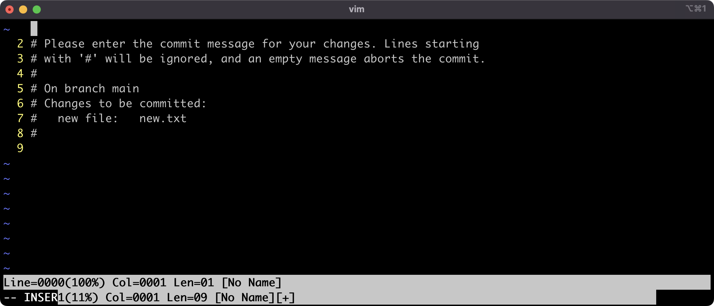

# Introduction to Git and local workflow

## Week 1, Lesson 1

This lesson introduces the fundamentals of the Git workflow, Git Bash, and VS Code Git support for local repositories.

## Learning objectives

* TNTs will understand what is source control and why we need it.
* TNTs will learn how their previous code or doc collaboration experience maps to aspects source control.
* TNTs will be able to work with a local repository using Git.

## Time required and pace

Total time: 1.5 hour

    * 10 minutes - engage: source control and you
    * 5 minutes - explain: Git basics and best practices
    * 10 minutes -background learning, research, and investigations
    * 30 minutes - explore: create repo and edit using Git Bash and VS Code integrated terminal
    * 25 minutes - your Turn! review, and investigations
    * 10 minutes - elaborate: best practices, trouble spots and talk about 

## Session setup

* [ ] Git installed
  * [installation guide for Mac](https://github.com/tnt-summer-academy/Curriculum/blob/main/Week%201/images/Pdfs/[ENG1.4]-Installing-Git-Mac.pdf)
  * [installation guide for windows](https://github.com/tnt-summer-academy/Curriculum/blob/main/Week%201/images/Pdfs/[ENG1.4]-Installing-Git-Windows)
* [ ] Prepared to demo commands in git using VS Code and the integrated terminal
  * Experiment the [integrated terminal](https://code.visualstudio.com/docs/editor/integrated-terminal) with VS code to execute some of git commands

## References

* [What is Git and GitHub?](https://www.youtube.com/watch?v=uUuTYDg9XoI)
* [git in VS code](https://code.visualstudio.com/docs/editor/versioncontrol)
* [Git documentation](https://git-scm.com/book/en/v2/Git-Internals-Git-Objects)
* [Atlassian guide](https://www.atlassian.com/git/tutorials/setting-up-a-repository)
* Learn about best practice on [how to write good commit message](https://chris.beams.io/posts/git-commit/)
* [Git Cheat Sheet](https://www.git-tower.com/blog/git-cheat-sheet).

## Lesson details

### Source control and You (10 min)

1. In groups have NTs discuss the following questions:
   * Have you ever worked on a code project or a document with other people? How did you share? Google doc? Emailing? GitHub?
   * When working with other people on code or project, what has gone wrong? Have you gotten versions of the document mixed up? Have you lost changes?

2. Groups come back together and share.

3. Wrap up and connect to source control.
   * Source control enables code collaboration
   * Makes large projects with 1,000s of people possible
   * Makes it easy to manage your own changes and work
   * Source control allows you to try things without fear
   * Git takes practice

### Explain Git basics and best practices (5 minutes)

1. Why Git?
   * There are other version control systems. There are a number of Version Control Systems out there. This alone should prove that version control is incredibly important. Examples
        * [Git](https://git-scm.com)
        * [Subversion](https://subversion.apache.org)
        * [Mercurial](https://www.mercurial-scm.org)
    
    * Git is the most popular and an industry standard.
    * It has some advantages over a centralized system, which has a single copy of the code:
    * It's quick to take action on your own copy
    * It works locally, on your own computer, and offline
    * It makes having multiple branches, parallel worlds of code, easier

       

2. Git Gotchas
   * Git can mean several things - the name of the source control technology, the functionality built into VS Code, the file formats and protocols that underlie the system.
   * It’s both powerful (because it’s open-ended), plentiful (because it’s open source), and sometimes hard to use (because it’s open-ended).
   * It takes practice, it's a learned skill, it's not intuitive - ask your coaches about their Git disasters - everyone has a story.

### Background learning and research (10 minutes)

1. Background about Version Control Systems( VCS)
    * [what is version control?](https://www.atlassian.com/git/tutorials/what-is-version-control)
        * Distributed version control system - files and folders + tracking
        * It is essential in team software development, working with multiple people on code

2. Git Vs. GitHub
   **In Simple**
    * **Git**: is a version control system that lets you manage and keep track of your source code history
    * **GitHub** : is a cloud-based hosting service that lets you manage Git repositories

3. Introduction to Git

    Git was designed and developed by Linus Torvalds for Linux kernel development. Git provides support for non-linear, distributed development, allowing multiple contributors to work on a project simultaneously. Git is the most popular distributed version control and source code management system.

    **Some Fun Facts, Naming ["Wikipedia"](https://en.wikipedia.org/wiki/Git)**

    The name "git" was given by Linus Torvalds when he wrote the very first version. He described the tool as "the stupid content tracker" and the name as (depending on your way):
    * a random three-letter combination that is pronounceable, and not actually used by any common UNIX command. The fact that it is a mispronunciation of "get" may or may not be relevant.
    * stupid. contemptible and despicable. simple. Take your pick from the dictionary of slang.
    * "global information tracker": you're in a good mood, and it actually works for you. Angels sing, and a light suddenly fills the room.
    "goddamn idiotic truckload of .....": when it breaks

### Explore: Git Demo Using Git Bash and VS Code integrated Terminal (30 minutes)

#### ***Demo: Using Git Bash***

1. Creating new repo and initial commit. The flow for using git starts with creating a directory (folder). The cycle as changes are made is `add` and `commit`. Small chunks as you go.

    * Configure your git
      * `git config --global user.email "youremail"`
      * `git config --global user.name "yourname"`
      * `git config --global core.editor "code --wait"`
        * This last one will tell git to use VSCode as your default editor.
          This is important ensure that you don't [accidentally get yourself stuck in vim](https://stackoverflow.blog/2017/05/23/stack-overflow-helping-one-million-developers-exit-vim/).
          vim is an old-school editor which a lot of people swear by because of it's power and flexibility,
          and lot of people swear at because of it's obscure and difficult interface.
    * `mkdir SampleApp` - create new folder named SampleApp
    * `cd SampleApp` - move to the project folder
    *  `git init` - initialize the repository
    *  `touch index.html` - create a new file
    * `git status` - view the repository status
    * `git add  .` - stage the files to commit and tell get what files to track, "." selects all the new files or files with changes
    * `git commit index.html -m "New index file"` - add the changes to the repo with the named file, "-m" indicates message included
      * If you leave out the `-m "New Index file"` part then git will start your default editor and let you edit the message that way.  If you didn't do the `git config --global core.editor "code --wait"` command then git will use vim and you'll end up looking at something like this:
        
      * Congratulations!  [You're now stuck in vim!](https://stackoverflow.blog/2017/05/23/stack-overflow-helping-one-million-developers-exit-vim/)
      * If you do end up starting vim you can quick by doing the following:
        * Press the Escape key (Esc, in the top-left corner of your physical keyboard) several times.  4-7 should do the trick.  After this you should be in [vim's normal mode](https://www.freecodecamp.org/news/vim-editor-modes-explained/).
        * Now you should press the following keys.  Press these keys, only these keys, and press them in this exact order:
          `:q!`  after that press the return key
        * That should quit vim.  If this doesn't work then do ask for questions - it's surprisingly easy to get stuck in vim :
          
          
    **Remember**

    
    

#### ***Demo: Git in VS Code***

* Visual Studio Code has integrated source control and includes Git support in-the-box.
  * [git in VS code](https://code.visualstudio.com/docs/editor/versioncontrol)
  * [integrated terminal](https://code.visualstudio.com/docs/editor/integrated-terminal) with VS code to execute some of git commands

1. Open the workspace in VS Code. VS Code has git support built in. It doesn't have all the commands of Git Bash but is convenient when working in VS Code.

2. Click in the Activity Bar, the Source Control log, and Initialize the repository.

3. Add an index.html file (File/New) and fill it with some starter code:

        <!doctype html>
        
            <html lang="en"> 
                <head>
                    <meta charset="utf-8">
                    <title>Blog Project</title>
                    <meta name="viewport" content="width=device-width, initial-scale=1"> <meta name="description" content="">
                    <link rel="stylesheet" href="css/app.css">
                </head>
                <body>
                     
                </body>
            </html>
4. Follow the git workflow. We need to complete staging for the changes
    * Invoke the command either View -> Command Palette or `Ctrl+Shift+P. (Cmd+Shift+P for Mac OS)`
    * Type / select `"Git: stage all changes"`.
5. After staging is Committing changes
    * Invoke the command pallette again and type / select "Git: commit"
    * Check out the changes in Git Bash with `git log`
    * Show the different between `git log` and git `log --oneline`

 

6. Make some changes to index.html.
   
7. Show the Source Control tab and the file diffs.

  

8. Show how to read the git log view

### Your Turn! review, and investigations

#### Exercise 1 Create repo and edit in VS Code (10 minutes)

This practice reinforces using the Git command line and VS Code together.

1. Start this practice by creating a new directory with Git Bash. Add two files.
2. Open the work space in VS Code and initialize the repository.
3. Edit one of the files with the code we completed in the last demo and stage the commit.
4. View the diff.
5. Commit!
6. Make another edit that add the header tag just inside the body tag in index.html

        <header>
            <h1>My first webpage</h1>
        </header>

7. Stage and commit.
8. Post the Git status to teams.
9. Room discussion - What worked? Where did you get stuck? How we can address trouble areas

#### Exercise 2 [15 minutes]

* Do some changes to meet your instructors page and experiment git commands with the changes you make.

### Elaborate: best practices, trouble spots, and what's next [10 minutes]

1. Share any problems you encountered completing the two exercises.

2. Git best practices
     * It takes practice
     * Keep commits light, [how to write good commit message](https://chris.beams.io/posts/git-commit/) 
     * It's good to save often and keep the change set small, it'll be easier to merge
     * Take a minute to review your changes before checking-in - more time will be spent on debugging, diff tools make it easier to quickly glance. Your teammates will thank you when it's time for them to review your merge request.
     * Use .gitignore when needed.

3. What's next?
     * How does this actually help if it's just local on my computer? Remote repositories are next! This week practice the basics of source control on your local machine. Next we'll dive into remote repositories, branching, pull requests, and merge conflicts.

## Stretch

- Complete this learning module - [Introduction to Git](https://docs.microsoft.com/en-us/learn/modules/intro-to-git/)
    - The exercises suggests using the sandbox. **Instead** use `Git in VS Code and the integrated terminal` to become more familiar with one of the tools we'll be using. There are lots of tools for using Git, just like there are lots of different places to save files or programs to edit text.
    - For this lesson complete all the but the fix simple mistake module and the last exercises.
- Interested in how Git works under the hood? Learn about how [git works internally](https://medium.com/@shalithasuranga/how-does-git-work-internally-7c36dcb1f2cf).
- Interested in security? Learn about how [git uses cryptographic hashes](https://ericsink.com/vcbe/html/cryptographic_hashes.html).
- [xkcd](https://xkcd.com/1597/).
- Want to learn more about all the amazing things you can do using bash? Check out [Linux Productivity Tools](https://www.usenix.org/sites/default/files/conference/protected-files/lisa19_maheshwari.pdf)
