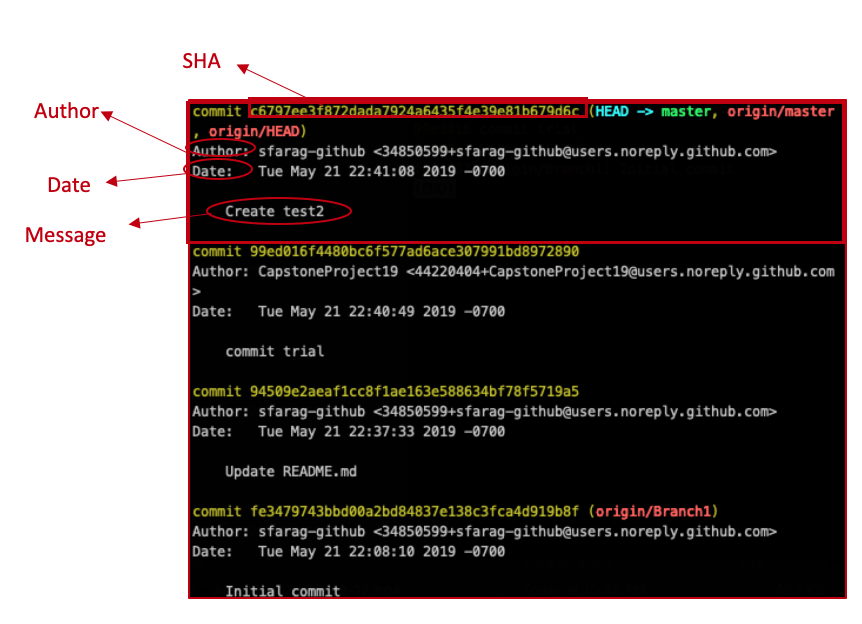

# Introduction to Git and local workflow

## Welcome to Week 1, Lesson 1!

This lesson introduces the fundamentals of the Git workflow, Git Bash, VS Code support for Git, for local repositories.  
In addition, you will learn enough about cloning (downloading) a repo from GitHub to be able to get the course materials that you’ll need in other lessons.

## Learning objectives

* TNTs will understand what is source control and why we need it.
* TNTs will learn how their previous code or doc collaboration experience maps to aspects source control.
* TNTs will be able to work with a local repository using Git.
* TNTs will be able to work with a download a repository from GitHub.
* TNTs will understand that it’s normal to encounter problems while using git and start to develop strategies for dealing with such problems

## Time required and pace

Total time: 1.5-ish hours

* 10 minutes - Session Setup: Install git
* 5 minutes - explain: Git basics
* 30 minutes - Explore: Git Demo Using VS Code integrated Terminal
* 15 minutes - Demo: Git Support in VS Code
* 10 minutes - Exercise: Create repo and edit in VS Code
* 10 minutes - Elaborate: best practices, trouble spots and talk about
* 5 minutes - Explain Remote repositories and GitHub( Basics and Clone)
* 10 minutes - Demo:  Clone a repository from GitHub using VSCode
* [Additional background, info, and OPTIONAL exercises](eng1-0-exercises-for-intro-to-git-and-local-workflow)

## Session setup

Start by making sure that you have the most recent version of Git installed

* [Installation guide for Mac using HomeBrew](https://github.com/tnt-summer-academy/Curriculum-2022/blob/main/Week%201/Pdfs/%5BENG1.2%5D-Installing-Git-Mac.pdf)
  (NOTE: MacOS comes with a version of git already installed.  It’s _probably_ ok to use that one, but it’s better to use the most recent version so please do install this version of git
* [Installation guide for windows](https://github.com/tnt-summer-academy/Curriculum-2022/blob/main/Week%201/Pdfs/%5BENG1.2%5D-Installing-Git-Windows.pdf)

## Explain - Git basics

1. [What is version control?  Why do we need it?](https://swcarpentry.github.io/git-novice/01-basics/index.html)
2. Why Git?
    * There are a number of Version Control Systems out there, such as [Subversion](https://subversion.apache.org), [Mercurial](https://www.mercurial-scm.org), and of course [Git](https://git-scm.com)
    * Git is the most popular and an industry standard.
    * It has some advantages over a centralized system, which has a single copy of the code:
    * It's quick to take action on your own copy
    * It works locally, on your own computer, and offline
    * It makes having multiple branches, parallel versions of code, easier

2. Git Gotchas
   * Git can mean several things - the name of the source control technology, the functionality built into VS Code, the file formats and protocols that underlie the system.
   * It’s both powerful (because it’s open-ended), plentiful (because it’s open source), and sometimes hard to use (because it’s open-ended).
   * It takes practice, it's a learned skill, it's not intuitive. Assk your coaches about their Git disasters - everyone has a story.

> [Some Fun Facts about gIt’s name (from Wikipedia):](https://en.wikipedia.org/wiki/Git#Naming)
> The name "git" was given by Linus Torvalds when he wrote the very first version. He described the tool as "the stupid content tracker" and the name as (depending on your way):
> * a random three-letter combination that is pronounceable, and not actually used by any common UNIX command. The fact that it is a mispronunciation of "get" may or may not be relevant.
> * stupid.  Roughly equivalent to ‘dummy’. As in “Wait, you forgot that thing we needed?  You’re such a git!”
> * "global information tracker": you're in a good mood, and it actually works for you. Angels sing, and a light suddenly fills the room.
> * "goddamn idiotic truckload of .....": when it breaks

## Explore: Git Demo Using VS Code integrated Terminal

_Please follow along as your instructor demonstrates (and walks you through) the following:_

1. Create a new directory (folder) for your repo, then create the repo inside thate folder, and then do your initial commit:
    * Start by creating a new folder using the MacOS Finder (i.e, using the normal Mac windows and such). It doesn’t matter what you name it as long as you remember the name.  The name “GitTest” is fine.
    * Next, start VSCode
              You can hold down the Command button and pressing the spacebar - this is usually written as Cmd+Space - and then typing “code” into the MacOS Spotlight search bar thingee)
    * In VSCode you should then open that folder that you created on your Desktop.
              In the ‘File’ menu select the ‘Open Folder’ option (this is usually written similar to “File -> Open Folder”, or “File / Open Folder”, etc) ![[ENG1.0]VSCodeOpenFolder](images/%5BENG1.0%5DVSCodeOpenFolder.png)
    * At this point you should start VSCode’s integrated terminal.
              Use the Terminal / New Terminal menu option: ![[ENG1.0]VSCodeNewTerminal](images/%5BENG1.0%5DVSCodeNewTerminal.png)
    * At this point the terminal that’s integrated into VSCode should have started up, and it should “be in” the folder that you just told VSCode to open (which is the folder you just created).
              You can confirm that you’re in the correct folder by typing **pwd** into the terminal and then pressing the return key.  It _should_ tell you that you’re at `/Users/<your Mac login>/Desktop/GitTest` (or whatever you named the new folder, if you didn’t use GitTest in the prior step). It should similar to the following: 
![[ENG1.0]TerminalPrintWorkingDirectory]($resource/%5BENG1.0%5DTerminalPrintWorkingDirectory.png)
    * You will need to configure your git install before you can commit your changes.  Let’s do that now.
        * `git config --global user.email "youremail"`
        * `git config --global user.name "yourname"`
        * `git config --global core.editor "code --wait"`
          * This last one will tell git to use VSCode as your default editor. This is important ensure that you don't [accidentally get yourself stuck in vim](https://stackoverflow.blog/2017/05/23/stack-overflow-helping-one-million-developers-exit-vim/).  vim is an old-school editor which a lot of people swear by because of its power and flexibility, and lot of people swear at because of its obscure and difficult interface.
      * If you wanted to, you could create a new directory inside the terminal by typing `mkdir SampleApp` and then return (to create a new folder named SampleApp), followed by typing `cd SampleApp<return>` to move into the SampleApp folder
    * `git init` - initialize the repository
    * `git status` - view the repository status (it should say that there are no commits yet, and there’s nothing to commit)
    * `touch index.html` - create a new file
    * `git status` - view the repository status (still no commits, but now it should list index.html as a new file that git isn’t keep track of)
            PRO TIP: _Always_ return `git status` after every other git command so that you can check that things are working the way that you’d like them to.
    * `git add  .` - stage the files to commit and tell get what files to track, "." selects all the new files or files with changes
    * `git status`
              (You’re probably getting tired of typing this - you can push the Up Arrow key on your keyboard to go through your previous commands, and when `git status` appears you can press return.  This is quicker than typing it all in each time)
    * `git commit index.html -m "New index file"` - add the changes to the repo with the named file, "-m" indicates message included
      * If you leave out the `-m "New Index file"` part then git will start your default editor and let you edit the message that way.  If you didn't do the `git config --global core.editor "code --wait"` command then git will use vim and you'll end up looking at something like this:
        
      * Congratulations!  [You're now stuck in vim!](https://stackoverflow.blog/2017/05/23/stack-overflow-helping-one-million-developers-exit-vim/)
      * If you do end up starting vim you can quit / exit vim by doing the following:
        * Press the Escape key (Esc, in the top-left corner of your physical keyboard) several times.  4-7 should do the trick.  After this you should be in [vim's normal mode](https://www.freecodecamp.org/news/vim-editor-modes-explained/).
        * Now you should press the following keys.  Press these keys, only these keys, and press them in this exact order:
          `:q!`  after that press the return key
        * That should quit vim.  If this doesn't work then do ask for questions - it's surprisingly easy to get stuck in vim : 
* Remember
    
* `git status` - you didn’t forget, did you?
* Check out the changes with `git log`
* Let’s look at the differences between `git log` and git `log --oneline` 
* How to read the git log view: 

## Demo: Git Support in VS Code

* Visual Studio Code has integrated source control and includes Git support in-the-box.
  * VS Code has git support built in. It doesn't have all the commands of Git Bash but is convenient when working in VS Code.
  * [git in VS code](https://code.visualstudio.com/docs/editor/versioncontrol)
  * [integrated terminal](https://code.visualstudio.com/docs/editor/integrated-terminal) with VS code to execute some of git commands

1. Make sure that you’ve opened the folder in VS Code (this was done in the previous demo, but you can check by opening the Explorer panel and verifying that you’re looking at the correct folder).
2. Follow the git workflow listed above (make a change, then stage that change, then commit that change).  Let’s start by making a change: open then index.html file and fill it with some starter code:

        <!doctype html>
          <html lang="en">
              <head>
                  <meta charset="utf-8">
                  <title>Blog Project</title>
                  <meta name="viewport" content="width=device-width, initial-scale=1"> <meta name="description" content="">
                  <link rel="stylesheet" href="css/app.css">
              </head>
              <body>
                  <h1>Hello, world!</h1>
              </body>
          </html>

* Make sure that you save your file!  File/Save or Command-S work well.
* Note that a file that has been changed but NOT saved has a circle in it’s tab (to tell you that it’s not saved): ![[ENG1.0]VSCodeNOTSaved](images/%5BENG1.0%5DVSCodeNOTSaved.png) but once you’ve saved the file it changes to an ‘x’: ![[ENG1.0]VSCodeSaved](images/%5BENG1.0%5DVSCodeSaved.png).
* However, there’s an even better option: you can tell VSCode to automatically save your files after you change them.  You can do this using the File/AutoSave option.  Click on it to enable auto-save.  When autosave is enabled the menu item will have a check mark next to it, like so:
![[ENG1.0]VSCodeEnableAutoSave](images/%5BENG1.0%5DVSCodeEnableAutoSave.png)
3. Next, open the Source Control panel  (in the Activity Bar):
![[ENG1.0]SourceControlActivityBar](images/%5BENG1.0%5DSourceControlActivityBar.png)
4.  Having made a change we need to stage the change.  Before we do that let’s proofread / double-check our change.  Within the Source Control panel click on the file that you modified.  VSCode will show you a ‘before and after’ view of the file (also known as showing you the difference between the versions, which is called a diff for short).  I can never remember which side is which so instead I look for my changes - that side must be the ‘new’ side, and the other side is the ‘original’ side:
![[ENG1.0]indexDiff](images/%5BENG1.0%5DindexDiff.png)
    * **Always make sure to review your changes before you stage/commit them!!**
5. In the above picture you’ll see some plus signs ( + ).  The bottom one allows you to stage that individual file (this means that if you had changed multiple files that you could stage and commit only some of those files).  The top plus only appears when you move the mouse pointer over the ‘Changes’ row; the top plus stages ALL the changes.
Click on the plus (either one) to stage your change.
You should then see the file moved from the ‘Changes’ area to the ‘Staged Changes’ area.
6. After staging is Committing changes.  First type a commit message in the box labeled “Message”, then click on the check mark right above it (if you forget to type the message than VSCode will ask you for the message.  Don’t worry, there’s no risk of accidentally getting stuck in vim! :)  ) ![[ENG1.0]VSCodeCommit]($resource/%5BENG1.0%5DVSCodeCommit.png)

### How to write good commit messages

Writing commit messages that are concise/short, informative, and will be helpful for you and your teammates in the future can be challenging.  Please definitely [look online for suggestions about best practices on how to write good commit message](https://chris.beams.io/posts/git-commit/)

## Your Turn! review, and investigations

### Exercise: Create repo and edit in VS Code

This practice reinforces using the Git command line and VS Code together.

1. Start this practice by creating a new directory and initialize the repository.
2. Open the work space in VS Code and then add two HTML files.
3. Stage and commit both files
4. Edit one of the files with the code we completed in the last demo and stage the commit.
5. View the diff.
6. Commit!
7. Make another edit that add the following ++inside the body tag++ in index.html

            
This is paragraph.  It should immediately underneath the "h1" element that's already on the page.

            
This is another paragraph.  If you want to fill your page with text that looks realistic but isn't actually real try searching for "Lorem Ipsum"

8. Stage and commit.
9. Post the Git status to teams.
10. Room discussion - What worked? Where did you get stuck? How we can address trouble areas

### Elaborate: best practices, trouble spots, and what's next

1. Share any problems you encountered completing the two exercises.

2. Git best practices
     * It takes practice
     * Keep commits light, [how to write good commit message](https://chris.beams.io/posts/git-commit/)
     * It's good to save often and keep the change set small, it'll be easier to merge
     * Take a minute to review your changes before checking-in - more time will be spent on debugging, diff tools make it easier to quickly glance. Your teammates will thank you when it's time for them to review your merge request.
     * Use .gitignore when needed.

3. What's next?
       * How does this actually help if it's just local on my computer? Remote repositories are next! This week practice the basics of source control on your local machine. Next we'll dive into remote repositories, branching, pull requests, and merge conflicts.

## Downloading stuff from GitHub

## Explain Remote repositories and GitHub( Basics and Clone)

We will learn together how to clone a repository using `git clone` so that you can download lesson materials this week.  Next week we’ll see how to upload your changes back to GitHub (using `git push`) and how to download your teammates changes to your computer (via `git pull`)  
([Image Source](https://drstearns.github.io/tutorials/git/))

## Demo:  Clone a repository from GitHub using VSCode

We'll now walk through the process of cloning a repository from GitHub.

1. [Go to the practice repo on GitHub](https://github.com/tnt-summer-academy/RepoToPracticeCloning)
2. Click on the green button (1), make sure that HTTPS is selected (2), and then copy the URL (3): ![[ENG1.0]GitHubCloneURL]($resource/%5BENG1.0%5DGitHubCloneURL.png)
3. Note to instructor: explain `.gitignore`
    * ++**IMPORTANT:**++ _You and your team should make sure that your repo has a .gitignore before you start collaborating on the code._  It’s tricky and time-consuming to remove files later but easy to ignore them at the start.
4. In VSCode open the Command Pallette using Cmd+Shift+P, then type **clone** to get VSCode to suggest possible commands, then use the `Git: Clone` command.
5. VSCode will then ask for the URL, and you should paste the URL that you got from the green button.
6. VSCode will then ask you to pick a folder.  For right now putting this on your desktop is fine.  WARNING: This step just sorta pops up a ‘file open’ dialog with much explanation so it takes a while to realize that it’s asking you where to put the repo :)
7. Next, VSCode will need to verify that you’re allowed to access this private, TNT-only repository.  VSCode itself has no idea if you’re allowed to or not, so VSCode will ask GitHub (which does know).  
    * In computer security the process of figuring out if you’re allowed to use something or not is called **authorization** (as in, “Are you authorized to access that private, TNT-only repo?”).  
    * Before GitHub can figure out if you’re authorized to access this repo it need to make sure that you really are the person you’re claiming to be, which is called **authentication**.  Logging into your Mac by clicking on your user name and then typing in your password is one form of authentication.
    * VSCode will start by asking if it’ok to authenticate you using GitHub using this dialog.  You should click on Allow. ![[ENG1.0]VSCodeOkToAuthenticate](images/%5BENG1.0%5DVSCodeOkToAuthenticate.png)
    * Next, VSCode will send you to the GitHub website (this will appear in your browser).  It should look something like the following.  You should click the green button that says “Authorize Visual Studio Code” ![[ENG1.0]GitHubOkToIntegrate](images/%5BENG1.0%5DGitHubOkToIntegrate.png)
    * Once that’s done you’ll be sent back to VSCode, where you must confirm that it’k for VSCode to open a URL.  You should agree to Open the URL, as pictured here: ![[ENG1.0]VSCodeOkToOpenGHURL]($resource/%5BENG1.0%5DVSCodeOkToOpenGHURL.png)
    * [Here’s a short (1:66) YouTube video demonstrating this process](https://www.youtube.com/watch?v=bz1KauFlbQI)
8. OPTIONAL SIDE-NOTE: It’s good to know that there’s several other ways to authenticate yourself to GitHub (mostly so that if you’re looking for help online you can separate out the different approaches web pages may be telling ou about).
    * One way is using SSH keys, which is the way that the git command line client first did authentication (and is still very commonly used).  
    * Another option is [creating a Personal Access Token, which you can do on the GitHub website](https://docs.github.com/en/authentication/keeping-your-account-and-data-secure/creating-a-personal-access-token) - this can be used with the git command line client, and is also used by the IntelliJ IDE (e.g., PyCharm for Python)
9. After authenticating yourself to GitHub (and having GitHub authorize you to clone the repo) VSCode will clone (download) the repo to your personal computer.
10. Lastly, VSCode gives you the choice about how to open the new repo.  Either ‘Open’ or ‘Open In New Window’ are both fine.  Try cloning several times so that you can try the different options, if you’d like.

## References

* Learn about best practices about [how to write good commit message](https://chris.beams.io/posts/git-commit/)
* [What is Git and GitHub?](https://www.youtube.com/watch?v=uUuTYDg9XoI)
    (YouTube, 3:48 duration -3 minutes, 48 seconds long)
* [Atlassian guide](https://www.atlassian.com/git/tutorials/setting-up-a-repository)
    (pretty readable, has examples and nice diagrams)
* [git in VS code](https://code.visualstudio.com/docs/editor/versioncontrol)
* [The “git book”](https://git-scm.com/book/en/v2)
    (free, online, oftentimes very technical)
* [Git Cheat Sheet](https://www.git-tower.com/blog/git-cheat-sheet)
    (Summary of a lot of git commands but doesn’t tell you which one to use when)

## [Additional background, info, and OPTIONAL exercises](eng1-0-exercises-for-intro-to-git-and-local-workflow)

To revoke access:
GitHub, 
then your user account (top-right) -> Settings
Under the “Integrations” category (left-hand column)
Click on ‘Applications’
In the main area, click on ‘Authorized OAuth Apps’
GitHub for VSCode - revoke this and neither the GUI nor the integrated terminal will be able to authenticate.
In VSCode log out of GitHub (lower-left corner - the ‘Accounts’ button, then your GitHub account & Sign Out)
Then, the next time you push/pull (either from GUI or integrated terminal)   and it’ll run you through the authentication dance listed above