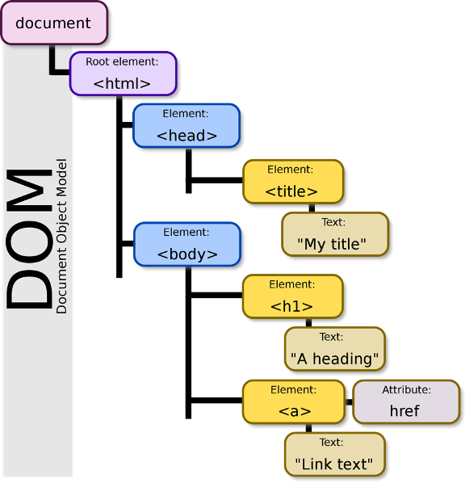

# Intro to web app architecture

*<u>REMINDER</u>: You'll need a working GitHub account in order to to do the TNT Lessons on git & Github.  Make sure that you've got a working account by going to https://github.com/ and clicking on "Sign Up" (to create a new account) or "Sign In" (if you've got a working account)(both are at the top right corner of the page).*

## Week 1, Lesson 1

This lesson provides an overview of how web apps work, HTML, CSS and JavaScript to lay the foundation for the prototypes NTs will build.

<!--NOTE: You may notice that the name of this file starts with "ENG1.1", as do many of the supporting files for this lesson - this is how the files were named in a previous iteration of the TNT program.  
The 'new' name is now 'Week 1, Lesson 1'.  When you're figuring out what the order of the lessons is please ignore the "ENG1.1" part of the filename and instead use the 'Week 1, Lesson 1' lesson name instead.-->

## Learning objectives

- TNTs will learn the basics of how web pages and web apps work.
- TNTs will be able to make HTML and CSS changes and learn about the use of JavaScript.
- TNTs will learn where to go for CSS and HTML info and resources.

## Time required and pace

Total time: 1 hour, 15 minutes

- Background and Overview (15 minutes)
- Demo and explore (15 minutes)
- Group activities: review and investigation (45 minutes)

## References

* [HTML, CSS, JS tutorials, exercises, and references](https://www.w3schools.com/)
* [html-css-js.com](https://html-css-js.com/)
* [HTML CheatSheet](https://htmlcheatsheet.com/)
* [CSS CheatSheet](https://htmlcheatsheet.com/css/)
* [Udemy - Learn HTML, CSS, JavaScript And JavaScript From Scratch](https://www.udemy.com/course/html-and-css-from-scratch/)

## Background and overview

### How a full-stack web app works


Note: This summer we're developing a web app *prototype* - something that looks like a finished app but doesn't necessarily have any of the stuff in the back end part of the diagram.

Later on we will cover Firebase which is an online, JavaScript-based database, but you may or may not choose to try and incorporate that into your prototype or not.

### The Dom / HTML DOM

So how does the client-side JavaScript that runs in the user's browser actually change the page that the user is looking at?  Through an thing called the Document Object Model (which represents the stuff the user is looking at in a way that's relatively easy for JavaScript to change).

The Document Object Model (DOM) is a cross-platform and language-independent interface that treats an XML or HTML document as a tree structure wherein each node is an object representing a part of the document. The DOM represents a document with a logical tree. [(Wikipedia)](https://en.wikipedia.org/wiki/Document_Object_Model). The HTML DOM can be accessed with JavaScript (and with other programming languages).

For example, the following .HTML code:

```html
<!DOCTYPE html>
<html>
  <head>
    <title>My Title</title>
  </head>
  <body>
    <h1>A heading</h1>
    <a href="https://www.bing.com">Link text</a>
  </body>
</html>
```

will produce the following DOM:


 

In the DOM, all HTML elements are defined as objects. The programming interface is the properties and methods of each object.
A property is a value that you can get or set (like changing the content of an HTML element). A method is an action you can do (like add or deleting an HTML element).
You can learn more about the DOM from [here](https://www.w3schools.com/js/js_htmldom_methods.asp).

### Intro to web tech 

There's likely a range of familiarity with web pages, web apps, and how they work. This refresher aims at closing any gaps and providing the opportunity to dig in and get familiar with resources that will be applicable throughout the program.

1. Why are we building a web app?

   - Quick to prototype
   - Introduction to broadly applicable tech - VS Code, HTML, CSS, JavaScript
   - Many projects - professional, community, philanthropic, for fun... have some web component
   - Some capabilities between web and native apps are closing

2. Tech we will use and introduce over the next week. This lesson focuses on HTML, CSS, and an introduction to JavaScript.

   | Technology / Tooling   | Solution              |
   | ---------------------- | --------------------- |
   | Programming Language   | HTML, CSS, JavaScript |
   | Web framework          | React                 |
   | Project setup          | React create app tool |
   | Server environment     | Node.js               |
   | Package manager        | npm (instead of Yarn) |
   | Source control         | Git                   |
   | Source control tools   | Command line, VS Code |
   | Testing infrastructure | Jest                  |
   | Debugging              | VS Code debugger      |
   | Text editor            | VS Code               |
   
3. How HTML, CSS, and JavaScript come together. W3Schools describes it well:

   - Hyper Text Markup Language (HTML) - the language for building webpages
   - Cascading Style Sheets (CSS) - the language for styling webpages
   - JavaScript (JS) - the language for programming web pages


## Demo and explore

### [Meet Your Instructors page](https://github.com/tnt-summer-academy/Exercises/tree/main/Week_1/ENG1.0/meet-your-Instructors)

- Show a demo and walk through the HTML tags and CSS files
- Ask students to clone or download and experiment with different CSS properties to see different effects

### Online HTML/CSS/JavaScript Online Playgrounds

To experiment with some code and exercises, you can use the following online editor.  It's great because you don't need to worry about which files are where - you can edit the .HTML file right in your browser and then immediately see the results.

[W3Schools Online Code editor](https://www.w3schools.com/tryit/)

There's a bunch of these - some examples include [JSFiddle](https://jsfiddle.net/), [CodePen](https://codepen.io/), and [many others](https://www.bing.com/search?q=javascript+playground&qs=SS&pq=javascript+&sc=6-11&cvid=63CED364C7354662B32E7B5028427618&FORM=QBRE&sp=1&ghc=1).

Early on these are great for testing out individual concepts / code snippets (such as when learning a new part of the JavaScript language).  Later on your programs will have too many parts to easily separate out just one part, at which point you'll need to use other debugging strategies.### 

## Group activities: review and investigation

For this activity you will work in groups of 2-3 to learn/review HTML and CSS, and to investigate new HTML/CSS.

While doing this activity you may find these resources to be helpful guides for looking up details about HTML and CSS (skim the page that is linked to here, and then look in the left-hand column for topics that look useful for what you're trying to do)

* [HTML basics](https://www.w3schools.com/html/html_basic.asp)
* [CSS intro](https://www.w3schools.com/css/css_intro.asp)

The task you're given is to mockup a sample app, but the real task that you should be focusing on is getting familiar with HTML and CSS.  It's way better to "only" do a couple things here but really understand what's happening, what the patterns are, how to look up more things in the future, etc, etc (instead of slamming out a mockup this time but not being able to build on that knowledge in the future).

1. Pick one of your favorite apps on your phone. 
2. Using the [online editor](https://www.w3schools.com/css/tryit.asp?filename=trycss_default) try to mock, or recreate, a single screen from the app with CSS and HTML.
3. Post your screen in your team's Team channel.
4. If you finish one screen, choose another more challenging one (optional).

The following process is recommended (so as to maximize the amount of learning you do):

1. Pick an aspect of the screen that you'd like to try and replicate in your mockup (for example, the title)
2. Start by putting the text / image / etc onto the web page *without any formatting*.  (for example "RL Garage")
3. Next, pick one aspect of that newly added thing that looks different between your phone's screen and the web page, and see if you can make the web page look closer to the app (for example, "can I find a similar font?  And how do I change the font in CSS?").  
    - Your goal is to learn how to adjust the appearance of your app NOT to create an identical replica.
    - This is a great opportunity to also practice mindful self-compassion.  'Close enough' is good enough.
    - In a lot of school courses (particularly STEM classes) there are oftentimes single correct answers (and all other answers are wrong).  A critical skill to cultivate in the TNT program is the ability to pivot / change your goals so that you end up with something that will work well for what you want even if it's not 100% what you started out trying to make.
    - If you can't get things to work in about 5, maybe 10 minutes max then ask for help and/or go on to another aspect of this thing that you'd like to style
    - Repeat step 3 until you're satisfied with how the element looks.
4. Repeat these steps until you've add enough elements to the page that it kinda looks like your phone app's screen

## Stretch

 If you are familiar with HTML and CSS - find new topic tutorials and try it out. Push yourself to discover something you didn't know before. Here are a few suggestions for you

Modify, [Meet Your Instructors](https://github.com/tnt-summer-academy/Exercises/tree/main/Week_1/ENG1.0/meet-your-Instructors) page:
* So that it does an animated 3D flip of an image with text instead of static tile
* Add simple script to the button to make it clickable to show a popup alert window with the contact email address [some hints found here](https://www.w3schools.com/howto/howto_js_popup.asp)
* Change the page layout to use different [CSS layout](https://www.w3schools.com/css/css_templates.asp)
