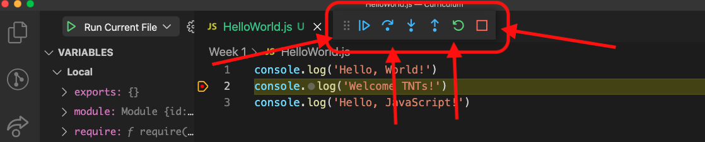

# Intro to VS Code and JavaScript

## Week 1, Lesson 3

This lesson introduces Visual Studio Code (aka "VSCode") and JavaScript including why this set of technology is important, a tour and basics of using the IDE, and JavaScript fundamentals.

[Wikipedia describes JavaScript by saying](https://en.wikipedia.org/wiki/JavaScript) "Alongside HTML and CSS, JavaScript is one of the core technologies of the World Wide Web. Over 97% of websites use it client-side for web page behavior, often incorporating third-party libraries. All major web browsers have a dedicated JavaScript engine to execute the code on the user's device."

## Learning objectives

- TNTs will be able to navigate Visual Studio Code (VSCode).
- TNTs will be able to open VSCode's Integrated Terminal in a specific folder (directory), and then type in common linux commands (such as `ls` and `cd`)
- TNTs will be able to create a new HTML & JavaScript file and run it.
- TNTs will learn the basics of JavaScript.
- TNTs will learn the basics of JavaScript support for functional programming, specifically those parts that are commonly used by React.

## Time required and pace

Total time: 1 hour 30 min

- Getting Started: Make sure that VSCode and NPM are installed (5 minutes)
- Overview of VSCode and 'Hello World' example (20 minutes)
- Introduction to JavaScript ([ENG1.1]Intro_To_JavaScript.html]([ENG1.1]Intro_To_JavaScript.html)) (40 minutes)
- Exercise: Fix and complete the code sample ([[ENG1.1]JavaScriptPractice.html]([ENG1.1]JavaScriptPractice.html)) (25 minutes)

## References

- [Node.js Package Manager](https://www.npmjs.com/)
- [Visual Studio Code](https://code.visualstudio.com/)
- [Getting started with VS](https://code.visualstudio.com/docs)
- [VS Code User Interface Guide](https://code.visualstudio.com/docs/getstarted/userinterface)
- [VS Code User Shortcuts](https://code.visualstudio.com/docs/getstarted/keybindings)
- [Debugging in VS](https://code.visualstudio.com/docs/editor/debugging)
- [JavaScript in VS Code](https://code.visualstudio.com/docs/languages/JavaScript)

## Getting Started:

1.  Install [Visual Studio Code](https://code.visualstudio.com) and skim the links here:

    - ("Skim" means briefly look through in case you see anything interesting but don't worry if it's overwhelming / doesn't make sense / etc)
    - [Getting started with VS](https://code.visualstudio.com/docs)
    - [VS Code User Interface Guide](https://code.visualstudio.com/docs/getstarted/userinterface)
    - [VS Code User Shortcuts](https://code.visualstudio.com/docs/getstarted/keybindings)
    - [Debugging in VS](https://code.visualstudio.com/docs/editor/debugging)
    - Think about Visual Studio Code as an IDE and how it can help you work productively

2.  Install [Node.js Package Manager (npm)](https://www.npmjs.com/get-npm)

- Review npm - an online repository for publishing open-source node.js projects and a command line utility for interacting with the repo for package installation, version management, and dependency management.
    - [What is node?](https://nodejs.org/en/knowledge/getting-started/npm/what-is-npm/).
    - It makes it easy to install and maintain packages.
    - A package contains all the files needed for a module.
    - A module is a file that's re-used throughout an application. For example, React is a module.

## Overview of VSCode

1. Your instructors are here to help *and* you need to be able to drive and to understand the rules of the road.

2. Open VS Code, without a workspace or folder open.

    - Call out that "Learn" is in the landing page. 
        It takes time to get to adopt VS Code, for everyone.
    - Highlight the "Help" menu option in the toolbar for quick access to references
    - **[Highlight the palette (Command+Shift+P) to access commands](https://code.visualstudio.com/docs/getstarted/userinterface#_command-palette).**
    - Highlight the [activity bar, status bar, and side bar](https://code.visualstudio.com/docs/getstarted/userinterface).
    - Highlight [the "Extensions" section](https://code.visualstudio.com/docs/editor/extension-marketplace).
        - NOTE: If you clone the entire Exercises repo, and then open the entire (top-level) folder in VSCode then VSCode should notice a folder named ".vscode" which contains a file named "extensions.json".  This file contains a list of extensions that are recommended for working in the Exercises folder/project, in a format that VSCode can easily read.
            If VSCode finds this file then it should give you a quick and easy way to install all the recommended extensions.
            (And if not then you can install the extensions yourself)
        - The request to install the recommended extensions will look something like this:
            
    - As of this writing, the following extensions are recommended:
        - [Debugger for Chrome](https://marketplace.visualstudio.com/items?itemName=msjsdiag.debugger-for-chrome) - This will allow you to use the VSCode debugger on your JavaScript code, even though it's running in your Chrome browser.
        - [Live Share Extension Pack](https://marketplace.visualstudio.com/items?itemName=MS-vsliveshare.vsliveshare-pack) - DEFINITELY INSTALL THIS!!!
            This will allow you to collaborate with other TNTs in VSCode just like multiple people can change the same file in Google Docs.  It's awesome!  Get it!  Get it now! :)
        - [Prettier](https://marketplace.visualstudio.com/items?itemName=esbenp.prettier-vscode) - Install this, and then every time you save a file it'll autoformat it for you
        - [ESLint](https://marketplace.visualstudio.com/items?itemName=dbaeumer.vscode-eslint) - this will help find JavaScript errors and show them to you.
        - [Open In Browser](https://marketplace.visualstudio.com/items?itemName=techer.open-in-browser) - this will allow you to open an HTML file in your browser, which is useful for previewing the file that you've written
        - [GitGraph](https://marketplace.visualstudio.com/items?itemName=mhutchie.git-graph) - shows you a nice graph of branches and commits in your repos.
        - [GitLens](https://marketplace.visualstudio.com/items?itemName=eamodio.gitlens) - more tools for interacting with git and GitHub
    - WARNING: You may need to turn Prettier on to get it to format your files.  You can do that by following these steps:
        1. In VSCode, click on the **Code -> Preferences -> Settings** menu item
        2. In the search box at the top, type in **formatter**
        3.  Look for the configuration option that's entitled "Editor: Default Formatter" and make sure to pick Prettier from the list.
            Note: The list may be long and it does not appear to be sorted. You have my sympathies in advance.
        4. Look for the "Editor: Format On Paste" and make sure that it's checked off.  (I guess you don't *have* to check this off - it's your editor after all.  Check it off if you'd like Prettier to format stuff as soon as you paste it in from the clipboard)
        5. Look for the "Editor: Format On Save" and make sure that it's checked off too.
        6. These steps are summed up in this picture:
            

##  A 'Hello World' example for JavaScript and the VSCode Debugger

1. We're going to look at the JavaScript file that we'll be using for today's demonstrations, and make a tour of the file system.

2. In order to set things up, you'll need to do the following steps once each: (Once things are set up you can go straight to running the debugger, in the next step at this level, below)
   1. Create a new folder for the project using the Finder.

   2. Launch VS Code if you haven't already, and then do the following steps in VSCode:

   3. Use `File -> Open Folder` to open the folder (that you just created in the Finder).

   4. Create a file in folder (via `File -> New File`) and name it as `Helloworld.js`.

   5. Copy and paste the following code into the JS (JavaScript) file.
   
      ```javascript
       console.log('Hello, World!')
       console.log('Welcome TNTs!')
       console.log('Hello, JavaScript!')
       console.log('Hello, World!')   
      ```
   
   6. In the activity bar on the left, click on the 'Debugger' icon, which looks like this like a play button with a small bug on it: 
   
   7. When you first open a folder, you'll need to create a "launch.json" file that stores the configuration info for running the debugger. Luckily VSCode will do this for us, if we click on the link that says "Create a launch.json file", as pictured here:
   
       
   
       - VSCode will show you the launch.json file in the editor - you can close this because we won't edit it directly.
   
   8. After you've created the launch.json file then the debug panel (just to the right of the Activity Bar) will have several options for running your program at the very top of the panel, in a box that has a green play button in it:
   
       
   
   9. Click on the 'down arrow' (or the text in that box - "Launch Chrome" in this case) in that box and it'll give you a menu of options.  For today we're going to use the "Node.js..." option: 
          
   
   10. At this point you should choose the "Run Current File" option:
          
   
      1. If you don't see "Run Current File" (for example, if you're only seeing "JavaScript Debug Terminal") then cancel out of this (you can press the Escape key a bunch) then make sure that you have the HelloWorld.js file open in VSCode, and that it's the file that you're looking at in the editor, and then try adding the "Node.js..." option again.
      2.  If you still don't see it after that definitely ask for help from teammates, the instructor, etc
   
3. Once you've done all of the above 'one time setup' you should be able to run the program.  You can do this by clicking on the green play button in the Debugger panel.  Make sure that you click on the green 'Play' button and NOT on the text next to it!
   

4. At this point you may not see anything appear in VSCode, even though you can see the program start, run, and then end.
   In order to see the results of the program you'll need to use the VSCode menu option for View / Appearance / Show Panel (shortcut: Command/Control-J), at which point you should see something like this:
   
5. Notice that you can see the 'Hello, World!' text that our console.log() line produced, above.
6. This command ( `console.log`) can be useful for figuring out why your program isn't working the way you'd like.  The console.log messages can be quickly scanned to look for a particular message.  In general, console.log is good for displaying detailed information (the value of variables, typically).

### Debugger: Breakpoints, Showing Variables' Values, Stepping Through Code

Another feature that the debugger provides for you is a way of stopping the program as it runs and examining the variables at that point.  Think of it like pressing "Pause" as your program is running, and then being able to use a microscope to examine all the details of that paused program

1. Do this by clicking in the space to the left of a line of source code so that a red dot appears:
   
2. (When you're moving the mouse over the correct spot you'll see a dim red dot, such as the one below the bright red dot in the above image)
3. This red dot is called a "breakpoint" and you can think of it like a stop sign - the program will stop there, and then when we tell it to go it'll resume
4. At this point you will need to re-run the program in order to see what this does - click on the green play button and you should see the first "Hello, World!" message appear, then the program pauses, and the 'Variables' panel on the left should fill in with a bunch of variables.  
5. If you want to take a step use the controls at the top of the screen:
   
6. Try playing around with these features - what can you discover about your program using the Variables panel?  How can you step through the program?  What if you go too far and you need to revisit a line of code that your program has already executed?

VS Code JS language support features

- IntelliSense - code completion, hover info, and signature information.
- [Snippets](https://code.visualstudio.com/docs/editor/userdefinedsnippets) - chunks of JS (try typing in the for `for`, and then looking for the 'For loop' completion in the list of completions (if you don't see the list of completions then press `CTRL+space` to bring it up).

## Introduction to JavaScript and debugging using VSCode

Syntactically ("what do I type?"), JavaScript is very similar to other languages that are derived from **C**, such as **C**, **C++**, **Java**, **C#**, **Objective-C**, and I'm sure others.  If you happen to have experience with any of those languages and you're wondering what to type in JavaScript try guessing whatever you would use in the other language.

Semantically ("What does this mean?"), JavaScript can be written in ways that are similar to any of the **C** languages mentioned above, or **Python**, or **Fortran**, or **Matlab**, so if you're wondering how to approach the task of writing a program in JavaScript (what steps your program should do, and in what order) you might a similar approach to what you would have done in whichever language you're previously familiar with.

*Please open the file [[ENG1.1]Intro_To_JavaScript.js]([ENG1.1]Intro_To_JavaScript.js), which includes both code AND a description of what the code does and/or what to focus on in the code itself.*

We're going to review those parts of JavaScript that you're most likely to have seen in another programming language first by having you look over the code and discuss the code amongst yourselves while the instructor circulates and helps out with any tricky parts. Here are the instructions:

1. Take a deep breadth, and prepare to be mindfully compassionate to yourself and your teammates.
   You may or may not have actually seen these topics, and chances are really good that you haven't seen all of them.
   Think of it this way - if you already knew all this then we wouldn't be doing this exercise, so it's ok to not know all the answers right now.

2. Divide up into your App Prototype teams (aka Team 1, Team 2, ..., Team 19, Team 20) 

3. Within Team X, please divide up into two mini-groups of people (each mini-group should be a pair or a triple of people)

4. Have both mini-groups work through the 'Variables' section of of the [[ENG1.1]Intro_To_JavaScript.js]([ENG1.1]Intro_To_JavaScript.js) file.  Examine the code using the VSCode debugger to walk through it, line by line.  Make sure that you're clear on what the code's doing and why - ask yourself, your other mini-group members, and the instructor any questions you've got about what the code is doing and why.

5. Next, look for comments in this section (Variables) that read "// WHAT DOES THE FOLLOWING LINE PR INT, AND WHY?".  For each line walk the debugger over that line, see what the output is, and see if you can figure out why that line of code produced the output that you saw.  Be prepared to report out to your entire App Prototype team ('Team X') with a summary and/or any unresolved questions you've got.

   - VSCode has a feature that searches for text in a file - press Command/Control-F, then paste in **// WHAT DOES THE FOLLOWING LINE PRINT, AND WHY?** and it'll show you the next place VSCode found the text in the file.

6. Remember the mindful compassion.  You're not expected to know all the answers!

7. Repeat for the remaining sections of the [[ENG1.1]Intro_To_JavaScript.js]([ENG1.1]Intro_To_JavaScript.js) file - working in a mini-group go through a section, discussing what the program is doing and why.  Once you've gone through a section as a mini-group report out to the larger App Prototype team.

   - *Stop when you get to the comment that reads* 
     *"//////////////////////////////////////// **React-Focused Stuff Starts Here** ////////////////////"*

   - Divide up the remaining sections and have 1 mini-group cover each section then report out to the App Prototype Team (to the other mini-group) so that you can cover more of the topics in the same amount of time.
   - This is also done to reduce competitiveness with the other people in your Team :)
   - This is also done to help y'all bond by supporting each other.
   - If y'all would like to work through these topics differently (for example, as the entire App Prototype Team) feel free to do so, as long as everyone actively participates roughly equally.

Here are the topics that we'll be covering in the separate file (the links below go to additional tutorials/etc)

1. [JS Variables](https://www.geeksforgeeks.org/variables-datatypes-javascript/)
2. JS Control Flow (Execution Control - if, if/else, loops, etc.) - [overview #1](https://www.techotopia.com/index.php/JavaScript_Flow_Control_and_Looping), [overview #2](https://javascript.fandom.com/wiki/Tutorial/Control_flow_statements)
3. Functions - [overview of functions](https://www.w3schools.com/js/js_functions.asp)
5. Class - [overview of classes](https://www.JavaScriptlang.org/docs/handbook/classes.html#classes)

<u>NOTE:</u> We're not going to cover any sort of input because we'll use React to present the user interface and to collect input / info from the user.

### Exercise: Fix and complete the code sample

- Fix and complete the code sample [[ENG1.1]JavaScriptPractice.html](https://github.com/tnt-summer-academy/Exercises/blob/main/Week_1/ENG1.1/%5BENG1.1%5DJavaScriptPractice.js), only going as far as the topics we've covered above
  - Open the file.
  - Read through the code comments and identify what the code is trying to do.
  - Fix the code and complete the sample.

## React-Specific Parts Of JavaScript (Functional Programming)

The topics listed in the 'Introduction to JavaScript' section are commonly covered in first-year programming classes.  Depending on whether your college runs on a schedule with two 15 week semesters or three 11 week quarters per academic year, and depending on how many Computer Science classes you've taken you may have seen more of these topics of fewer of them.  

The following topics typically are NOT covered in first year programming classes, but they're used extensively in React (and, more and more, in modern JavaScript).  Let's look at them now so that these are familiar to you when we start using React.

1. Object Literals- [overview of objects](https://dotnettutorials.net/lesson/javascript-object-literals/)
2. Creating functions using the fat arrow operator => [overview of arrow functions](https://careerkarma.com/blog/javascript-arrow-function/)
3. Passing Functions as parameters to [map](https://www.w3schools.com/jsref/jsref_map.asp) 
4. OPTIONAL: Passing Functions as parameters [filter](https://www.w3schools.com/jsref/jsref_filter.asp)

### Exercise: Fix and complete the code sample

- Finish the task of fixing and completing the code sample [[ENG1.1]JavaScriptPractice.html](https://github.com/tnt-summer-academy/Exercises/blob/main/Week_1/ENG1.1/%5BENG1.1%5DJavaScriptPractice.js), focusing on the React-specific topics covered above
  - Open the file.
  - Read through the code comments and identify what the code is trying to do.
  - Fix the code and complete the sample.

## Introduction To the [(Integrated) Terminal](https://code.visualstudio.com/docs/editor/integrated-terminal)

1. Make sure that you've got the Explorer panel open (via the Activity Bar), and then control-click on the folder that we've got open, and select 'Open in Integrated Terminal', as pictured here:

   
   (The picture uses the Curriculum.wiki folder - your folder will almost certainly have a different name)
   (Note: For this exercise it isn't important *which* folder you right-click/control-click on.  It *is* important that you understand that the integrated terminal is running inside that folder, whichever one you chose)

2. You'll then see a 'Terminal' window pop up.  This looks similar to (and functions the same as) the Terminal app that's built into MacOS.  What makes the integrated terminal waaaay easier to use is that the terminal starts in the folder that you control-clicked on (in contrast, the MacOS terminal starts someplace else and then you have to change directories to the one you want).

3. Try typing `ls` into the terminal, and then press the Return/Enter key once.  
   I remember the `ls` command by imagining that it stands for **l**ist **s**tuff - it show you a list of all the files in the current folder.

   - **In general, you use the terminal by typing in a command and then, once you're ready to run the command, you press Return / Enter.**
   - Try typing `ls -al` and then press Return.  How does the output differ from just plain `ls`?

4. Try typing `pwd` (and then press Return, of course).  What does it tell you?

5. For our last command today, try running the `ls --help` command (in other words, type it in and press Return).
   What does it tell you?

   - Most terminal commands have similar help options, which you can see by typing in the name of the command followed by 1+ space(s), followed by either `--help` or `-h`
   - You can also search the web for help.
     Including the name of the command and the word "example", along with the words 'Linux' or 'bash' or 'zsh' sometimes gets useful results. For example "bash ls examples"

### OPTIONAL - Changing the appearance of your terminal

You may notice that when you use the Integrated Terminal your window is pretty plain - the text is one color (typically white) and the background is another color (typically a dark one) and that's it.

We can make our prompt more colorful and useful by adjusting the 'config file' for the shell we're using.
Since MacOS uses Zsh by default we can customize it by putting a .zshrc file into our home directory.

If you do this then your shell will tell you which folder/directory it's operating in, what git repro you're in and what branch you're on (if you're in a git repo), and it'll nicely format the command prompt so that it's easier to visually separate what you're typing from the stuff that programs are printing for you.

#### Step 1: How to find your home directory

1. Open the Finder, and click on 'Desktop' in the left column, to go to your Desktop.
2. Hold down the Command key and press the up arrow to go up 1 folder.  This is your home directory.  Normally it's named something like **/Users/mike**.

#### Step 2: How to copy the .zshrc file into your home directory

1. Follow [this link to a copy of the .zshrc file that's stored in the Curriculum repo in GitHub](https://github.com/tnt-summer-academy/Curriculum/blob/9237f983ad03a2e42da7fff84d10bc8f0b9b9a87/Week%201/.zshrc).
2. Copy the contents of that file (NOT the entire web page, just the file) and paste it into a new file in VSCode.
3. Make sure that you name the file ***.zshrc*** (the dot at the start is really important)(also spell it the exact same, and capitalize it the exact same).
4. Tell VSCode to save the file into your home directory.
5. Warning: Normally MacOS hides all files and folders that start with the dot ( . ) so you probably won't see the new .zshrc file in the Finder.  However, there are [at least a couple different ways of getting MacOS to show you these hidden files](https://www.ionos.com/digitalguide/server/configuration/showing-hidden-files-on-a-mac/).

#### The results

Once you're done, your terminal should look something like this:


## Stretch

- [JavaScript vs TypeScript pros and cons](https://www.youtube.com/watch?v=D6or2gdrHRE) - dig into the pros and cons of JavaScript compared to JavaScript.
- [What's the difference between a console, a terminal, and a shell](https://www.hanselman.com/blog/WhatsTheDifferenceBetweenAConsoleATerminalAndAShell.aspx)
- [JavaScript Playground](https://www.JavaScriptlang.org/play/index.html) - check out the online editor for quickly running and experimenting with JS.


# Unused Material That I Didn't Want To Delete (Please ignore this :) )

##  A 'Hello World' example

3. [Hello World tutorial](https://javascript.info/hello-world) and make a tour of the file system:

   1. Create a new folder for the project using the Finder.

   2. Launch VS Code if you haven't already, and then do the following steps in VSCode:

   3. Use `File -> Open Folder` to open the folder (that you just created in the Finder).

   4. Create a file in folder (via `File -> New File`) and name it as `Helloworld.html`.
      Note that this is an HTML file, *not* a JavaScript file.  That's on purpose, and it's necessary for this example to work.

   5. Copy and paste the following code into the HTML file.

   ```html
   <!DOCTYPE html>
   <html>
       <body>
           <p>Before the script...</p>
           <script>
               console.log('Hello, World!')
               alert('Alert, world!')
           </script>
           <p>...After the script.</p>
       </body>
   </html>    
   ```

     6. Press `Cmd+Shift+P` to open the command palette, and then look for something that says "Open in Browser" (or "Open in default browser"). Running this command _should_ open the web page in your default web browser (on MacOS this will be Safari if you haven't changed it, possibly Edge or Chrome if you've installed those already)

        - If you're not seeing this (and you might not be - that's fine) then you'll need to install an extension to open the HTML file.  [Open In Browser](https://marketplace.visualstudio.com/items?itemName=techer.open-in-browser) seems like it should work just fine for our purposes.

     7. Probably the first thing that you'll notice is the box that pops up and says "Alert, World!".  This is caused by the line of JavaScript code that reads  `alert('Alert, world!')` 

     8. Open the browser's `Developer Tools` panel. There's several ways:

        - In the top-right corner of the browser there's a 'hamburger menu', in there you can see a 'More Tools' submenu, with 'Developer Tools' listed as an option:

        

        - You can use the keyboard shortcut that you see listed in the menu (Cmd+Shift+I, or Control+Shift+I for Windows)
        - The 'F12' key may work as well, if your keyboard has one

     9. Click on the top-most 'Console' tab in order to see where the 'console.log' message went:
        

     10. Notice that you can see the 'Hello, World!' text that our console.log() line produced, above.

     11. Both of these commands (`alert` and `console.log`) can be useful for figuring out why your program isn't working the way you'd like.  The alerts quickly become overwhelming, but the console.log messages can be quickly scanned to look for a particular message.  In general, console.log is better for displaying detailed information (the value of variables, typically) and alert is better if you're ever wondering "Hey, does my program even run this line?  Like, it should, but I'd swear that it never actually runs the line" (in which case, put an alert on the line before and see if the alert box pops up)

4. VS Code JS language support features

   - IntelliSense - code completion, hover info, and signature information.
   - [Snippets](https://code.visualstudio.com/docs/editor/userdefinedsnippets) - chunks of JS (try typing in the for `for`, and then looking for the 'For loop' completion in the list of completions (if you don't see the list of completions then press `CTRL+space` to bring it up).
