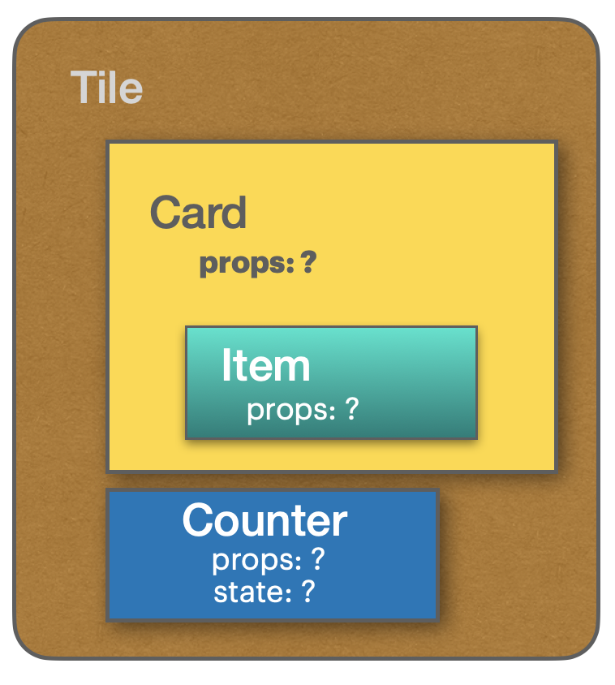

# Components

## Week 1, Lesson 5

This lesson explores the purpose of a React component, how a component works and how its methods function

## Learning objectives

- TNTs will be able to describe the purpose of a React component
- TNTs will understand how a component's key methods function
- TNTs will practice conceptualizing components and their structure

## Time required and pace

Total time: 1 hour

- 50 minutes - **Instructional Session - Discussion and Lecture**
  - 10 minutes – Review basic component's ideas
  - 10 minutes – Explain component's lifecycle
  - 15 minutes - Components discussion in groups
  - 15 minutes - Components discussion as a class

## Session Details (60 minutes)

### Component Description (10 minutes)

At its simplest, a component is an object that returns a Javascript XML Element (JSX Element) which is rendered on the screen. Components are the building blocks of a React App, independent and reusable, much like HTML elements are for web pages.

#### Key Component Ideas

- Component Data: _Properties_, _State_, _Children_
- Component Lifecycle Methods

#### Functional components

1. Expected to return the JSX element to be displayed.
2. Properties (optional): These arguments are passed in from the component's parent similarly to passing parameters to a function. They cannot be changed in the component.
3. State (optional): It only exists within the component. Changing it causes the component to update. React.useState is a hook function that permits to provide a state. It returns a state variable.
4. Children (optional): Components nested inside the parent's JSX tags.
5. (optional) components can contain other additional methods.

#### Functional Components Examples (two common syntax - with and without lambda function)

##### A. Standard Function Syntax

    function App() {
        return 
<h1>My App</h1> <Tile/>

    }

##### B. Lambda Function (Arrow Function) Syntax

    let App = () => 
<h1>My App</h1> <Tile/>

Usage: `<App></App>` or `<App />`

#### Component With Props

     const Tile = (props) => {

        const [size, setSize] = React.useState(props.width * props.height);

        return ( 
This is tile {props.name} with ID {props.id} of size {size} 
)

      }

Usage: `<Title name="a name" id="an id" width="15" height="30" />`

#### Rendering Other Components in a Component

    import React from "react"
    import { Header } from "./Header"
    import { PhotoGrid } from "./PhotoGrid"

    // Assume each import is a separate component that was built
    // Homepage will render Header and PhotoGrid

    const HomePage = () => {

        return (
            

                <Header/>
                <PhotoGrid numberOfPhotos={5} />
            

        )
     }

Usage: `<Homepage/>`

### LifeCycle Methods (10 minutes)

Every component has a lifecycle - mounting, updating, and unmounting. React provides a hook _useEffect_ to create lifecycle methods. useEffect methods specify the behavior of the component when it goes through a phase of its lifecycle - when the component is constructed or dismissed. Examples of phases could be: when the component is just about to render on the screen, when it has rendered on the screen, or when it is updated/modified in response to a change.

#### Stateful Component With Props and Common Lifecycle Method

     const Tile = (props) => {

        // This is called 1st
        const [size, setSize] = React.useState(props.width * props.height);

        useEffect(() => {
            // Do stuff here after component is mounted in DOM tree
            return () => {
                //Do stuff here after component is unmounted
                //Could be cleanup or service calls
                //Ex: log("User destroyed the tile. Maybe it's alive somewhere else")
                //Ex: this.database.tileDestroyed(userId, Date.now())
            };
        },[]);

        useEffect(() => {
          //Do stuff here after component state has changed in DOM tree
          //Ex: setSize(0);
        }); // note the lack of a dependency array here, this will run after every render of the component

        return ( 
This is tile {props.name} with ID {props.id} of size {size} 
)

      }

### Session Discussion (30 minutes | 15 minutes in groups, 15 minutes as a class)

In your team channels, discuss the following; be prepared to share an insight or example with the class. Keep in mind the following:

- Investigate a couple of websites you use regularly; be prepared to share some good candidates for Views and Components that you identified in the websites.

- Think about examples from your experience where you have built up a larger thing from smaller pieces. Can you make an analogy that reflects a stateless Component? a stateful Component? a reusable Component?

- As a group, imagine your daily schedule and activities as a set of components, e.g., Wake up, Exercise, Breakfast, .... Group the schedule under the following areas to present:
  - Component **properties** vs. **state**
  - **Re-usable** components
  - Components made up of other components (**composition**)

### Stretch Exercise Setup - MyTNT App (15 minutes)

- Identify components and composition: Tile, Card, Item in the [MyTNT App](./samples/mytnt-layout/) layout

<!-- - Review GitHub process: Clone•Branch•Commit•Push•Pull Request -->

- Explore Code
  - Identify Components, props, state, and children
  - Examine the Properties and State
  - Examine the use of the state value **count** in the _Counter_ component and **map** function
  - Review HTML/CSS including `<ul>`, `<li>` and `<a>` elements

## Stretch

- Use pair programming in Live Share to complete the [_My TNT_ Exercise](./Exercises/mytnt-exercises/)

- Push your work to GitHub <!-- and submit a Pull Request (one per pair)-->

- Continue coding on the _My TNT_ Exercise Stretch Goals (See Exercises)

- Explore the purpose of React components, how to identify them and why they are used

## Resources

- Read [this short chapter](https://leanpub.com/reactjsforthevisuallearner/read#leanpub-auto-chapter-2--what-is-react-and-why-is-it-cool) (Chapter 2) describing the way React uses Component to create website Views.
- [Rubber Duck Debugging](https://en.wikipedia.org/wiki/Rubber_duck_debugging)
- [VS Code Live Share Extension for Pair Programming](https://marketplace.visualstudio.com/items?itemName=MS-vsliveshare.vsliveshare-pack)
- [React useState documentation](https://react.dev/reference/react/useState)
- [React useEffect documentation](https://react.dev/reference/react/useEffect)
