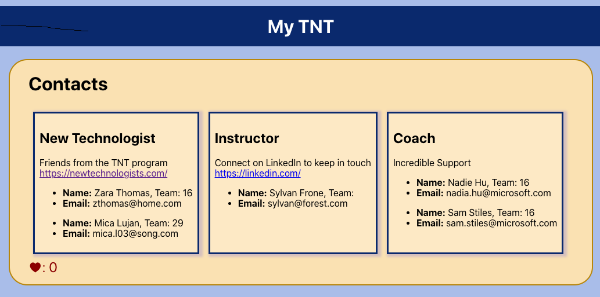

# My TNT Exercise 

Modify the MyTNT application with both stateful class and stateless function components. Compose the Tile, Card, and Item components into the following UI layout.

## Available Scripts

In the project directory, you can run:

### `npm install`

This will install all the node_modules for the project

### `npm start`

Runs the app in the development mode.\
Open [http://localhost:3000](http://localhost:3000) to view it in your browser.

The page will reload when you make changes.\
You may also see any lint errors in the console.

## Exercise Instructions

1. If you haven't done so already, clone the Exercises repository
2. Use VS Code to open the folder for this exercise
3. Review the *App.js* and the code in the *components* folder;
4. Add multiple Cards to the `<Tile>`; this nesting  of components within other components is called *composition*
5. Follow along with the **TODO** and **CONFIRM** comments to complete the instructions in the *App.tsx*, *Card.js*, *Counter.js*, and *Tile.js*
6. Create a Item as a function component with the given set of properties, name, email, and team (as an optional property)
   - Add several Items to each `<Card>` component as another level of composition, components inside components inside compontents
   - Pass a couple of meaningful properties to each Item using the data shown below

## Exercise Stretch Goals

1. Update the Tile class to include a "name" property that sets its heading so that you could reuse it to create other Tiles besides "Contact". Include a ***TileProps*** interface.
2. Update the Tile class to include the state for the number of "Likes". Pass this state value to the Counter as one of its properties; use it to set the Counter's initial state.
3. Styling with Properties [https://fettblog.eu/typescript-react/styles/](https://fettblog.eu/typescript-react/styles/)
   - Add a **color** property to the Tile component like <Tile color="blue"/> that sets the background color of the Tile area
   - Add a **color** state to the Counter component that changes the color of the Counter on every click
