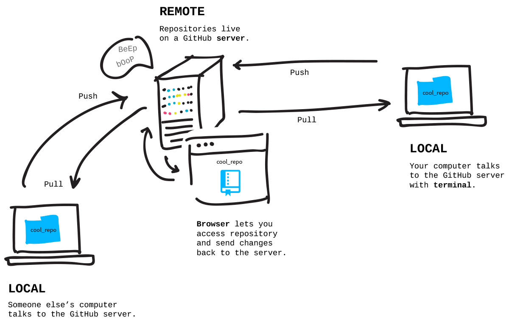
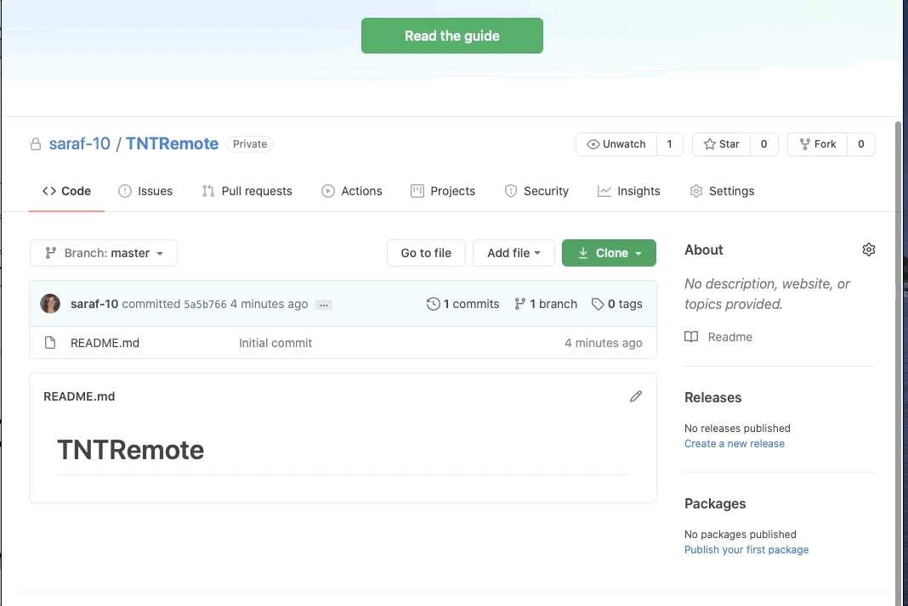

# Remote repositories and GitHub

## Week 2, Lesson 2

This lesson introduces the core concepts for collaborating with Git and working with a remote repository.

## Learning objectives

- TNTs will understand the basic workflow for how multiple people work with Git.
- TNTs will understand why using branches and practice branching.
- TNTs will be able to clone a repository, make a pull request, push changes.
- TNTs will be able to Stash changes
- TNTs will learn how to create and use repositories on GitHub.

## Time required and pace

Total time: 1 hour

    * 5 minutes - Explain Remote repositories and GitHub( Create, Clone, Pull and Push)
    * 10 minutes - Explore: create and use a repo on GitHub
    * 5 minutes - Explain Branching
    * 5 minutes - Explain git Stash
    * 15 minutes - Explore: create and use local Branching and on GitHub
    * 20 minutes - Elaborate: review trouble spots

## References

- [learn about working with branches](https://www.youtube.com/watch?v=JTE2Fn_sCZs)
- [GitHub workflow](https://guides.github.com/introduction/flow/)

- Interactive online tutorial for practicing Git branching
  - [Learn Git Branching](https://learngitbranching.js.org/)

### Session set up

- [ ] You have a GitHub account ready to make and clone a remote repository

### Explain Remote repositories and GitHub( Create, Clone, Pull and Push) (15 minutes)

we will learn together how to clone a repository using `git clone` and contributing to a repository using `git pull`, and `git push`. These are the building blocks for collaborating with Git and working with a remote repository.

<table style="border: none">
    <tr align="center">
        <td> </td>

</tr>
</table>

**Demo:** Create a new repository in GitHub and clone it using the integrated terminal or Git Bash

We'll now walk through the process of cloning a repository from GitHub. We'll be creating a private repository in our own accounts.

1. [Go to GitHub](https://github.com/) and create a new (private) repository.
2. Make an initial commit by creating a Readme file.

<table style="border: none">
    <tr>
        <td> </td>
        <td></td>
    </tr>
</table>

3. Explain `.gitignore`
4. Explain `Licence`
5. Clone the remote repository to your local directory using `git clone` followed by the URL provided by GitHub.
6. Show the folders and open the workspace in VS Code. You can also go in the directory and write `code .`

<table style="border: none">
    <tr align="center">
        <td> </td> 
 </tr>
</table>

**Demo: Clone from VS Code**

1.  It's also possible to clone a repository from VS Code.
2.  Open the palette with Cmd+Shift+P for Mac OS / Ctrl+Shitf+P for Windows.
3.  `Git: clone` prompts for a URL. You can paste the one from GitHub.

**Demo: Make changes in VS Code and push changes**

1.  With the folder open in VS code, add a new file and make changes to the existing file.
2.  In VS Code integrated terminal, then `git add .` to stage the files.
3.  `git commit -m "commit-message"` to create the commit. The changes are now committed locally.
4.  `git remote -v` to know what remote branches are available on your local (here `origin`).
5.  `git push origin main` to push the changes to the remote repo main branch.
6.  Check the remote repository in GitHub.

## Explain Branching

Watch this short video to know what branches means in Git and how it works

## Explore: create and use local Branching and on GitHub

**Demo 1:Create a branch and push work to this branch**

1. Create a new branch
   - Two-step method: `git branch NEW-BRANCH-NAME` creates the branch and `git checkout NEW-BRANCH-NAME` switch to the new branch
   - There’s a shortcut to create and checkout a new branch at once. You can use the -b option (for branch) with git checkout. The following commands do the same thing: `git checkout -b NEW-BRANCH-NAME`
2. Edit, add and commit your files.

**Demo 2: Stash a work on progress code and switch between branches**

1. Edit your file on the feature-branch
2. Stash your work using `git stash`
3. Switch to main branch `git checkout main`
4. Check the work directory and changes
5. Switch back to feature-branch `git checkout <Feature-Branch-Name>` 6. Run `git stash list` to check all stashed work on the Feature-Branch
6. Pop Stashed work using `git stash pop`
7. Finish Edit, add and commit your files.

**Demo 3: Push Branch to remote repository**

1. Push your branch to the remote repository: `git push -u origin feature_branch_name` and check the remote repository in GitHub.
   - the `-u` flag (upstream) when you make your first push to track a remote branch
2. Pull from the remote branch: `git pull --rebase origin <Branch-Name>`
3. View the branches - To view the branches in a Git repository, run the command: `git branch` - To view both remote-tracking branches and local branches, run the command: `git branch -a`
4. Rename a branch - To rename a branch, run the command: `git branch -m OLD-BRANCH-NAME NEW-BRANCH-NAME` - Alternative `git branch --move OLD-BRANCH-NAME NEW-BRANCH-NAME`
5. Delete a branch - Git won’t let you delete a branch that you’re currently on. You first need to checkout a different branch, then run the command: - `git branch -d BRANCH-TO-DELETE` - Alternative: `git branch --delete BRANCH-TO-DELETE`

### Your Turn: Create and use a repo on GitHub (30 minutes)

The goal is to create a repo on GitHub, clone the repository, make changes in VS Code and push the changes back to GitHub.

1. Create a new private repository on GitHub. Make an initial commit adding a file directly from the interface.
2. Clone the repository to your computer.
3. Open the folder in VS Code.
4. Add a new file in GitHub and edit this file.
5. Do some changes locally and commit them. Make a pull request.
6. View the changes in GitHub.
7. Continue making changes in VS Code. Check out the `git diff`. Check out the log using `git log` ,`git log --oneline` or `git log --oneline --graph --decorate --all` to see the tracking of the commits.
8. Share a screenshot of the commit history from GitHub.

<table style="border: none">
    <tr align="center">
        <td> </td>
    </tr>
</table>

In your Teams' team channel, discuss:

- What went well?
- What was difficult?

## Review

Poll for questions

## Stretch

- Complete this learning module: [Collaborate with Git](https://docs.microsoft.com/en-us/learn/modules/collaborate-with-git/). Use the sandbox for this exercise to preserve your local Git configuration.

- The module covers the following:
  - [ ] Clone a repository
  - [ ] Introduction to pull requests
  - [ ] Stash changes
  - [ ] Push changes
