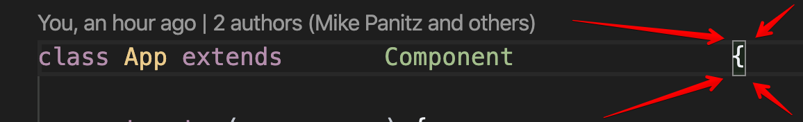

# Sample app - bringing JS, React, HTML, and CSS together

## Week 2, Lesson 1

In this lesson NTs will build on top of a sample ToDo List app that demonstrates how the core technologies work together. In future lessons the same sample app will be used for more advanced topics.

WARNING: There are several example apps that demonstrate React  using a To-Do list.
You're of course welcome to look at those, but just be aware that those examples may be different than this one.
Veeeeeery different.
You have been warned.

## Learning objectives

* TNTs will understand how the intro blocks of JS, React, HTML, and CSS are used in the app.
* TNTs will learn how to add a React component and JS logic, manage app props, add input that affects the app.

## Time required and pace

Total time: 2 hours

* 30 minutes - Instructor explains the sample app
* 30 minutes - Instructor modifies code to show how app can add new todo items
* 60 minutes - Small Group Exercises

## Resources

* [Tutorial: ReactJS – Todo List with Class Components](https://fullstacksoup.blog/2020/08/25/reactjs-todo-list-with-class-components/)
* [Using 'Ref's in React](https://reactjs.org/docs/refs-and-the-dom.html)
* WARNING: There are several example apps that demonstrate React  using a To-Do list.
  You're of course welcome to look at those, but just be aware that those examples may be different than this one.
  Veeeeeery different.
  You have been warned.

## Obtaining the sample

[View the code of this session here](./Samples/todos-via-classes/)

For this lesson we'd like to allow y'all to make changes to the starter app BUT we don't want everyone to try and change the starter repo in GitHub.  We'll solve this by having one person in each team ***fork*** the overall Exercises repo, which will create (yet another :) ) repo on GitHub.  Each person should then clone the repo for their team.  After that you can work on your team's fork without any worries about changing other team's forks (repos).  Here's a picture showing the overall goal  here:


MAKE SURE THAT YOU FORK THE REPO!!!  You can then have everyone in your small group (your App Prototype group) clone that one, forked copy.  This way everyone in the App Prototype small group can merge their changes while doing the exercises at the end of this lesson.

How to fork a repo:

- This site has a set by step guide: https://www.digitalocean.com/community/tutorials/fork-clone-make-changes-push-to-github
- Go to the Github website.
- Go to the specific repo you want to fork. You'll see three buttons in row, watch/unwatch, star, and fork:
- Click fork. This will create a copy in your own repo for you to use and modify.
- Go to your own repositories under your Github account. The forked repo should appear there.
- Use `git clone` to clone this git repo to your personal machine.

Note: You specifically want the `todos-via-classes` folder, not any other todo folders

*Credit where credit is due:* this code sample originally came from the [ReactJS – Todo List with Class Components by Ivy Barish](https://fullstacksoup.blog/2020/08/25/reactjs-todo-list-with-class-components/).  You may find it helpful to read through that blog post / tutorial as well, although do be aware that a couple of things have been changed in the code that we're using here.

### Install the sample app and try running it

- Note: it may take a while to fully install this app so please please please make sure you do this before the start of class!

- Once you've obtained the sample app you should open it in VSCode and then start the app.
  
  - You can do this by opening VSCode's Terminal in the repo's folder / directory.  
      Within VSCode's Explorer panel you should Control-Click (Mac) or right-click (Windows) on the `todos-via-classes` folder, and then select 'Open In Integrated Terminal', as pictured here:
      
  - Once you've got the Terminal panel open you'll need to install all the modules that the app needs.
      Type in `npm install` and then tap the Return/Enter key.
      This *should* install everything that's needed but be warned that this may take a while - it'll need to download about 30,000 separate files that total up to about 200 MB of space.  This step is easy, but not quick
  - After that you should type in `npm start` to actually start the app
  - Sometimes it takes several minutes for the app to actually start; feel free to read through these directions and/or do something else productive and/or take some deep breadths and remind yourself that it's really an opportunity to work on your patience just like this author does :)

# [Conceptual overview of how the app works](./assets/ToDoSample.pptx)

## How the list is displayed in the sample app:

- React Components divides the app up into properties (**props**) which never change and **state** which does change.
  - Essentially, TodoParent will handle the state, and it'll pass the current value of the state down to child components (Todos and TodoItems) for them to use.  The child components treat the data as props since the children shouldn't change those values themselves.
  - When a TodoItem is clicked that component tells TodoParent to change that particular Todo item.
      TodoParent then tells it's children to re-render so that the page is updated.

### src/App.js:

- The purpose of this file is to server as a top-level 'container' for everything that we might put in the app.  
    Since our app only does 1 thing our App class is pretty short.

- Notice that the file ends in `.js` instead of `.jsx`. For our purposes this is fine - [your React app will run fine no matter which of those two file extensions you use](https://stackoverflow.com/a/46169521/250610).

- Everything that's "inside" is between the opening { and the matching, closing }.  VSCode helps you match these - put your cursor on the opening { and VSCode will draw a box around it.  If you scroll down far enough you'll see the matching } which VSCode has drawn a matching box around.  By looking for the boxes VSCode can help you figure out which curly braces are matching which others.
    
  
    

- Notice that our App class extends the Component class that's built into React.  We do this so that we can use the methods that `React.Component` provides, such as the .`setState` method.
  
  - For this particular class we're not going to need anything from `React.Component` , but it doesn't hurt to put the `extends Component` in and it's good to get in the habit of doing this.

- The render() method says that the method should return a single HTML <div> element, that has been styled using the "App-header" CSS class.  Inside of that we want React to render the <TodoParent> element, which will handle everything about rendering the todo list, responding to buttons being clicked, etc.  

- Highlight the 'import' statements at the top of the file, both for .CSS and for our custom component (TodoParent)

- The "App-header" CSS class is defined in the App.css file.  Open the App.css file itself and look over the App.css, App.js, and the running app.
    One good exercise is to pick something in the app and then try to figure out which part of the CSS made that happen.  Some examples:
  
  - Why is the background color what it is?  
  - Why is everything centered on the page?  

- Notice that the TodoParent component is in a subfolder, and we'll need to reference it from other files using the correct path

### src/components/todoparent.js:

- The purpose of this file is to contain everything needed to display the list of todo items, and to respond to any user input (specifically, when the user checks off an item the item should be crossed out, when a user unchecks an item it should be un-crossed-out)
- TodoParent is a [container component](https://scotch.io/tutorials/create-a-simple-to-do-app-with-react#toc-types-of-components), meaning that it's job is to contain all the stuff the user sees in the todo list and to store all the data that any of it's parts need.
- Note that the `state` object is a special instance variable that React looks for.  When this changes React will re-render the page.  We will need to tell React when it changes
  - Instead of using a constructor we'll initialize `state` directly.
  - We create it here and then, for the rest of the life of the program, we will update the state by calling the `setState` method with a brand-new object literal.
    **After creating the state do not change the state directly - call `.setState()` with the new state object literal!**
- We'll skip over markComplete until we get to the part about how the app changes when the user clicks on todo items.

#### the render() method:

- The Render method is intended to display a list of the currently existing todo items, and to  display a textbox that allows the user to add new todo items

- Displaying each item will be handled by the TodoItem component, so this method is focused on producing a list of those individual items.

- Point out that `this.state.todo` is actually an array of the individual items - this was the `state` variable back in the TodoParent class

- Highlight the call to `.map()`, and the use of the `makeOneTodoItem` function

### src/components/TodoItem.js:

The purpose of this file is to display a single todo item.  

It also sets things up so that when the user clicks on the checkbox the item will be marked as 'completed', which will trigger/cause the item to re-render.

- `render()` starts by "deconstructing" (unpacking) the props into local variables (local constants)
- Next, point  out the `cssStyle` object literal
  - This is a 'style object' - an object literal that React uses to set up CSS for this element
  - textDecoration is the same as the [CSS text-decoration](https://www.w3schools.com/cssref/pr_text_text-decoration.asp) property.  JS doesn't allow hyphens/dashes in variable names so React expects us to remove the dash & camel case the variable.
    - Point out the `? : ` operator - it's a compact if/else
- Point out that it returns JSX, and that the { } pairs switch from HTML to JavaScript

## How an item's completed status is toggled in the sample app:

### src/components/todoparent.js:

- The goal of this file is to store the state (think of this as the 'global variables' for your app), and to define functions that allow other components to modify the state
- Point out that we create the state here, using an object literal.
  - We also could have used a constructor method instead
- markComplete function: probably better to name this toggleCompleted, but I'm sticking with the example in that blog post, so here we are :)
- We also use the fat arrow syntax to create a new function to toggle the state of a particular item.
  - The fat arrow will use 'this' from the surrounding code.  In other words, it uses the same 'this' as the TodoParent class around it.
  - So `this.setState()` changes the state in the TodoParent object NOT on the component that calls markComplete
- There's two versions of this - the first separates all the steps out, the second jams everything into a single statement
- Goal: We need to create a new copy of whichever item was toggled, and then re-use the existing objects for the unchanged items
  - WARNING: This is different than the original tutorial, which incorrectly modified the object in-place instead of making a copy.  
- Highlight how we create a function (`toggleTargetItem`) that will check if the item it's given is the one we want to toggle.  If so, create a brand-new object literal with the `completed` field toggled; if it's not the item we want to toggle then hand that same object back via return.
- Highlight how 'map' creates a new array; `toggleTargetItem` is used to get the unchanged original todo item or the brand-new copy of the toggled target item.
- Highlight the object literal that we create and store into a local variable
  - (This is easy to missing the 'everything jammed into a single statement' version - it's the { and } has a single field  inside it)
- Highlight how we set the 'todo' field in the object literal (because the new object needs to have the same shape as the existing state object)

#### EXERCISE

In your App Prototype teams, examine the 'everything jammed into a single statement' version of this function, and make sure that you're able to identify where each of the steps happen in that one statement.

Hint: the 'single statement' version does all the same steps, they're just jammed together (and therefore easier to miss).

### src/components/TodoItem.js:

- The goal for this file is to set things up so that when the user clicks on the checkbox then markComplete will get called (and ONLY when the user clicks on the checkbox - do NOT call it before then!)

- Point out how the checkbox input, and the space, and the title variable are put onto the page, in the source code

- Point out the onChange event handler, and what it does

- Point out the arrow function
  
  - Allows us to define a function that will be called later (NOT when the item is rendered on the page - that would be too soon).  
  - Point out that we're fixing / binding the parameter when we define the arrow function.
  - We are creating a brand-new function for each and every todo item

- NOTE: If you read through the original tutorial you'll notice that the following line has been replaced by an arrow function.
  
    Original version: `onChange={this.props.markComplete.bind(this, id)}`
    New, arrow version: `onChange={() => this.props.markComplete(id)}`
  
    The [original reason for using .bind() is explained in this blog post](https://codeburst.io/binding-functions-in-react-b168d2d006cb); we switched to using fat arrow functions because that syntax is more familiar than the new .bind() function

## Adding new Items To the list

### src/components/AddTodo.js :

- There are two goals of this component:
  
  1. keep track of what the user has typed in by connecting an instance variable to the textbox, so that we can get the contents of the textbox when the button is clicked.
  2. Then, when the user clicks on the plus button, call the addTodoItem function so that TodoParent can add the new todo item

- We keep track of the user's input via an instance variable which stores a reference (a `ref`) to the textbox's DOM object
  
  - We  use it to get the value out of the textbox at any time; we'll wait until the user pushes the button
  - We need to establish the connection so that we can remove the user's text after we add the new item. 
  - We create the `ref` via this line of code in the constructor: `this.input = React.createRef();`
  - NOTE: This is NOT the same as that blog post; this way is more recent/modern and easier to understand and less typing.

- The `<form>` is an HTML element that tells the browser: everything between the opening `<form>` and closing `</form>` tags are all related - they're all part of the same form. 
  
  - There's [more information online](https://www.w3schools.com/html/html_forms.asp) about forms

- The `<input type="text">` tells the browser to put a text box on the page (as opposed to a button, a checkbox, etc).  
  
  - `placeholder="Enter a task"` tells the browser to put the text "Enter a task" inside the box only until the user types something in (at which point it'll show whatever you've typed).
  - `ref={this.input}` tells React that when the textbox is created to establish a reference between the input instance variable and the DOM node (i.e., the textbox)
  - There's [more information online about input elements](https://www.w3schools.com/html/html_form_input_types.asp), too.

### src/components/todoparent.js:

- The purpose of this component still the same as it was before - to contain that app's state  the list of todo items), and to respond to any user input.
- We'll add the `addTodo` function which needs to create a new object literal for the todo item itself AND ALSO create a new array and a new state object.  Most of the complexity of this function comes from needing to leave the original state untouched and instead to make a copy of anything that's changed, and to copy any objects that referred (directly or indirectly) to the changed object.

##### Common error: changing the state variable but not telling React that it's changed

One common error is to try and change this.state directly.  Syntactically you're allowed to do this (in other words,the program will compile and run) but semantically this is wrong.  What will happen is that we'll change the app's state but React will not know that it's changed and so the screen that the user is looking at won't change.  **We must call the setState method instead**.

```javascript
// Common Error:
// This is not rendered but the list is updated
// setState needs to be used
this.state.list.push(this.inputValue);  // WRONG WRONG WRONG DON'T DO THIS!!!! :)
```

#### EXERCISE

In your App Prototype teams, examine the 'everything jammed into a single statement' version of this function, and make sure that you're able to identify where each of the steps happen in that one statement.

Hint: the 'single statement' version does all the same steps, they're just jammed together (and therefore easier to miss).

## More Exercises

Within your small teams, pair/triple up and have each pair/triple choose an exercise from the following list (making sure that each pair/triple in a small team picks a unique feature).  See if you can have each pair/triple do the exercise, then come back together in your small group.  Do a quick, informal code review (i.e., the pair/triple that wrote the code should explain what they did to everyone else; everyone else should ask questions) and then practice merging all your work into  a single git repo.

Y'all are NOT expected to do all of these (or even most of these).  Work on stuff that seems useful, or that you find interesting, and focus on learning how and why this stuff works the way it does.

* Add static styling (in other words, find an element(s) on the page and put some styling in the .CSS file to make the element look different.)

* When item is checked change the style more, in addition to the strike-through that's currently being applied (for example, can you make completed items appear to be grayed-out, italicized, and struck-through?)
  
  * When item is checked change the style by using one of two styles in CSS (instead of listing out all the CSS attributes you want to set, inline)

* Try changing what the user sees on the page.  For example, can you number the todo items?  Can you do this using the ordered list element(s) in HTML?

* Add fields to the items
  
  * Maybe another text field - one text field could be the item's title, and the other could be used to describe the item
  * Maybe having an assignedTo field?  Priority?  Feel free to come up with any (workplace appropriate) fields that you'd like.

* Make sure that the input is valid:
  
  * Check for empty inputs
  * Check if the new item duplicates an existing item
  * You might start by using `alert()` to describe the error, but it would be interesting to try putting an error message on the page next to the textbox instead.

* Add `delete()` functionality

* Sort the list alphabetically

* I RECOMMEND DOING A COUPLE OF THE ABOVE EXERCISES BEFORE MOVING ON TO THE FOLLOWING:

* What other changes, improvements, and/or modifications would you like to add to the app?  After checking in with your small group try adding them.

* What features are you thinking about adding to your TNT Prototype project?  If any of those features look like you might reasonably try adding them to this Todo app, feel free to try adding them (after checking with your small group, of course).  By 'reasonable' I mostly mean 'does it look like you can figure it out', not 'does it make sense in the context of a todo app'.  

* STRETCH EXERCISES / EXTRA CHALLENGING EXERCISES

* Add categories, set up the todo lists to show items by category

* Continue the discussions that you started in the "Reflect on your experiences" part of the instructional session

## Wrapping Up:

* At the end of lesson push your work to GitHub and communicate the repo's name to your instructor.
* Within your groups, please discuss and comment on what you learned and what was challenging
* Please continue this discussion after the instruction session ends
<!--
------

## Unused:

### Common controls (10 minutes)

Controls in a user interface (UI) follow familiar patterns of behavior. Customers using an app expect that certain controls behave in a certain way. For example - a checkbox allows you to select more than one option while a radio button only allows you to select one option. These model definitions, when the quality or property of an object defines its possible uses or makes it clear how it can or should be used, increases ease of use. Many of these controls are provided by the platform or operating system as part of the developer experience.  

* NTs - Look at two apps on your phone or computer. What common controls or interaction patterns do you see?
* Post one common control to the Teams channel.
* Come back together as a group. Share highlights. Some places to look if they're missed - navigation, window management, backstage and menus, buttons - radio, checkbox, dropdown, date / time picker...
* Keep these common behaviors and interaction patterns in mind as you think about your prototypes.
-->