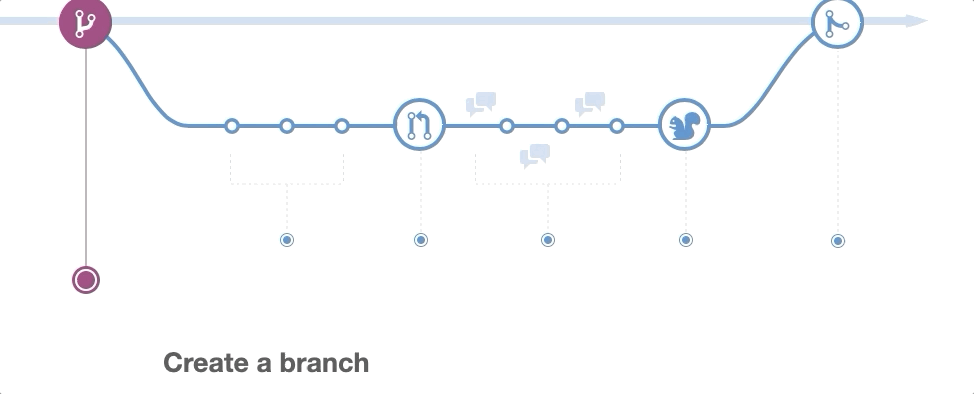
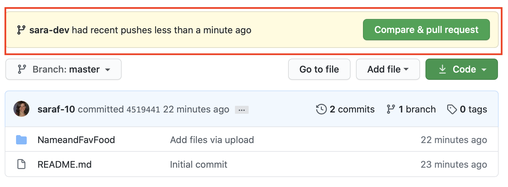
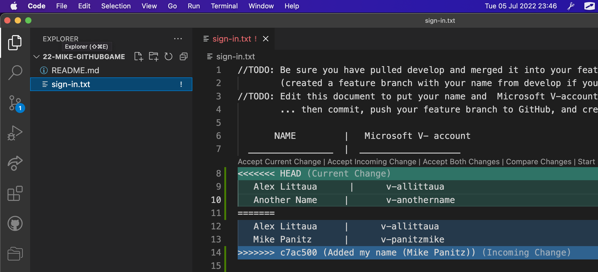
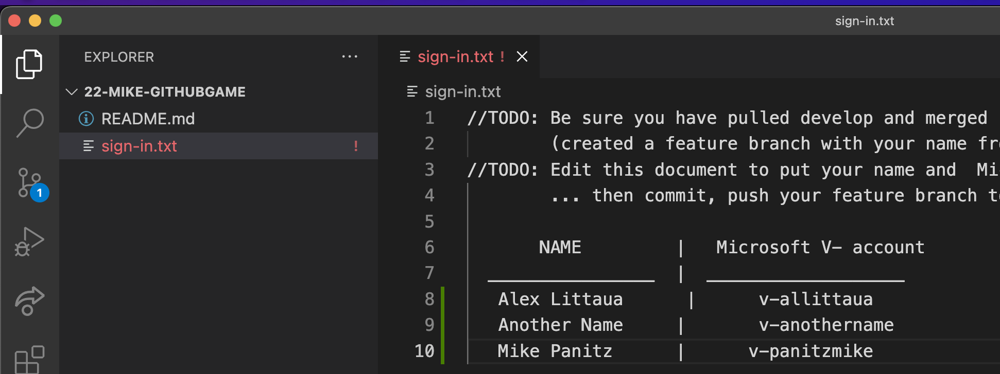
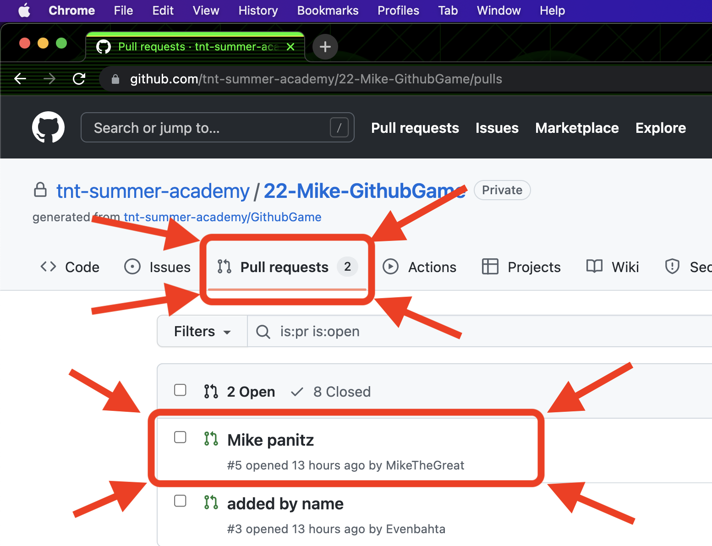
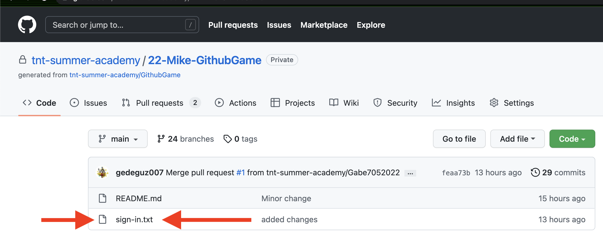
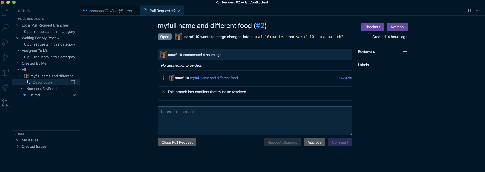

# Branching, merging, and merge conflicts

## Week 2, Lesson 2

This lesson introduces branching and merging for team collaboration. Conflict resolution will be covered. This is how you work together on projects!

## Learning objectives

* TNTs will understand the basic of branching, merging, and resolving conflicts.
* TNTs will learn what are merge conflicts, what causes them, how to resolve and reduce them.
* TNTs will be able to create and merge a branch locally and with GitHub.

## Time required and pace

Total time: 1 hour

    * 5 minutes - Explore: GitHub Workflow and Pull requests
    * 10 minutes - Explore: GitHub Pull request
    * 10 minutes - Explain Git Conflict
    * 5 minutes - best practices
    * 20 minutes - explore: try it: GiHub Game
    * 10 minutes - elaborate: regroup and review

## References

* Watch this [video](https://channel9.msdn.com/Events/Microsoft-Azure/Azure-DevOps-Launch-2018/A107?ocid=player) to start to use Pull Request within VS Code
* Watch this [video](https://www.youtube.com/watch?v=0iuqXh0oojo): Git: merging and workflow
* [VS Code Pull Request Extension](https://marketplace.visualstudio.com/items?itemName=GitHub.vscode-pull-request-github)
* Checkout more learning modules on GitHub
  * [Managing merge conflicts](https://lab.github.com/githubtraining/managing-merge-conflicts) 
  * [Ramp up on Git and GitHub](https://lab.github.com/githubtraining/paths/ramp-up-on-git-and-github)
* Interactive online tutorial for practicing Git branching
  * [Learn Git Branching](https://learngitbranching.js.org/)

## Session set up

* [ ] You have a GitHub account ready to make and clone a remote repository
* [ ] GitHub - For the demos, we wil use the following repository: [NameandFavFood demo](https://github.com/tnt-summer-academy/Samples/tree/main/Week_2/NameandFavFood) in Samples

## Explore: GitHub Workflow and Pull requests

Here's how the team development process is applied with GitHub: [Understanding the GitHub Flow](https://guides.github.com/introduction/flow/).

<table style="border: none">
    <tr align="center">
        <td> 
    </td>
 </tr>
</table>

It's called a "pull request" because it's asking the main branch to pull in the changes.

 **Demo: Cloning, branching, committing a repo from GitHub and open pull request**

1. We're going to review the basics of creating a branch and merging it in GitHub.
2. Clone the NameandFavFood repository in [Samples](https://github.com/tnt-summer-academy/Samples/tree/main/Week_2/NameandFavFood)
3. Create a new remote repository on your GitHub
4. Change the remote origin in the NameandFavFood cloned directory to the new created remote repository 
   **`git remote set-url origin <the URL for the created repo on your GitHub>`**
   5. Create a new branch and checkout to the branch.
   6. Open and edit the file in VS Code, adding your name and favorite food
   7. Commit the changes to the branch.
   8. Push your branch with the changes to GitHub.
   9. Notice Compare and Pull Request in GitHub.
   10. Open a Pull Request to merge to main.
   11. Look at the pull request and complete the pull request and merge.

<table style="border: none">
    <tr align="center">
        <td> </td> 
    </tr>
</table>

 **## Explain Git Conflict

**Demo: Show a merge conflict**

    1. In your local repo, switch to main branch.
    2. Create a new branch and switch to this new branch.
    3. From VS Code on the branch, make a change to the NameandFavFood by adding a different change.
    4. Commit the changes to the branch.
    5. Push the new branch and changes to GitHub.
    6. Notice the Pull Request and the conflict in GitHub.
    7. Resolve conflict.

<table style="border: none">
    <tr>
        <td></td>
        <td> </td>
    </tr>
</table>
<table style="border: none">
    <tr>
        <td></td>
    </tr>
</table>

### Best practices to resolve and reduce merge conflicts (5 minutes)

1. Git attempts to resolve differences in code. Merge conflicts occur when Git is unable to resolve the differences. This occurs when there are changes made to the same part of the same file on two different branches.
2. Before attempting to merge, make sure any work in progress is either committed or merged. If you need to `git merge --abort`, this will prevent you from losing changes.
3. Take a minute (or several) to understand the conflict. This will help you pick a solution to resolve the conflict.
4. Decide what code should be included in main after the merge. Make the changes to resolve the conflict.
5. Make sure your code is still working as expected and it didn't break any of the old working code
6. Fetch from main and pull into your branch frequently to stay in sync.
7. Plan the work. Breakdown who is working on what and what may conflict.

### YourTurn: Try it, Game Play

(20 minutes to explain and start playing a few rounds)

1. Together we're going to create a whole bunch of merge conflicts

2. Navigate to the **GitHub Game** repository that you have access to it

3. Play the game using these TWO RULES
   
   - You will **ONLY** edit the file when on your **feature branch**!
   - You will **NEVER** commit changes when on the **main branch**!

**Setup in VS Code and use VS Code integrated Terminal**

4. Open VS Code
5. Clone the repo into a new directory
6. Create a new branch, call it **sign-in\*-yourName\*** (this will be your ***feature branch***) and check out this new branch using "**git checkout -b \*your feature branch name\***"
7. Modify the *sign-in.txt* code to add your name and the v-account below my name
8. Commit the changes
9. Push your feature branch to Github using "**git push origin \*your feature branch name\***"

**Using GitHub**

7. Make a Pull Request from your branch to main to push changes
8. Resolve the merge conflicts, if there is any. (Check Pull-Merge-Commit-Push details below)
   * Be mindful not to delete other people's response
   * You may have to deal with merge conflicts more than once through this process.

### Pull-Merge-Commit-Push (repeat this part)

*(NOTE: you will need to do this several times since the main branch will be changing using other TNT's Pull Requests )*

#### From VS Code Integrated Terminal

1. Be sure you are in the directory for this project
2. Type "**git status**" to make sure you are on your **feature** branch and it is clean
3. Type "**git pull origin main**" to pull the current copy of the main branch from the server and merge it into your feature branch
4. Make whatever changes you need to the file so that all of the existing names are included in the list and your name is below all other names
5. Finish the changes and commit them
6. Type "**git status**" to be sure you are on your feature branch and it is clean
7. Type "**git push origin \*your feature branch name\***" to push the updated copy of your feature branch to the server

#### From Github

1. Navigate to your Pull Request
2. Review your Pull Request to see that it shows that it is able to be merged
3. If yes, complete the merge, otherwise see below

#### Repeat over the next few minutes, hours, days...

1. Review your pull request details to see if your branch has conflicts with the current main branch. (Somebody branch has been merged ahead of you or other changes were made to main, sorry!!)
2. Resolve the conflicts using the "Pull-Merge-Commit-Push-Request" steps above (Redo the entire process from pulling the main branch to pushing your feature branch and requesting a new review). Notice that the code continue to incorporate new names into main
3. Repeat until you are able to merge your branch and close your pull request

### Regroup and review (10 minutes)

1. Take a look at the repository commit history, look at all the changes!
2. Are branches or pull requests outstanding?
3. Poll the room - what made this difficult? what helped?

## Stretch

* Complete the module: [Edit code through branching and merging in Git](https://docs.microsoft.com/en-us/learn/modules/branch-merge-git/)
  
  * Use the sandbox for this exercise to preserve your local git configuration
  * Create branches with git
  * Merge branches with git

* Use VS Code and the integrated terminal to complete the work below
  
    ***Share your solutions for Week 1 exercises with us on Github***
  
  * Clone the [Exercise repository](https://github.com/tnt-summer-academy/Exercises) on Github to your local machine
  * Clone **your team scratch repository** to your local machine. You can use the Repositories search functionality to locate your team repo. Such as Search for Team12-2022-ScratchRepo.
  * Create a work directory with the following name: **FirstNamesLastIntial** (e.g. AliceB). Please follow the naming convention as coaches and instructors will look for these specific name formats.
  * Prepare your local work directory and move it inside the cloned team repository to move forward. Stage and Commit any pending changes.
  * Create a branch and switch to it.
  * Push your solutions to the following week 1 exercises to your branch:
    * [JavaScript Practice](https://github.com/tnt-summer-academy/Exercises/blob/main/Week_1/ENG1.1/%5BENG1.1%5DJavaScriptPractice.js)
    * [Extended input-app with a submit button](https://github.com/tnt-summer-academy/Samples/tree/main/Week_1/input-app-javascript)
    * [My TNT Exercise](https://github.com/tnt-summer-academy/Exercises/tree/main/Week_2/ENG2.1-myTNT)
  * Name the files and directories appropriately for easy identification
  * Create a pull request to your branch
  * Title the pull request with your name and the names of anyone else who worked on the code. Again, please follow the requested formats.
  * Merge the pull request to the main branch.

# Summary of GitHub Game:

(Note - this is slightly different than the above version, in that you take turns and help each other through the process)

<u>Instructor Note:</u> Make sure that the **main** branch in GitHub has branch protections to prevent people from committing directly to **main**

## Stuff Each App Prototype Team Needs To Do, Once:

1. First, the instructor will give you the URL for the repo to use.

2. Each team should decide on one person [to fork the repo](./%5BENG2.0%5D%20To%20Do%20sample%20app.md#obtaining-the-sample) (so that each team can work on this at the same time)

3. Each person should [clone their own copy of the repo,](https://github.com/tnt-summer-academy/Curriculum-2022/blob/main/Week%201/%5BENG1.0%5D%20Intro%20to%20Git%20and%20local%20workflow.md#demo--clone-a-repository-from-github-using-vscode).  
   **Make sure that you clone your team's fork and NOT the original repo**

4. Once everyone on the team has cloned the repo (and ONLY after everyone has finished their clone) then 1 person should go into GitHub and modify the `sign-in.txt` file by adding a made-up, workplace appropriate, name to the END of the file.
   (Doing this will ensure that everyone gets a merge conflict)

## Stuff Each Person Needs To Do, One Person At A Time (With The Support Of Their Team):

1. The team should decide on who's going next, and everyone on the team should help and support that person
   (all of the following steps should be done by the person who's going next)

2. The person should create a create a new branch
   Call it **sign-in*-yourName*** (this will be your ***feature branch***) and check out this new branch using git checkout.  
   Here's an example  (please replace YourNameHere with, y'know, your name :)  )
   `git checkout -b sign-in-YourNameHere`
   `git status`  (to confirm that it worked, of course)

3. In VSCode, modify the *sign-in.txt* code to add your name and the v-account to the END of the file
   4- Stage the changes locally, to the local branch
   `git add .`
   `git status`
   5- Commit the changes locally, to the local branch
   `git commit -m "Added my name (YourNameHere)"` (change this to be your name, of course)
   `git status`
   6- Push your feature branch to Github using 
   `git push -u origin sign-in-YourNameHere` (warning - you can choose a different branch name on GitHub but people almost never do.  People DO make typos, so watch out for that)
   `git status`

4. Switch over to the GitHub website, where you should see something asking if you'd like to create a pull request:
   Click on the 'Compare & pull request' button
   
   <table style="border: none">
    <tr align="center">
        <td> </td> 
    </tr>
   </table>

5. Steps to create the pull request:
   First, fill in a brief description of your pull request:
   

6. If someone has modified the repo that you cloned (since you last cloned or pulled from it) then you will see the following: 
   

7. At this point go back to VSCode, and in the terminal you want to run the following commands:
   `git status` - specifically, you want to **make sure that you're still on your personal branch** and NOT on main
   `git pull origin main`  - if everyone adds their changes to the end of the file then you should see several error messages here
   `git status` - you should still see errors (and several hints/suggestions

8. At this point open up the sign-in.txt file in VSCode.  VSCode will highlight the merge markers in the file so it will look something like this:
   

9. Git considers the merge conflict to be resolved once we've deleted the line that starts with `<<<<<<<`, the one with `=======`, and the one with `>>>>>>>`.
   HOWEVER
   We need to make the text file actually work - it needs to list ALL the names here, including both your name and the names of everyone who committed before you.  So in this example we'll change it to look like this:
   

10. IMPORTANT: You'll need to do this for ALL the merge conflicts in this file.  In our sign-in.txt file there's probably only one, but it's very common for source code files to have multiple conflicts in each file.

11. (If any other files have merge conflicts then you'll need to repeat these steps for each of the files that have merge conflicts)

12. Once all the merges have been resolved, you should stage and commit your changes:
    `git status`
    `git add .`
    `git status`
    `git commit -m "Added my name (YourNameHere)"` - this is the same as the prior commit message

13. At this point you're almost, but not quite done.  We have to tell git that we're finished resolving the merge conflict:
    `git status` - you'll still see an error message, along with a suggestion to do the next command:
    `git rebase --continue`
    `git status` - everything *should* be ok (although it will say that "Your branch is ahead of 'origin/main' by 1 commit."  - this is fine )

14. At this point we need to repeat the 'push' step:
     `git push -u origin sign-in-YourNameHere` 
     `git status` 

15. At this point go back to the GitHub website, click on 'Pull Requests', find your pull request, and see if it's ok to merge your changes in: 

16. At this point confirm that your changes are, in fact, in GitHub by opening the `sign-in.txt` file:
    

17. At this point the person currently working through the merge conflicts should be done, so have the team decide on the next person and go through the process again, adding their name.

18. Repeat until everyone's name has been added to the team's forked repo

# UNUSED:

(Stuff that we aren't using but we don't want to delete )

## Pull Request via VS Code Extension

**Demo: Show pull request**

### To get started follow these steps:

1. Download the extension from the [marketplace](https://marketplace.visualstudio.com/items?itemName=GitHub.vscode-pull-request-github)

2. Reload VS Code after the installation by clicking the reload button next to the extension

3. Open your desired GitHub repository

4. If you're using version 0.5.0 of the extension or higher, a new viewlet should be added to the bottom of the activity bar. For older versions, the GitHub Pull Requests tree view will appear in the SCM Viewlet.

5. You may need to configure the githubPullRequests.remotes setting. By default, the extension will look for Pull Requests for origin and upstream. If you have different remotes, add them to the remotes list.

6. A notification should appear asking you to sign in to GitHub. Follow the directions to authenticate.

7. You should be good to go! *Open the created Pull Request from the previous Demo in VS Code*
   
   