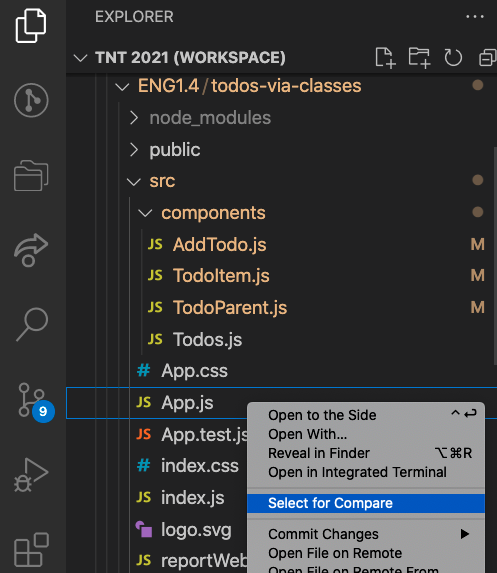
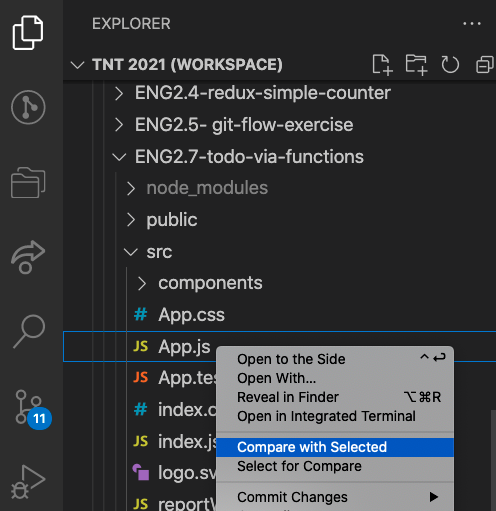
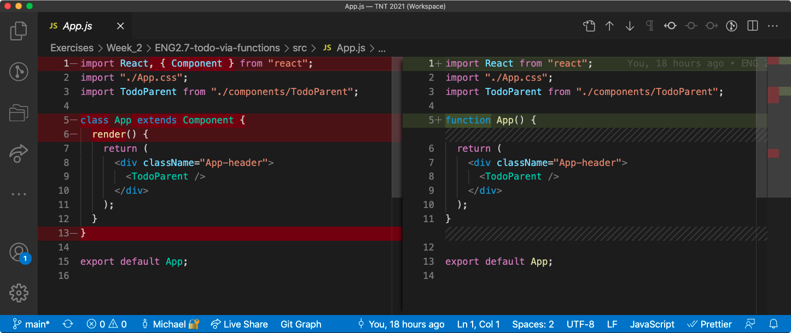
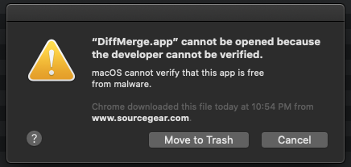
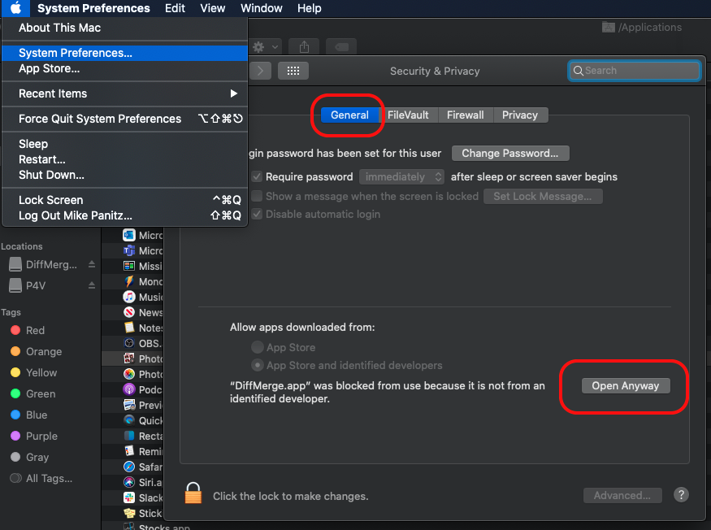
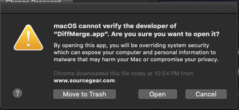
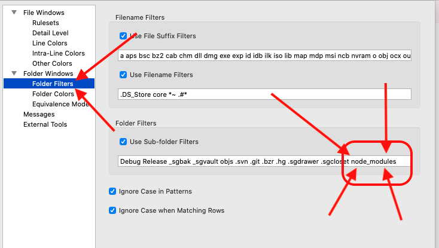

# React *function* components (and state hooks!)

## Week 2, Lesson 4

In this lesson NTs will examine how function components and the useState() hook can be used instead of class components, by examining a copy of the sample ToDo List app that has been converted to use function components.

## Learning objectives

* TNTs will understand how the intro blocks of JS, React, HTML, and CSS are used in the app.
* TNTs will learn how to add a React *function* component and JS logic, manage app props, add input that affects the app.

## Time required and pace

Total time: 2 hours

* 10 minutes - What are function components, and what are hooks?
* 20 minutes - Examining the changes made to the todo sample app to convert it to using function components
* 40 minutes - Write a program from scratch that's really similar to the pre-session program, with guidance
* 5 minutes - Reflect on your experiences

## Background / Resources

* [The React useState hook](https://reactjs.org/docs/hooks-state.html)
* [The Rules of Hooks](https://reactjs.org/docs/hooks-rules.html) - when to use them, when not to use them, etc
* [Presentational vs. Container Components](https://medium.com/@dan_abramov/smart-and-dumb-components-7ca2f9a7c7d0)
* [ToDo List via Functions Code](https://github.com/tnt-summer-academy/Exercises/tree/main/Week_2/ENG2.7-todo-via-functions)


## How to compare specific files in VSCode

- VSCode has built-in functionality that will show you the differences between two files.
- Start by finding the **first** file in the Explorer pane (in the Activity bar), then Control-click/right-click on it and choose 'Select For Compare':
  
- Next, find the **second** file that you want to compare, control-click/right-click on it, and choose "Compare With Selected":
  
-  VSCode will then show you the lines that are the same and those that are different between the two files:
  
  - You can choose which file goes into which side based on the order you selected them.
    The first file (the one you chose via "Select for Compare") will be placed on the left side
    The second file (the one you chose via "Compare with Selected") will be placed on the right side
    - There's no built-in way to swap the two panels once it's done the comparison, but there is a small extension ( [swapdiff](https://marketplace.visualstudio.com/items?itemName=shalimski.swapdiff) ), which adds a command to your command palette - press Command-Shift-P, then use the command "Swap diff documents" and the left & right side will reverse

### How to compare folders in VSCode

It's common to want to compare all the files in two different folders (meaning: go through the two folders and if you find a file named, say, 'src/TodoParent.js' in both folders then those two files should be compared).

VSCode doesn't have a built-in feature to do this, but there's at least two extensions that will compare two folders, file-by-file for you ('[Compare Folders](https://marketplace.visualstudio.com/items?itemName=moshfeu.compare-folders)' and '[Diff Folders](https://marketplace.visualstudio.com/items?itemName=L13RARY.l13-diff)')

## What are function components, and what are hooks?

Try comparing the App.js file from the [Week 2, Lesson 1](https://github.com/tnt-summer-academy/Curriculum/blob/main/Week%201/%5BENG1.4%5D%20To%20Do%20sample%20app.md) to the App.js file in this lesson, and you'll see something like this:


- Notice that instead of 
  
  ```javascript
  class App extends Component {
   render() {
     return ( // etc
  ```
  
  we've now got
  
  ```javascript
  function App() {
    return ( // etc
  ```
  
- Other than that the two approaches are the same - notice that they both return the same JSX (HTML) snippet..

- Function components were originally intended to display information on the page but NOT to have any state themselves.
  Function components are a great match for the abstract idea of [presentation components](https://medium.com/@dan_abramov/smart-and-dumb-components-7ca2f9a7c7d0), if you find it useful to create such components.

- We can also create function components using the fat arrow operator / lambda functions:

  ```javascript
  const App = () => {
        return ( // etc
  ```

- However, *functions* can't have instance variables (like `this.state`), nor can they inherit methods from a base class (unlike class components, which do inherit `.setState()` from the `React.Component` class) so function components aren't able to create their own state in the same way that class components do.

- Recently (Feb 2019) [React added a feature that they're calling 'hooks'](https://reactjs.org/docs/hooks-intro.html), which allows a function component to create their own state.
    The above link has a great (and concise) example of how to use the state hook

## Rules Of Hooks

There's more detail at [The Rules of Hooks](https://reactjs.org/docs/hooks-rules.html), but here's some important ones to remember:

- You can ONLY use hooks inside function components.
    You can NOT use these inside the class components.
- The order that you create/call the hooks must be identical every time the function component is asked to render (every time it's called).  Don't put the call to useState inside a loop, or inside an if statement, etc.
    - I recommend putting all the calls to useState at the top of your function - call them all, every time, and the rest of your code can use whichever parts of the state that it needs to (and ignore the rest)

## Representing the todo list using useState

- Open the TodoParent.js file, and notice the following:
    - We've moved the initial state (the starting list of todo items) out to a global variable named `startingState`.  We're also changing the state to be an array (instead of an object that contains only a single array)
    - We changed the TodoParent to use a lambda function / fat arrow
    - Inside the fat arrow function the first thing we do is call useState, handing it the `startingState` variable.
    - We've still got the markComplete and addTodo functions, but anywhere that we used to write `this.state.todo`  we now write `todoArray`.  Similarly, instead of calling `.setState()` we now call `setTodoArray`, and hand it the new array (which is 'just' an array, instead of an object that contains the array)
        - Don't forget to change markComplete and addTodo into instance variables by putting the keyword `const` (or `let`, if you'd really prefer) in front of the definition.
    - Similarly, in the return statement we remove the `this.` part
- Other than that everything else is pretty similar.
    In particular, we still pass the array to the `Todos` component as a prop.

## Function Components and Props

- Open the TodoItem.js file and you'll see that we've changed from a class component to a function component.
- Because this component accepts props from the TodoParent, the function needs a way of receiving those props.
    This is done with a parameter.  You can name it whatever you want, but `props` is the traditional name.
- After that, we made sure to replace `this.props.<whatever>` with `props.<whatever>`.
- We also did the same sort of thing for the AddTodoItem.js file to pass the props into that component.
- In the AddTodoItem.js file you'll notice that since we don't have instance variables (because functions don't have instance variables) that we'll instead use a `useRef` hook to obtain a reference (which we can then attach to the textbook).  Since this is a hook we'll get the same underlying object each time

## Exercises

Here are some things to try doing in order to practice what you learned here today.

For all of the following, start with this lesson's function-based components, and modify the code so that the app includes the following features:

* Make sure that the input is valid:
    * Check for empty inputs
    * Check if the new item duplicates an existing item
* Clear Input value after form submit
* Add `delete()` functionality
* Sort list alphabetically


---------------

# UNUSED (Ignore stuff below this line)

## Using A 'Diff' Program To Quickly See Changes from the previous version of the Todo app

* If you want to use a stand-alone program to compare files on MacOS (and for some reason you don't want to use VSCode) then you'll need to find, download, install, and use that separate program


* There are a bunch out there (P4Merge and Meld are both free)(there's several MacOS diff programs that are not free, too).  

* We'll use DiffMerge because it's free, quick to download, and seems to work ok

* Open up the [DiffMerge download page](http://www.sourcegear.com/diffmerge/) 

  * Click on 'Download'
  * Select ' OS X 10.6+ DMG (Intel)', then click 'Download Now'
  * Pick a place to download the .dmg file to
  * Pretty quick download (only 10-ish MB)
  * Try to run it, and you'll get 
    
  * Top-left corner: Apple menu, then System Preferences, then Security & Privacy, then General
    Notice the warning, then click 'Open Anyway':
    
  * When you see this, click 'Open':
    

* Diffing the files

  * Do NOT diff the folders immediately- node_modules will take for-ev-er!

    * If you did this anyways, use the top-left Apple Menu / Force Quit option to force DiffMerge to quit

  * Instead, we'll need to filter out node_modules.  Under DiffMerge / Preferences, in the 'Folder Filters' look for the "Folder Filters" list, and add "node_modules" to the end, as pictured here:
    (Then click 'Ok')

    

  * While you've in the Preferences panel you can change the font size by clicking on 'File Windows' (not the sub-items, but File Windows itself) and the top-most configuration item (on the right) will be 'Choose a Font'

  * Pick the same folder in both apps (say, the `src` folder) and DiffMerge will show you the list of files that have the same name, and whether they're different or not.
