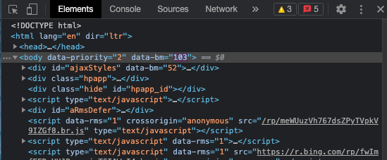
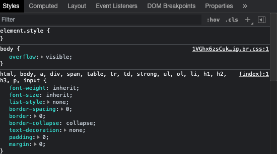
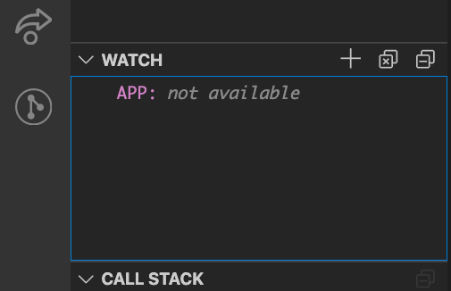
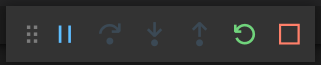

# UI Debugging

## Week 3, Lesson 2

This lesson explains how to debug UI code in the Edge browser (Chromium) and explores several tools in more detail.

## Learning objectives

* TNTs will learn basic UI debugging with Chromium tools
* TNTs will understand how to investigate HTML/CSS changes while debugging 
* TNTs will explore the browser debugging tools for TypeScript/JS and React

## Time required and pace

Total time: 1 hour

- 30 minutes - **Instructional Session**
  - 5 minutes - Debug Overview
  - 55 minutes - Debugging Tool Details

## Session Details

### Source Page

### Chrome Debugger Overview (5 minutes)

The developer tools are best shown in action. For this section we'll look at a browser's console and developer tools.
Open a website and review the panels:

1. **Elements panel** - View and modify the DOM and CSS that is loaded in the browser memory
2. **Console panel** - View messages, errors warnings and info, and run JS commands
3. **Sources panel** - Debug Javascript files via breakpoints, view other source files
4. **Network panel** - View network traffic, HTTP status codes, file types, file size, download times, etc.
5. **Performance** - View performance metrics by recording a page interaction

### Debug CSS: Elements Tool (5 minutes)

### Debug TypeScript/JS: Using VSCode (25 minutes)

1. We're going to look at the JavaScript file that we'll be using for today's demonstrations, and make a tour of the file system.

2. Open any exercise or sample. For the purposes of the exercise, we'll use the ENG2.2 MyTNT app.
   
   1. In the activity bar on the left, click on the 'Debugger' icon, which looks like this like a play button with a small bug on it: 
   
   2. When you first open a folder, you'll need to create a "launch.json" file that stores the configuration info for running the debugger. Luckily VSCode will do this for us, if we click on the link that says "Create a launch.json file", as pictured here:
   
       
   
     - VSCode will show you the launch.json file in the editor - you can close this because we won't edit it directly.
   
   3. After you've created the launch.json file then the debug panel (just to the right of the Activity Bar) will have several options for running your program at the very top of the panel, in a box that has a green play button in it:
   
       
   
   4. Click on the 'down arrow' (or the text in that box - "Launch Chrome" in this case) in that box and it'll give you a menu of options.  For today we're going to use the "Node.js..." option: 
          
   
   5. At this point you should choose the "Run Current File" option:
          
   
   6. If you don't see "Run Current File" (for example, if you're only seeing "JavaScript Debug Terminal") then cancel out of this (you can press the Escape key a bunch) then make sure that you have the HelloWorld.js file open in VSCode, and that it's the file that you're looking at in the editor, and then try adding the "Node.js..." option again.
   7.  If you still don't see it after that definitely ask for help from teammates, the instructor, etc
   
3. Once you've done all of the above 'one time setup' you should be able to run the program.  You can do this by clicking on the green play button in the Debugger panel.  Make sure that you click on the green 'Play' button and NOT on the text next to it!
   

4. Using the area next to the line numbers, add break points to your code.
    
5. Add some variables to your watch.

    
6. See the value of variables. Try putting breakpoints in the constructor and render and see the call order.
7. When your breakpoint has been hit then you have a few actions you can take:
    
    * **Pause/Resume**: Stop and continue debugging
    * **Step Over**: Gives you the ability to "step over" a line of code
    * **Step Into**: Go further into a function call
    * **Step Out**: If you've decided to Step Into a line of code to go back you can Step Out to navigate back to your last line of code
    * **Refresh**: Reloads the debugging session
    * **End/Terminate**: Stops debugging mode, terminates current debug session

### Debug ReactJS: Components and Profiler Tools (10 minutes)

Continue using the examples you were following along with, but open the React Debugging Tools
(You will need to have installed the [React Dev Tools Extension on the Chrome browser](https://chrome.google.com/webstore/detail/react-developer-tools/fmkadmapgofadopljbjfkapdkoienihi?hl=en) )

- The Components tool shows the individual components, their nesting, their properties and state
- The Profiler tool records the browser's execution of the app to identify performance issues. As you add more functionality to the app this becomes more interesting
