# View Component Layout

## Week 3, Lesson 3

This lesson introduces how to create components that can display a variety of data and distribute space dynamically.

## Learning objectives

* TNTs will learn how to layout a table with React using HTML and Bootstrap
* TNTs will understand the basics of Flexbox using Bootstrap
* TNTs will practice experimenting with and troubleshooting CSS in the browser

## Time required and pace

Total time: 1 hour 30 minutes

- 45 minutes - **Instructional Session**
  - 10 minutes - Discussion in groups
  - 5 minutes  - Setup Packages
  - 20 minutes – Layout using Bootstrap Tables and Grid
  - 5 minutes  - Using Fluent UI `<Stack/>` to nest components
  - 5 minutes  - Exercise Setup
- 45 minutes - **Exercise: pair programming**

## Session Details

Components are most useful when their contents are generated on the fly based on the data passed to them. But how can we layout a web page when we don't know what the final content of the page will be? or when the content may continue to change as the user interacts with the page?

Two useful options for working with this kind of dynamic layout are **HTML Tables** and **CSS Flexbox**.

In some UI frameworks, the equivalent may be a layout component such as a `<Stack/>` or `<GridView/>`.

### Session Discussion (5 minutes)

In your team channels, answer the following questions; be prepared to share an insight or example with the class

- Even though the website https://nytimes.com displays as rows and columns, why is it not created as an HTML table? 
- What is a table?
- Can you think of other web examples where they don't use a plain HTML table?
- Hint: look at the web inspector of the websites you are visiting 

### Setting up External Packages (5 minutes)

- For the purposes of this session, we will be installing two libraries to play around with. 
- We will be using Bootstrap and Fluent UI. You may install the correct packages via:
  - `npm install @fluentui/react`
  - `npm install sass` (this is the CSS compiler for bootstrap)
  - `npm install react-bootstrap bootstrap` (we specifically want this version of react-bootstrap bootstrap, other versions may cause issues)

### Layout using React Bootstrap Tables (10 minutes)

React-Bootstrap is an external open-source library. It provides and enables plug-ins for your projects for fast and responsive websites, with the React framework. 

Table is used to display tabular data using four container elements `<table>`, `<thead>`, `<tbody>` and **table rows** `<tr>` along with a two data elements **table header data**  `<th>`,  , and **table data** `<td>`. You can also add a `<caption>`. 

Bring this into your project using `import Table from 'react-bootstrap/Table'`. You also need to do `import bootstrap/dist/css/bootstrap.min.css` in index.js.  

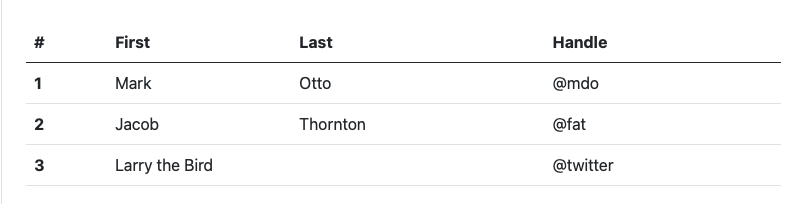

    <Container>
    <Table striped bordered hover>
      <thead>
        <tr>
          <th>#</th>
          <th>First Name</th>
          <th>Last Name</th>
          <th>Username</th>
        </tr>
      </thead>
      <tbody>
        <tr>
          <td>1</td>
          <td>Mark</td>
          <td>Otto</td>
          <td>@mdo</td>
        </tr>
        <tr>
          <td>2</td>
          <td>Jacob</td>
          <td>Thornton</td>
          <td>@fat</td>
        </tr>
        <tr>
          <td>3</td>
          <td colSpan="2">Larry the Bird</td>
          <td>@twitter</td>
        </tr>
      </tbody>
    </Table>
    </Container>

Now that table was basic. What if we spice it up a bit with some real Bootstrap? The following displays the table as in a 'dark mode' style, with the added benefit of highlight over hover.

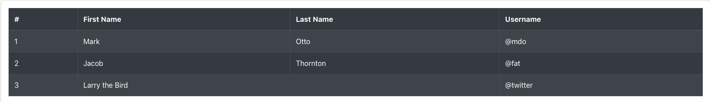

    <Container>
    <Table striped bordered hover variant="dark">
      <thead>
        <tr>
          <th>#</th>
          <th>First Name</th>
          <th>Last Name</th>
          <th>Username</th>
        </tr>
      </thead>
      <tbody>
        <tr>
          <td>1</td>
          <td>Mark</td>
          <td>Otto</td>
          <td>@mdo</td>
        </tr>
        <tr>
          <td>2</td>
          <td>Jacob</td>
          <td>Thornton</td>
          <td>@fat</td>
        </tr>
        <tr>
          <td>3</td>
          <td colSpan="2">Larry the Bird</td>
          <td>@twitter</td>
        </tr>
      </tbody>
    </Table>
    </Container>

### React Bootstrap Layouts (10 minutes)
The React Bootstrap Layout is akin to the CSS Flexbox Layout, which is an efficient way to layout and distribute child items in ANY parent container allowing for each child item to either take up more or less space based on the number of items in the collection and the UI requirements. This means as our screen gets bigger or smaller (think desktop to mobile), the items scale accordingly. Here is a basic example utilizing the `<Col/>` and `<Row/>` components from. Notice that since we didn't specify a specific width, all columns are of equal widths, each taking 4 or 6 "spaces" within the 12 column spaces allowable.

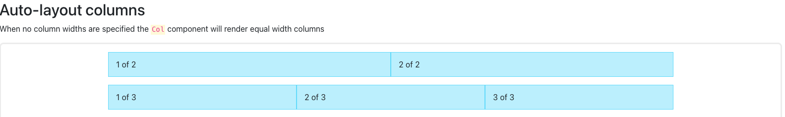

    <Container>
      <Row>
        <Col>1 of 2</Col>
        <Col>2 of 2</Col>
      </Row>
      <Row>
        <Col>1 of 3</Col>
        <Col>2 of 3</Col>
        <Col>3 of 3</Col>
      </Row>
    </Container>

Now let's see it with variable widths:

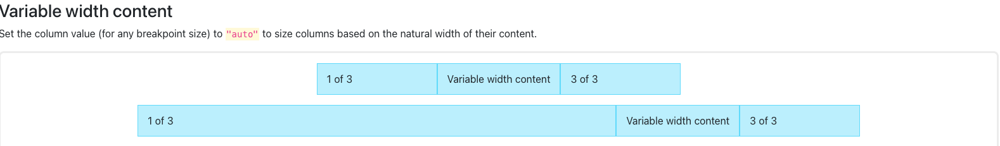

    <Container>
      <Row className="justify-content-md-center">
        <Col xs lg="2">
          1 of 3
        </Col>
        <Col md="auto">Variable width content</Col>
        <Col xs lg="2">
          3 of 3
        </Col>
      </Row>
      <Row>
        <Col>1 of 3</Col>
        <Col md="auto">Variable width content</Col>
        <Col xs lg="2">
          3 of 3
        </Col>
      </Row>
    </Container>
    
    
Finally, here is an example where the sizing scales to the device screen:

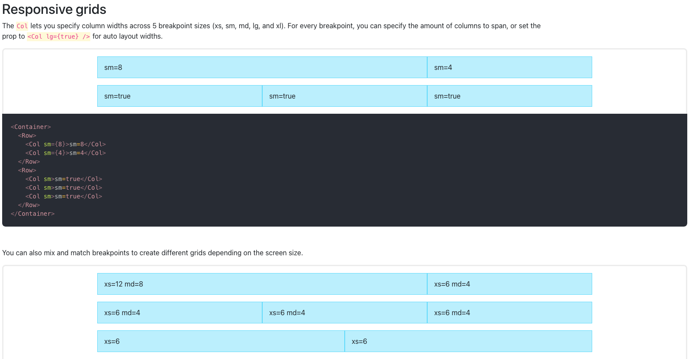

    <Container>
      {/* Stack the columns on mobile by making one full-width and the other half-width */}
      <Row>
        <Col xs={12} md={8}>
          xs=12 md=8
        </Col>
        <Col xs={6} md={4}>
          xs=6 md=4
        </Col>
      </Row>

      {/* Columns start at 50% wide on mobile and bump up to 33.3% wide on desktop */}
      <Row>
        <Col xs={6} md={4}>
          xs=6 md=4
        </Col>
        <Col xs={6} md={4}>
          xs=6 md=4
        </Col>
        <Col xs={6} md={4}>
          xs=6 md=4
        </Col>
      </Row>

      {/* Columns are always 50% wide, on mobile and desktop */}
      <Row>
        <Col xs={6}>xs=6</Col>
        <Col xs={6}>xs=6</Col>
      </Row>
    </Container>

### Fluent UI `<Stack/>`

To begin, ensure that you have downloaded Fluent UI into your project with `npm install @fluentui/react`.

To use any Fluent UI components in a file, type the following as a Javascript import:
  - `import { [name_of_component] } from '@fluentui/react'`
  - Ex: `import { Stack } from '@fluentui/react'`

You can go to [Fluent UI](https://developer.microsoft.com/en-us/fluentui#/) to view the documentation on Fluent UI and play with their examples.

In the case of `<Stack/>`, you can use it to neatly "stack" children components of a parent component. For example:

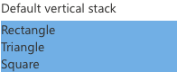

    import { Component } from 'react'
    import { Stack } from '@fluentui/react'
    import { Shape } from 'images/Shape'
    
    class Example extends React.Component {
      constructor(props) {
        super(props)
      }
      
      render() {
        return (
          <>
          

            Default vertical stack
          

            <Stack>
              <Shape type={"rectangle"}/>
              <Shape type={"triangle"}/>
              <Shape type={"square"}/>
            </Stack>
          </>
        )
      }
    }

### Exercise Setup (5 minutes)

1. If you haven't yet, clone the current group project to your machine
2. Identify the components used in the App
3. Using React Bootstrap, implement a Layout Grid using React Bootstrap `<Container/>`, `<Row/>`, and `<Col/>`
4. Inside the grid, implement a React Bootstrap `<Table/>`, akin the project specifications

<!--
# Material Not Used

### Layout using an Bootstrap Grids (10 minutes)

The Bootstrap Grid is akin to the CSS Flexbox Layout, which is an efficient way to layout and distribute child items in ANY parent container allowing for each child item to either take up more or less space based on the number of items in the collection and the UI requirements. This means as our screen gets bigger or smaller (think desktop to mobile), the items scale accordingly. Here is a basic example utilizing the `col` and `row` classes from Bootstrap. Notice that since we didn't specify a specific width, all columns are of equal widths, each taking 4 "spaces" within the 12 column spaces allowable.

To use the original base Bootstrap library, you need to use `npm install sass` and `npm install bootstrap`

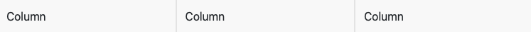

    

      

        

          Column
        

        

          Column
        

        

          Column
        

      

    

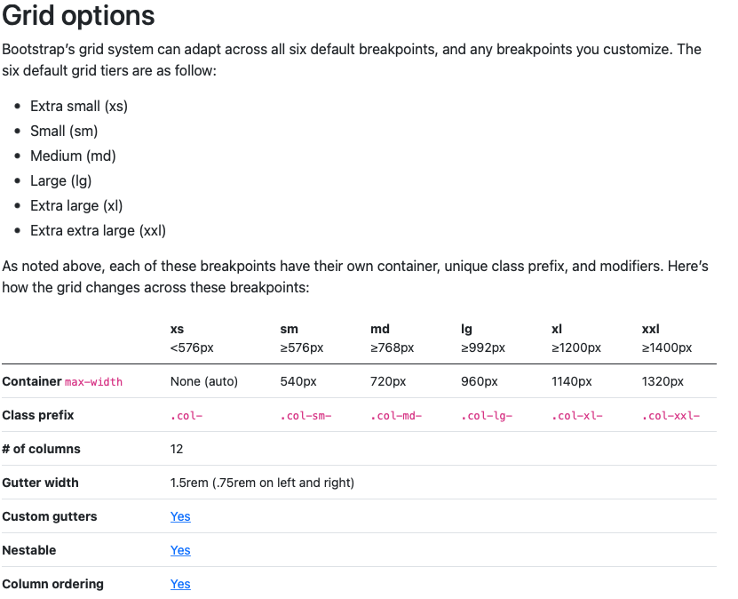

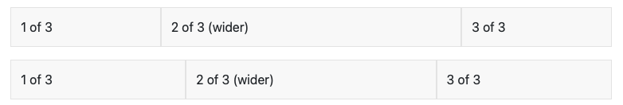

    

      

        

          1 of 3
        

        

          2 of 3 (wider)
        

        

          3 of 3
        

      

      

        

          1 of 3
        

        

          2 of 3 (wider)
        

        

          3 of 3
        

      

    

    
    
    
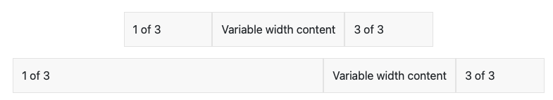

    

      

        

          1 of 3
        

        

          Variable width content
        

        

          3 of 3
        

      

      

        

          1 of 3
        

        

          Variable width content
        

        

          3 of 3
        

      

    

    
    

### Layout using an HTML Table (~8 minutes)

An HTML Table is used to display tabular data using four container elements `<table>`, `<thead>`, `<tbody>` and **table rows** `<tr>` along with a two data elements **table header data**  `<th>`,  , and **table data** `<td>`. You can also add a `<caption>`

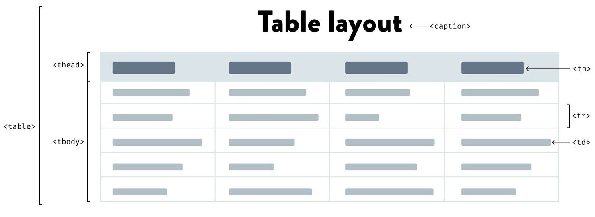

If you look at how these elements are used to create a table, you can see a repeating pattern in the format. From this pattern, we can build a template for a **table component** that can be reused with a variety of dynamic data. For example, below a basic **HTML Table Element** structure

    <table>
        <thead>
        	<tr>
        	  <th>ID</th>
            <th>NAME</th>
            <th>EMAIL</th>
           </tr>
        </thead>
        <tbody>
            <tr>
            		<td>371</td>
                <td>Grace</td>
                <td>grace@email.com</td>
            </tr>
            <tr>
                <td>455</td>
                <td>Angela</td>
                <td>angela@email.com</td>
            </tr>
            ... more rows in the same pattern as above ...
        </tbody>
    </table>

We can convert the basic table element above into a table component using the template below. By passing the component a dataset, say an array of objects like `{id:371, name:Grace, email:grace@email.com}` , the two functions, `headerNames()` and `dataRows()` can be created to generate the table dynamically.

    render() {
        return (
            <table>
                <thead>
                    <tr>{this.headerNames()}</tr>
                </thead>
                <tbody>
                    {this.dataRows()}
                </tbody>
            </table>
        )
    }

### CSS Flexbox layout (~8 minutes)

The Flexbox Layout is an efficient way to layout and distribute child items in ANY parent container allowing for each child item to either take up more or less space based on the number of items in the collection and  the UI requirements.

When configuring a Flexbox layout both the Parent Container and Child Items have properties you set to meet your UI design needs. The five styles below should get your started, but you can review [a more complete view of Flexbox properties](https://css-tricks.com/snippets/css/a-guide-to-flexbox/) for both the Parent Container and Child Items.

#### Parent Container Properties:

1. ***display: flex*** 
   To get started with flex, setting a container&#39;s ***display*** property to ***flex*** allows you to manipulate its children with their flex properties.
2. ***flex-direction*: row || column**  
   The flex direction determines the axis the container is oriented on, horizontal or vertical.
   
3. ***flex-wrap*: wrap || no-wrap** (default)
   Child items will all try to fit on one line. Setting **flex-wrap** to **wrap** allows the items to flow to a new line rather than overflow the view
   
4. ***justify-content*: space-around || space-between || flex-start || flex-end**  
   Sets the alignment of the child items along the main axis
   

#### Child Item Property:

***flex: integer*** 
Setting a child's flex to an integer makes it try to fill as much of the container as possible. If there are multiple children in the container, as is usual, each child will fill an amount of space proportional to its flex.

This means if all the children's flex is set to 1 they will take up an equal amount of space. If a child is set to 2 and the rest are 1, it will take up twice the amount of space.

-->
