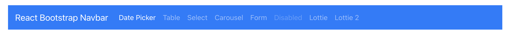
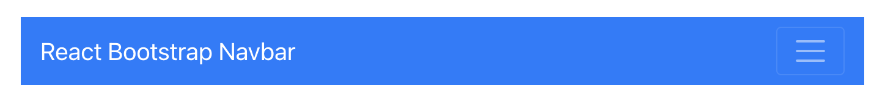
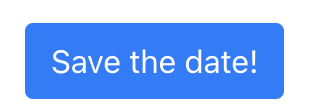
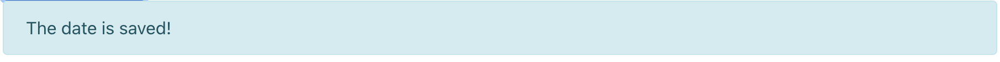
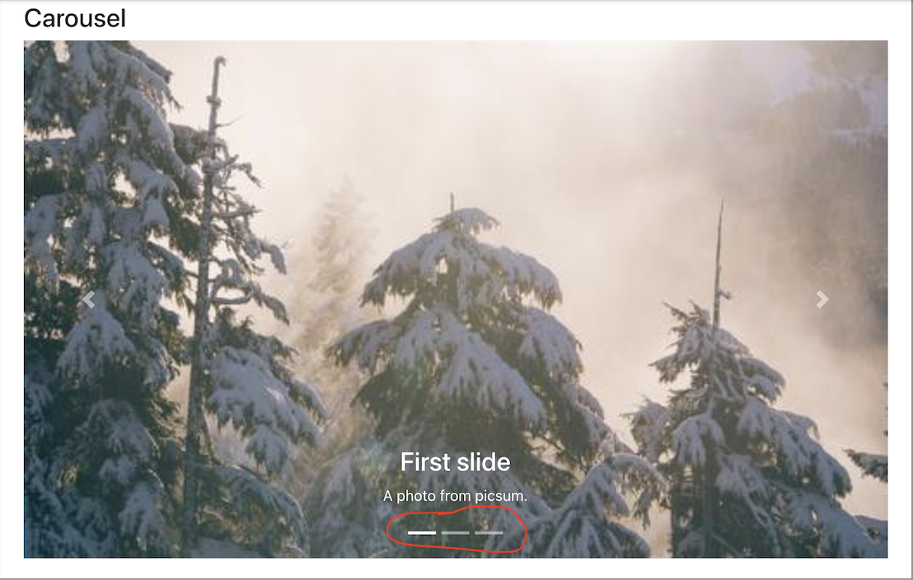
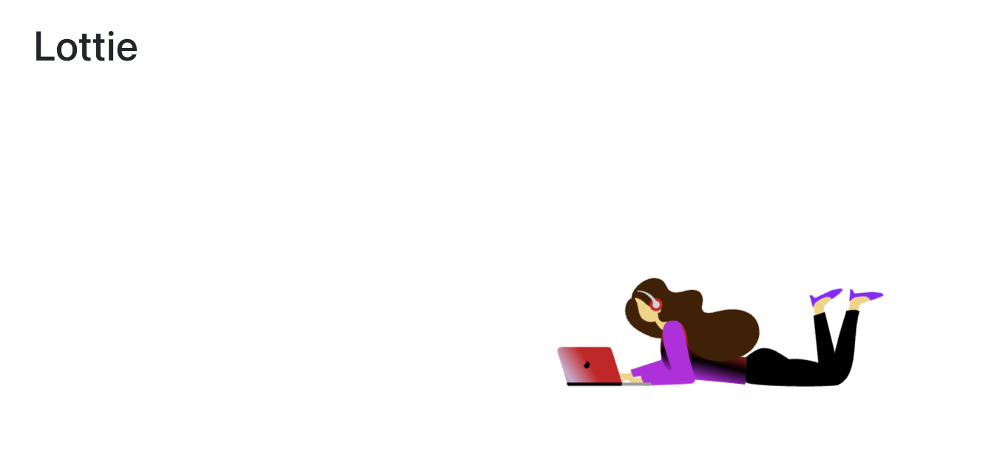

# Bootstrap and Lotties

## Week 3, Lesson 5

## Learning objectives

* TNTs will articulate some of the reasons for using a UI Component Library
* TNTs will be able to install a UI Component Library and use a component in a React project
* TNTs will identify requirements, challenges and resources for integrating library components
* TNT will specifically learn about React-Bootstrap and Lottie

## Time required and pace

* Total time: 1 hour 30 minutes

  - 5 minutes - Resources and choosing a library
  - 10 minutes - React-Bootstrap overview
  - 20 minutes - Going through Bootstrap components
  - 10 minutes - Lottie
  - 45 minutes - Work on YourShare in your team, integrate Bootstrap components and present your work

## Background

* HTML, CSS and JavaScript overview for Web Apps 
* Function components / Class Components
* Adaptive layouts 
* React Hooks

## Resources

### React Bootstrap Resources

* [React-Bootstrap](https://react-bootstrap.github.io/): UI component library based on Bootstrap
* [Bootstrap: Front-end UI toolkit](https://react-bootstrap.github.io/getting-started/introduction)
* Be aware of the different versions of Bootstrap and the difference between Bootstrap and React-Bootstrap

### React Hooks for UI

* [React Hooks](https://reactjs.org/docs/hooks-overview.html) are sometimes used in React UI components

### Other React UI Component Libraries

* [Fluent UI for React](https://developer.microsoft.com/en-us/fluentui#/get-started/web): Microsoft open-source React front-end framework designed to build experiences that fit seamlessly into a broad range of Microsoft products. It provides robust, up-to-date, accessible components which are highly customizable using CSS-in-JS.
* [Material Design](https://material-ui.com): Create a mobile app feel similar to Android
* [Ant Design](https://ant.design): Crisp, geometric design feel; built in Typescript
* [Prime React](https://primefaces.org/primereact/showcase): Over 70 components including a variety of menus, charts, data components, even a color picker

RABBIT HOLE WARNING: Can't find the component that you need in these lists? Checkout out

* [Awesome Components](https://github.com/brillout/awesome-react-components)
* [Awesome React Component Library list](https://github.com/enaqx/awesome-react#react-component-libraries)

### Lottie

* [Lottiefiles.com](https://lottiefiles.com)
* [An example of using Lottie in React](https://lottiefiles.com/blog/working-with-lottie/how-to-use-lottie-in-react-app)
* [Lottie editor](https://edit.lottiefiles.com/)

## Choosing a UI Component Library

There are a large number of React UI component libraries to choose from, each with a different history, focus, strengths and limitations. Some things to look for include:

- **Built for React** - some JavaScript front-end libraries can be used with React, but are not built for React. This can lead to integration issues and challenges with installation
- **Open Source Licensing** - Not all libraries are open source or free to use. Look for MIT Licensing for the most flexibility. Note that some free libraries offer paid support or charge for custom themes.
- **Clearly Supported** - Pay attention to when the library's GitHub repo was last updated; look for clear documentation, well-thought out examples, and sample projects.
- **Responsive, Accessible** - frontend components libraries should include a focus on responsive design (adapting to different screen sizes), and accessibility (adapting to different user abilities).

## React-Bootstrap

### What is React-Bootstrap?

React-Bootstrap is Javascript library. It replaces Bootstrap JavaScript and was built from scratch such as each UI element is a component.

To start with React-Bootstrap, use:

* [Getting started with Bootstrap](https://react-bootstrap.github.io/getting-started/introduction)
* [Explore the existing components](https://react-bootstrap.github.io/components/alerts/)
* Experiment with [Bootstrap class presets](https://hackerthemes.com/bootstrap-cheatsheet/#m-1)
* Use the [Component Sandbox](https://codesandbox.io/s/sharp-snow-v1j90?file=/src/App.js) 

### Exercise

Pick and choose a component from [here](https://react-bootstrap.github.io/components/alerts/) and look at how to use it. Explore the API.

### Demo Code

[Sample code for Bootstrap React UI Components demo](https://github.com/tnt-summer-academy/Samples/tree/main/Week_3/react-bootstrap-javascript)

### Installation 

* Install react-bootstrap using `npm install react-bootstrap bootstrap@4.6.0`. We will use Bootstrap 4.6.0.
* Install Holder.js `npm install holderjs`. We will use [holder.js](http://holderjs.com/) to render image placeholders entirely in the browser. Placeholders can have custom colors, fonts, resizing behavior, and rendering engine (Canvas/SVG).
* Install react-router-dom `npm install react-router-dom` to run our demo example as it uses React Router.
* The example uses sample pictures from https://picsum.photos.  

### Imports

* Bootstrap styling needs to be imported.

In `index.js`, import Bootstrap style:

```
import "bootstrap/dist/css/bootstrap.min.css";
```

* In `index.js`, import Holder.js:

```
import "holderjs";
```

* To import a React-Bootstrap component, import it from `react-bootstrap`. For example, to use a Button and Image use:

```
import { Button } from 'react-bootstrap';
import { Image } from 'react-bootstrap';
```

* To import an Image that is called `myimage.png` saved in a directory `images`, use: 

```
import { Image } from 'react-bootstrap';
import myimage from "../images/myimage.png";
```

Be sure to check the path! Lots of missing images come from errors in the path.

### Looking at some components

#### Navbar and Nav

Navbar is a powerful, responsive navigation header. It includes support for branding, navigation, and more.

The Navbar below uses a primary-themed navbar that is at the top of the page and automatically collapses at the lg (large) breakpoint. `expand` needs to be set for the Navbar to collapse at all. The Navbar also uses a dark background colors.

Nav is shared by all navigation tabs. Each navigation tab is a Nav.Item that contains a Nav.Link. The base Nav component is built with flexbox.


```
              import { Navbar, Nav } from "react-bootstrap";
              ...              
              <Navbar bg="primary" variant="dark" expand="lg" sticky="top">
                <Navbar.Brand href="#home">React Bootstrap Navbar</Navbar.Brand>
                <Navbar.Toggle aria-controls="basic-navbar-nav" />
                <Navbar.Collapse id="basic-navbar-nav">
                  <Nav className="mr-auto">
                    <Nav.Item>
                      <Nav.Link href="/">Date Picker</Nav.Link>
                    </Nav.Item>
                    <Nav.Item>
                      <Nav.Link href="/BootstrapTable">Table</Nav.Link>
                    </Nav.Item>
                    <Nav.Item>
                      <Nav.Link href="/BootstrapSelect">Select</Nav.Link>
                    </Nav.Item>
                    <Nav.Item>
                      <Nav.Link href="/BootstrapCarousel">Carousel</Nav.Link>
                    </Nav.Item>
                    <Nav.Item>
                      <Nav.Link href="/BootstrapForm">Form</Nav.Link>
                    </Nav.Item>
                    <Nav.Item>
                      <Nav.Link href="/BootstrapComment">Comment</Nav.Link>
                    </Nav.Item>
                    <Nav.Item>
                      <Nav.Link href="/BootstrapChart">Chart</Nav.Link>
                    </Nav.Item>
                    <Nav.Item>
                      <Nav.Link href="/Nowhere" disabled>Disabled</Nav.Link>
                    </Nav.Item>
                    <Nav.Item>
                      <Nav.Link href="/LottieAnimation">Lottie</Nav.Link>
                    </Nav.Item>
                  </Nav>
                </Navbar.Collapse>
              </Navbar>
```

Larger screens



Smaller screens



#### Button

`variant` is used to style a button.

```
import { Button } from "react-bootstrap";
...
<Button variant="primary" onClick={this.saveDate}>Save the date!</Button>
```



Other examples:

```
  <Button variant="primary">Primary</Button>
  <Button variant="secondary">Secondary</Button>
  <Button variant="success">Success</Button>
  <Button variant="warning">Warning</Button>
  <Button variant="danger">Danger</Button> 
  <Button variant="info">Info</Button>
  <Button variant="light">Light</Button> <Button variant="dark">Dark</Button>
  <Button variant="link">Link</Button>
```

#### Alert

AlertsProvide contextual feedback messages for typical user actions with the handful of available and flexible alert messages.

```
import { Alert } from 'react-bootstrap';
...
< Alert variant="info">
   The date is saved!
</Alert >
```


#### Image

```
import { Image } from 'react-bootstrap';
import myimage from "../images/myimage.png";
...
<Image src={myimage} className="border border-primary" roundedCircle />
```


#### Carousel

Be aware that carousels don’t automatically normalize slide dimensions. As such, you may need to use additional utilities or custom styles to appropriately size content.

Be sure that `import "holderjs";` is in `index.js` as this particular example uses placeholder images.

```
import { Carousel } from 'react-bootstrap';
...
               <Carousel>
                    <Carousel.Item>
                        
                        <Carousel.Caption>
                            <h3>First slide</h3>
                            <p>Nulla vitae elit libero, a pharetra augue mollis interdum.</p>
                        </Carousel.Caption>
                    </Carousel.Item>
                    <Carousel.Item>
                        
                        <Carousel.Caption>
                            <h3>Second slide label</h3>
                            <p>Lorem ipsum dolor sit amet, consectetur adipiscing elit.</p>
                        </Carousel.Caption>
                    </Carousel.Item>
                    <Carousel.Item>
                        

                        <Carousel.Caption>
                            <h3>Third slide label</h3>
                            <p>Praesent commodo cursus magna, vel scelerisque nisl consectetur.</p>
                        </Carousel.Caption>
                    </Carousel.Item>
                </Carousel>
```

A nice tutorial is available [here](https://www.freakyjolly.com/react-bootstrap-carousel-example-tutorial/).



## Lottie

### What is a Lottie?

A Lottie is a JSON-based animation file format enabled for any platform - Android, iOS, web etc. It is a small file that works on different devices and scale easily.

Lottie was developed by Airbnb. The top 500 apps on the App Store use Lottie to engage users and enhance conversations. It is 600% smaller than gif and 10x faster to ship.

### Demo Code

[Sample code for Bootstrap React UI Components demo](https://github.com/tnt-summer-academy/Samples/tree/main/Week_3/react-bootstrap-javascript)

### How to use a lottie?

Install the library using `npm install --save react-lottie`. A dependency concerning `react-lottie` should be present in `package.json`.

Select an animation from [LottieFiles](https://lottiefiles.com). For example, [musicalgal](https://lottiefiles.com/67962-music-gal#).

In your React project, create a directory to store your Lottie animations (let's say `animations`) and create a JSON file with your Lottie (for example `musicalgal.json`).

To use your lottie, you need to import the `react-lottie` player component and the lottie JSON file.

```
import Lottie from "react-lottie";
import musicgalimg from '../animations/musicgal';
```

To integrate the Lottie, create a component to render it. Here is an example for [musicalgal](https://lottiefiles.com/67962-music-gal#). The options to display the Lottie are as follows:

* animationData: Object with the exported animation data
* loop: Repetition of the animation: true / false / number
* autoplay: Auto-plays when the player is ready (true / false)
* name: Animation name for future reference
* renderer: 'svg' / 'canvas' / 'html' to set the renderer
* container: Dom element on which to render the animation

More infos on the options are available [here](https://github.com/airbnb/lottie-web).

```

import React from 'react';
import Lottie from "react-lottie";
import animationData from '../animations/musicgal';

const LottieAnimation = (props) => {

    const defaultOptions = {
        loop : true,
        autoplay : true,
        animationData : animationData,
        rendererSettings: {
            preserveAspectRation : "xMidYMid slice"
        }
    }

    return (
        <div>
            <h3>Lottie</h3>
            <br></br>
            <Lottie options={defaultOptions} height={300} width={300}
        />
        </div>
    )
}

export default LottieAnimation;
```



You can edit lotties in the [editor](https://lottiefiles.com/editor).

## Your turn

Apply what you learned on the YourShare project. Each team member enhanced the screen she/he is responsible of with Bootstrap components and Lottie elements. 


