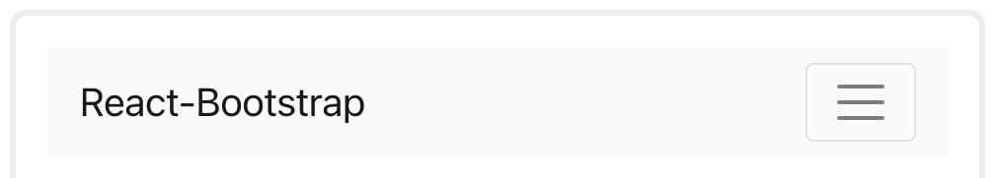

# React Router

## Week 3, Lesson 3

React router is a library that allows you to handle routes in a web app, using dynamic routing. Dynamic routing takes place as the app is rendering on your machine.

React router implements a component-based approach to routing. It provides different routing components according to the needs of the application and platform.

There are three primary categories of components in React Router:

* routers, like `<BrowserRouter>`, and `<HashRouter>`
* navigation, like `<Link>`, `<NavLink>`, and `<Redirect>`
* route matchers, like `<Route>`, and `<Switch>`


## Learning objectives

* TNTs will learn how to do simple, multi-page navigation in React using React Router
* TNTs will be able to easily add links after designing the webpage
* TNTs will explore Adaptive Layouts for Navigation UI Design of React apps

## Time required and pace

* [20 Minutes]: Explain React Router different components
* [30 Minutes]: Explore and Create a simple multiPage navigation using react-router-Dom (Example 1)
* [30 Minutes]: Explore React Router: How to do simple, multi-page navigation in React with React router and BootStrap Navbar
* [1 hour] - Exercise: Start coding up the page navigation
  
## References

1. [React Router quick Start](https://reactrouter.com/web/guides/quick-start)
2. [Using hooks with react router](https://blog.logrocket.com/using-hooks-with-react-router/)
3. [Browser Router Vs. Hash Route](https://medium.com/@daniel.hramkov/browserrouter-vs-hashrouter-e8bf1c3824ce)
4. [Bootstrap Navbar](https://react-bootstrap.github.io/components/navbar/)
5. [Bootstrap Form](https://react-bootstrap.github.io/components/forms/)

## Session Setup

* [ ] First, install create-react-app and make a new project with it. ```npx create-react-app demo-app```
* [ ] Install React Router from the public npm registry with either `npm or yarn`. Since we’re building a web app, we’ll use react-router-dom
```npm install react-router-dom@5.3.3``` We are using 5.3.3 version.

### Example 1

In this small example we will build an app that have 3 “pages” handled by the router: a home page, an about page, and a users page. As you click around on the different `<Link>s`, the router renders the matching `<Route>`.

React router gives us three components [Route,Link,BrowserRouter] which help us to implement the routing.

```JSX
import { BrowserRouter as Router , Route, Switch, Link} from "react-router-dom" 
```

* **`<BrowserRouter>` tags**: Set up your app to work with React Router by wrapping the app in `<BrowserRouter>` element.We refer to it here as `<Router>`. Everything that gets rendered goes inside the `<BrowserRouter>` element tag.

Note: Behind the scenes a `<Link>` renders an `<a>` with a real href, so people using the keyboard for navigation or screen readers will still be able to use this app.

***Let’s implement the routing.***

In the Route component, we need to pass the two props

* path: it means we need to specify the path.
* component: which component user needs to see when they will navigate to that path.

```JSX
In App.js

<Router>
    <Route component={Home} exact path="/" />
    <Route component={About} path="/about" />
    <Route component={Users} path="/users" />
</Router>
```

Alternative way

```JSX
<Router>
   <Route exact path="/">
        <Home />
    </Route> 
    <Route path="/about">
        <About />
    </Route>
    <Route path="/users">
        <Users />
    </Route>    
</Router>
```

We will also add simple 3 function components one for each page to App.js

```JSX
In APP.js

//Home Page function Component
function Home() {
  return <h2>Home</h2>;
}

//About Page function Component
function About() {
  return <h2>About</h2>;
}

//User Page function Component
function Users() {
  return <h2>Users</h2>;
}
```

Now if you enter manually localhost:3000/users you will see *Users* component is rendered.

But still, *Home* component is also rendered in the screen this happens because of our home path is ’/’ and users path is ‘/users’ **slash** is same in both paths so that it renders the both components to stop this behavior we need to use the `exact prop`.

***Adding Navigation using Link component***
React Router provides a `<Link>` component to create links in your application. Wherever you render a `<Link>`, an anchor `(<a>)` will be rendered in your HTML document.
So it provides declarative, accessible navigation around your application.

Normally we use the Link component from react-router-dom as shown below:

```JSX
<Link to="/About">About</Link>
```

After adding navigation you will see the routes are rendered on the screen. if you click on the users you will see url is changing and Users component is rendered.

```JSX
<ul>
    <li>
        <Link to="/">Home</Link>
    </li>
    <li>
        <Link to="/about">About</Link>
    </li>
    <li>
        <Link to="/users">Users</Link>
    </li>
</ul>
```

***Route Matchers: Adding a Switch component***

A `<Switch>` looks through its children `<Route>s` and renders the first one that matches the current URL when path matches otherwise it fallbacks to the not found component..

```JSX
<Router>
  <Switch>
    <Route exact path="/">
            <Home />
        </Route> 
        <Route path="/about">
            <About />
        </Route>
        <Route path="/users">
            <Users />
        </Route>
        <Route>
            <PageNotFound />
        </Route>
  </Switch>
</Router>
```

We'll need to define the `PageNotFound` component, too:

```JSX
function PageNotFound() {
  return <h2>Page not found!</h2>;
}
```

Still in our index.js file, we are going to wrap our App component with the Router component.

```JSX
In index.js

React.DOM.render(
    <Router>
        <App/>
    </Router>,
    document.getElementById('root')
);
```

## Route Components props

The Route components have three route props

* [match](https://reactrouter.com/web/api/match): A match object contains information about how a `<Route path>` matched the URL. match objects contain the following properties:

  * params - (object) Key/value pairs parsed from the URL corresponding to the dynamic segments of the path
  * isExact - (boolean) true if the entire URL was matched (no trailing characters)
  * path - (string) The path pattern used to match. Useful for building nested `<Route>s`
  * url - (string) The matched portion of the URL. Useful for building nested `<Link>s`
* [location](https://reactrouter.com/web/api/location): Locations represent where the app is now, where you want it to go, or even where it was.
* [history](https://reactrouter.com/web/api/history): history objects typically have the following properties and methods:
  * length - (number) The number of entries in the history stack
  * action - (string) The current action (PUSH, REPLACE, or POP)
  * location - (object) The current location. May have the following properties:
    * pathname - (string) The path of the URL
    * search - (string) The URL query string
    * hash - (string) The URL hash fragment
    * state - (object) location-specific state that was provided to e.g. push(path, state) when this location was pushed onto the stack. Only available in browser and memory history.
  * push(path, [state]) - (function) Pushes a new entry onto the history stack
  * replace(path, [state]) - (function) Replaces the current entry on the history stack
  * go(n) - (function) Moves the pointer in the history stack by n entries
  * goBack() - (function) Equivalent to go(-1)
  * goForward() - (function) Equivalent to go(1)
  * block(prompt) - (function) Prevents navigation (see the history docs)

### Example 2: Create a BootStrap Navbar with React Router

Unless you are some CSS guru, you could end up spending countless hours tinkering around to make your NavBar responsive across different devices. One quick solution that I have found very effective is the use of the front-end framework React Bootstrap. In the next example, we will show you how I took advantage of this framework when building web apps.

We are going to create a `AppRouter.js` file where we are going to create a Navigation component.
First we need to make sure to add react-bootstrap to the project node modules.

```JSX
npm install react-bootstrap bootstrap@4.6.0
```

### React Navbar

A powerful, responsive navigation header, the navbar. Includes support for branding, navigation, and more

Here’s what you need to know before getting started with the Navbar:

* Use the `expand` prop to allow for collapsing the Navbar at lower breakpoints.
* `Navbars` and their contents are fluid by default. Use optional containers to limit their horizontal width.
* Use spacing and flex utilities to size and position content
* A responsive navigation header, including support for branding, navigation, and more. Here’s an example of all the sub-components included in a responsive light-themed navbar that automatically collapses at the lg (large) breakpoint.

```JSX
<Navbar bg="light" expand="lg">
  <Navbar.Brand href="#home">React-Bootstrap</Navbar.Brand>
  <Navbar.Toggle aria-controls="basic-navbar-nav" />
  <Navbar.Collapse id="basic-navbar-nav">
    <Nav className="mr-auto">
      <Nav.Link href="#home">Home</Nav.Link>
      <Nav.Link href="#link">Link</Nav.Link>
      <NavDropdown title="Dropdown" id="basic-nav-dropdown">
        <NavDropdown.Item href="#action/3.1">Action</NavDropdown.Item>
        <NavDropdown.Item href="#action/3.2">Another action</NavDropdown.Item>
        <NavDropdown.Item href="#action/3.3">Something</NavDropdown.Item>
        <NavDropdown.Divider />
        <NavDropdown.Item href="#action/3.4">Separated link</NavDropdown.Item>
      </NavDropdown>
    </Nav>
  </Navbar.Collapse>
</Navbar>
```

Now let’s talk a little bit about the components and some of the key props we used here. The Nav and Nav.Link components are pretty straight forward. The `Navbar.Toggle`, and `Navbar.Collapse` components that we wrapped around our Nav component, will collapse and expand our Nav content behind a button, when we are viewing the page in a small screen. 

<table style="border: none">
    <tr align="center">
        <td> </td>

</tr>
</table>

In our Navbar component, the fixed=’top’ prop will position our NavBar affixed at the very top and make it scroll with the page. The `collapseOnSelect` prop *will make the Navbar collapse automatically once the user selects an item from our Nav list (when the page is being viewed in a small screen).*

With the Navigation component all configured, we can import it and have it rendered by our App component.

In your `AppRouter.js` file, we’ll need to import the `Navbar, Nav, and Container` components form our `React Bootstrap library`.

Then we’ll use these components in the return statement of our Navigation component.

```JSX
In AppRouter.js
import { Navbar, Nav, Container } 
from 'react-bootstrap';
```

### Setup a 404 Page in your Router

#### What is a 404 page?

A 404 page is also called not found page it means when a user navigates to the wrong path that doesn’t present in the website we need to show the not found page.

let’s create a Not found component.

```JSX

NotFound.js

import React from "react";
import errorPage from "../Images/errorPage.jpeg";
import "../App.css";

const NotFound = () => (
  <div>
    <h2>404 error: Page not found</h2>
    <div>
      
    </div>
  </div>
);
export {NotFound};
```

```JSX
AppRouter.js

 <Switch>
    <Route component={Home} exact path="/" />
    <Route component={UserForm} path="/UserForm" />
    <Route component={Details} path="/details" />
    <Route component={PandaPic} path="/Panda" />
    <Route component={SeaTurtle} path="/SeeTurtle" />
    <Route component={NotFound} />
  </Switch>
```

Let’s check it now by manually entering wrong path localhost:3000/posts.

### Pass additional data while redirecting to a route in React

Normally we use the Link component from react-router-dom as shown below:

```JSX
<Link to="/register">Register</Link>
```

So when we click on the Register link, it will redirect to the /register route, but Link also allows us to pass additional data while redirecting.

```JSX
<Link to={{ 
 pathname: "/register", 
 state: data_you_need_to_pass 
}}>
 Register
</Link>
```

Here, at the place of data_you_need_to_pass, we can pass a string or object, array etc. and in the `/register` route we will get that data in `props.location.state`.
Instead of naming the variable as state, we can use any name but it’s generally called state.

***Using history.push***
Normally, to redirect using the push method, we use it like this:

```JSX
props.history.push('/register');
```

If you need to do some processing before sending the data like removing some values or to trim the values, we can call a handler on submit button click and pass data as shown below

```JSX
props.history.push({ 
 pathname: '/register',
 state: data_you_need_to_pass
});
```

### <NAVLINK> Navigation (or Route Changers)<Redirect>

* React Router provides a `<Link>` component to create links in your application. Wherever you render a `<Link>`, an anchor `(<a>)` will be rendered in your HTML document.`<Link to="/">Home</Link>`
// <a href="/">Home</a>

* The `<NavLink>` is a special type of `<Link>` that can style itself as “active” when its to prop matches the current location.
  
``` JSX

<NavLink to="/react" activeClassName="hurray">
React
</NavLink>
```

When the URL is /react, this renders:
`<a href="/react" className="hurray">React</a>`

 When it's something else:
`<a href="/react">React</a>`

Any time that you want to force navigation, you can render a `<Redirect>`. When a `<Redirect>` renders, it will navigate using its to prop.`<Redirect to="/login" />`

### *Now let's put all together and check our Full Code example [here](https://github.com/tnt-summer-academy/Exercises/tree/main/Week_3/react-router-javaScript)*

## Exercise [1 hour]

Now that you’ve explored React Router and it’s capabilities, it’s time to start building your own React applications.
In your small group of  five persons. Apply what you've learned today and complete the Navigation for yourShare app using React Router.

## Stretch

In your small group discuss the code in [this example](https://reactrouter.com/web/example/auth-workflow) and see how it can be useful to your prototype app.
