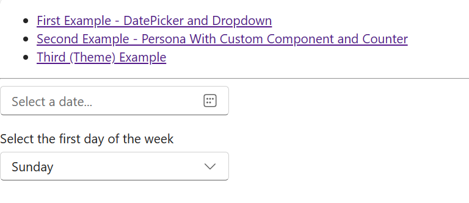
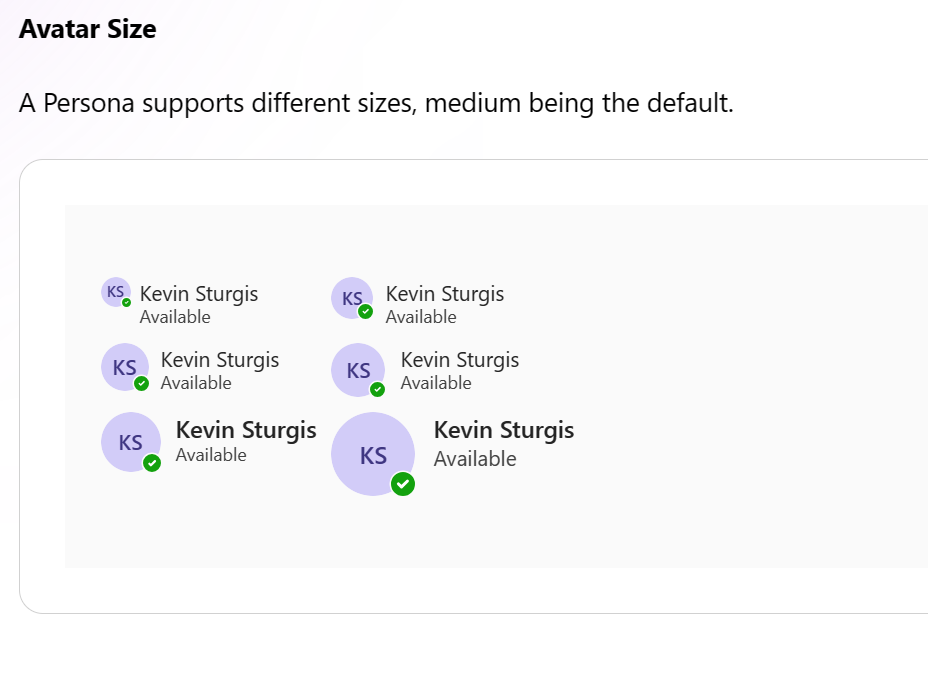
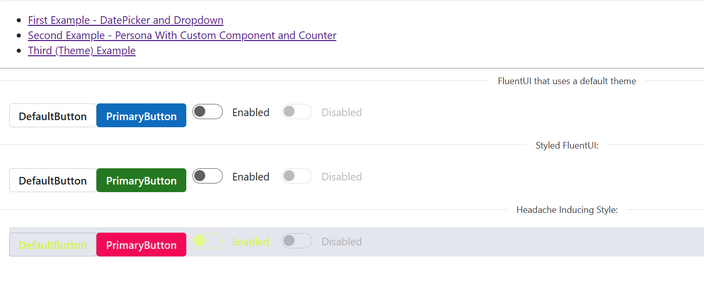

# Component Libraries, FluentUI

## Week 4, Lesson 1

This lesson provides an overview of component libraries (specifically Fluent UI), including both how to use FluentUI and tips on reading documentation about component libraries

## Learning objectives

- TNTs will understand what component libraries are
- TNTs will write code that demonstrates how to import component libraries into their project, and how to utilize existing components/controls/widgets in their existing project
- TNTs will write code that demonstrates how to create and use new, custom components in their existing project

## Time required and pace

- 60 minutes - Session:
  - 5 minutes – what are component libraries
  - 5 minutes - how to read documentation
  - 10 minutes – tour of the sample app, including how to react to user input
  - 5 minutes - styling FluentUI components with the Theme Designer
  - 10 minutes – using components inside your components

## Links to the app for this lesson

- [Demo of Data Picker, Persona and Theme in FluentUI](Samples/component-library-fluent/)
- The app will have a menu like depicted on the screenshot below



# Session

## What are component libraries?

A component library is a collection of components installed generally through a package manager that provides common solutions whether it's a UI library, testing library, etc.

Why use a component library?

- Prebuilt out of the box solutions
- Increase speed of delivery
- Customization of an application
- Allows focus on core application competencies vs boilerplate features

Things to consider before using a component library

- Components may become outdated as other technologies advance
- Consider the popularity and community activity for the component library
- Ease of use generally through an API defined by the component library
- Tradeoffs between speed, customization time, cost and immediate business needs

For a component library you're going to want to focus on how to find, figure out, and add components to your program. We'll go through an example.

## How to read documentation?

We will use Microsoft's Fluent UI to practice using a component library. Let's look at documentation for [DatePicker](https://react.fluentui.dev/?path=/docs/compat-components-datepicker--default), which we'll use in our first example (below).

- Oftentimes you can find a 'gallery' that shows off a lot of the components in one place, and is a great way to find what sort of component will be most useful for you
- Most (if not all) libraries will contain a "How to" section to quickly get started but may not include details on how to use all the components. This is a good place to start - it'll give you an overview of how the library works, and set you up with further reading based on what you're interested in
- Another important thing to look for in reading documentation are code examples or demos, many of which can be copy-and-pasted. Nowadays it's also pretty common to have online demonstrations of the code that you can edit & experiment with in your browser. These are great for trying out the specific features you're looking for, before trying to integrate this into your overall app.
- For FluentUI docs they show you a bunch of examples and then show you an 'interface', which is a list of methods, properties, and variables that you can use to customize the component (and/or to respond to user input, etc.)

(There's [a lot of documentation for the FluentUI library](https://react.fluentui.dev/?path=/docs/concepts-introduction--page) if you'd like to look for other components, learn more about how to use Fluent, etc.)

## Installing/Using Fluent UI

Using an existing project in the terminal use `npm` to install the component library:

    npm install @fluentui/react-components

## First Example: Adding Code From The Docs Into Your App

Adding a DatePicker to your App.js and responding when the user changes the first day of the week to present the DatePicker


- Looking over the docs for the [DatePicker](https://developer.microsoft.com/en-us/fluentui#/controls/web/datepicker), you can see that there's a lot of examples. We're going to look at the first example they give, and try and add it into our program.
- Notice that there's both an option to "Export To CodePen" (to immediately try this out online, in your browser) and there's a tab for 'Code'. Definitely try out both - here we're going to go directly to the 'Code' tab.
- You'll notice that the code is _almost_ JavaScript - it's actually in TypeScript, which we'll need to convert.

### TypeScript to JavaScript conversion

There may be useful tools to help with this (such as [this one](https://extendsclass.com/JavaScript-to-javascript.html)), but they tend to produce hard-to-read code, and that particular one doesn't work with JSX.

It's not that hard to manually convert the TypeScript into JavaScript yourself - fundamentally, you paste the code into a .JS file in VSCode, and then delete anything that's underlined in red squiggles that you don't recognize as being part of JS.

Some examples:

- Delete any interfaces (they look like classes, but use the word interface instead of class)
- Remove anything that follows the "`: <DataType>`" pattern
- Remove the return value from functions ( `-> <DataType>` )
- Remove anything between pointy brackets - < >
- Remove the words public or private
- Remove types
- Delete anything else that VSCode underlines in red squiggles :)

Idea - try to recreate the FirstExample by copy-and-pasting the code into the bottom of the file, deleting the stuff we don't need, converting TypeScript into JavaScript, and then pasting the component into our .JS file.

Highlight how to respond to user input

The demo code for this session is available [here](./Samples/component-library-fluent/src/).

### Examine demo code

Some things to pay particular attention to:

1. Importing the component at the top of your file makes a specific user-interface component/control/widget available for use in this file. Note that if you want to use other things (like Buttons, Checkboxes, lists, etc) you'll need to add them to this list too

   ```
   import { Dropdown, Option, makeStyles } from "@fluentui/react-components";
   import { DatePicker } from "@fluentui/react-datepicker-compat";
   import { DayOfWeek } from "@fluentui/react-calendar-compat";
   ```

Note: Most components you'll use will be from @fluentui/react-components, though there are a few other imports you can use.

1. You actually put the two components (DatePicker and DropDown) on the page with these lines:

   ```jsx
   <DatePicker
     firstDayOfWeek={firstDayOfWeek}
     placeholder="Select a date..."
     ariaLabel="Select a date"
   />
   ```

   ```jsx
   <Dropdown
     id="dropdownId"
     defaultValue={"Sunday"}
     defaultSelectedOptions={[DayOfWeek.Sunday]}
     onOptionSelect={onDropdownChange}
   >
     {days.map((day) => (
       <Option value={day.key}>{day.text}</Option>
     ))}
   </Dropdown>
   ```

### Reflect on demo code, read the docs

[Skim through the docs to get a feel for what sort of widgets are available](https://react.fluentui.dev/?path=/docs/components-accordion--default). If you want to search online for more resources it can be useful to search for "FluentUI _gallery_" or "FluentUI _screenshots_"

## Second Example: Personas, Creating A Custom Component, and Responding to User Input

For this example we're going to use makeStyles to show a vertical list of [Personas](https://react.fluentui.dev/?path=/docs/components-persona--default).



Note that this time we're going to create our own, custom component (the `PersonaWithClickCounter`). A `PersonaWithClickCounter` is called the following way:

```jsx
<PersonaWithClickCounter
  imageUrl="https://www.bing.com/th?id=OIP.kqk76MIGNb-kPWlnTk8bHQHaJq&w=76&h=106&c=8&rs=1&qlt=90&o=6&pid=3.1&rm=2"
  text="Harry Potter"
  secondaryText="The Boy Who Lived"
/>
```

The custom component is described using the `Persona` component of FluentUI. It also has event handling (via the onClick handler).

```jsx
<Persona
  avatar={{ image: { src: props.imageUrl } }}
  size="large"
  name={props.text}
  secondaryText={
    props.secondaryText +
    " | You clicked this " +
    clickCount.toString() +
    " times!"
  }
  onClick={increaseCounter}
/>
```


A couple of notes on the code:

1. We'll set up the initial state in the constructor for `PersonaWithClickCounter`:

```javascript
const [clickCount, setClickCount] = React.useState(0);
```

1. The actual method (function) that gets called is this one. Note that it must go "inside" the class:

   ```jsx
   const increaseCounter = () => {
     console.log("clickCount is: " + clickCount);
     setClickCount(clickCount + 1);
   };
   ```

1. Having defined the method that we _want_ to run is great, but doesn't tell JavaScript to connect that method to any particular action in our component. This line will tell JavaScript that when the component is clicked it should run that method:

   ```
   onClick={increaseCounter}
   ```


## Third example: Styling Your FluentUI Components With Your Own Theme

The fluent documentation has a [theme designer](https://react.fluentui.dev/?path=/docs/themedesigner--page). Once you're done adjusting the settings there's an 'Export' button in the top-right. Export this to code and you can copy-and-paste that into your file.

Don't forget to wrap the JSX in a `<FluentProvider>` (also part of the `@fluentui/react-components` library) - you can give it the `myTheme` variable that the theme designer exported to code.

There are two ways to create the theme from what the theme designer exported, see ThemeExample for both ways.

The components of FluentUI are called within the `<FluentProvider>` component and styled with 'myTheme`.

```javascript
<FluentProvider theme={newTheme}>
  <Button>DefaultButton</Button>
  <Button appearance="primary"> PrimaryButton </Button>
  <Switch label="Enabled" />
  <Switch label="Disabled" disabled={true} />
</FluentProvider>
```


