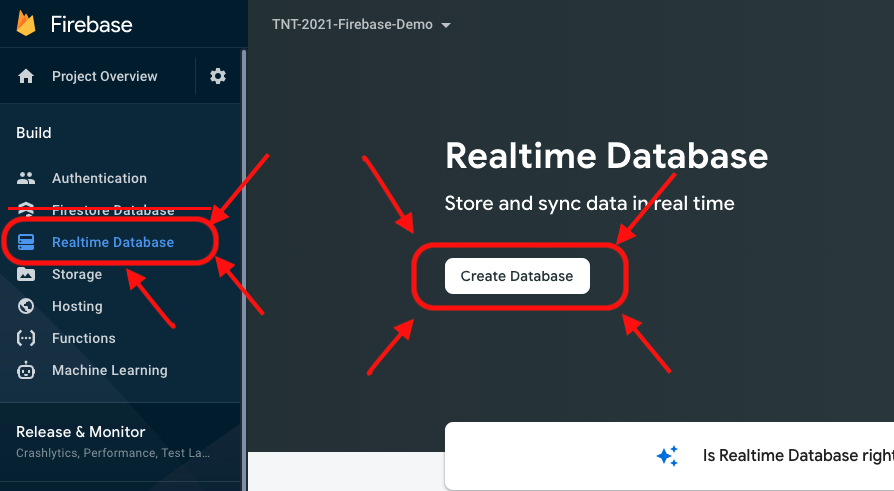
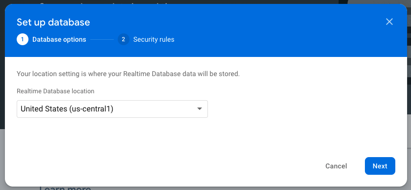
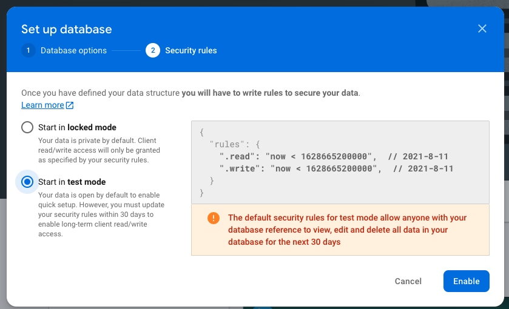
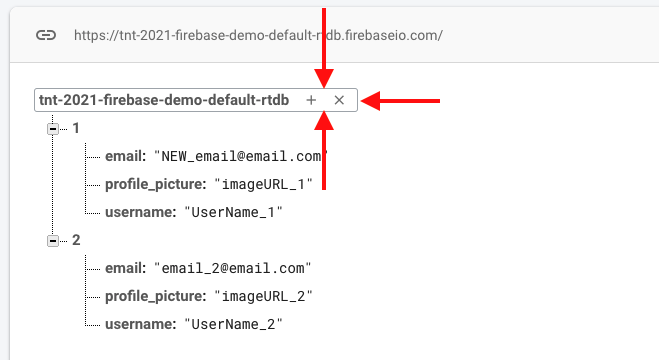
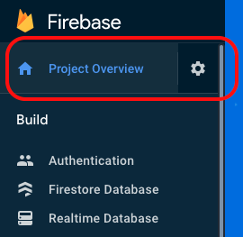
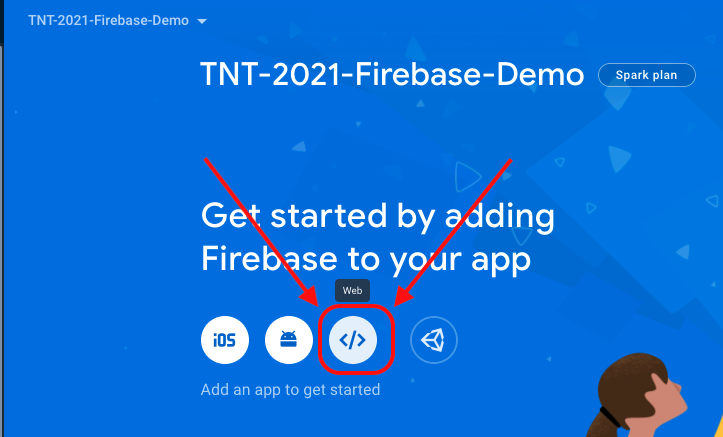
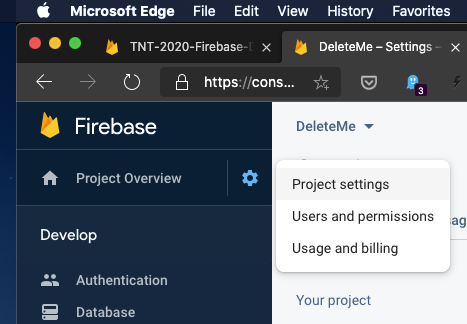

# Using Firebase In A React App

## Learning objectives

* TNTs will understand what a document-oriented database is (e.g., Cosmos DB, MongoDB, Firebase)
* TNTs will be able to create a new 'app' in Firebase
* TNTs will be able to create, read, update, and delete information in their Firebase database using the Firebase website
* TNTs will be able to access their Firebase database programmatically, including the normal CRUD operations

## Instructional session (60 minutes)

### Lesson Overview

1. Let's look at what a JSON 'database' is by looking at Firebase
   1. Let's look at Firebase
   2. Let's look at what JSON is
2. What *should* you put in a DB?
3. How do we access the database from code?
   1. How to set up Firebase (and how to get your app's database configuration info)
   2. Setting up your app
   3. Overview of our approach to using Firebase
   4. CRUD operations: **C**reate
   5. CRUD operations: **R**ead
   6. CRUD operations: **U**pdate
   7. CRUD operations: **D**elete

### Let's look at Firebase:

1. [There's an example solution available in the Samples folder](../Samples/firebase-function/); you'll need to update src/myFirebase.js with the info for your particular database (otherwise you'll be using the instructor's example DB, and may end up clobbering (destroying) someone else's data (or having your data in the DB getting clobbered by someone else))
   
2. [Sign up for Firebase on their website.](https://firebase.google.com/)
   (It's free)

3. Set up a Firebase project
   [Step-by-step guide](https://www.robinwieruch.de/firebase-tutorial)

   - Pick a name
   - Say 'No' to Google Analytics :)

4. Next, the left-hand column open up the 'Develop' tab and click on 'Realtime Database':
   (We're going to use the "Realtime Database", NOT Firestore database)

   

5. Next, you'll need to create a new database by clicking on the 'Create Database' button in the above picture

6. The web page will then ask you where you'd like to physically locate the database.  The general rule is "close to where my users/customers are" because it's quicker to access stuff that's closer by, even on the Internet.
   The closest choice for me is "United States" so let's go with that, then click 'Next':

   

7. For now let's use "test mode", since it will be easier to connect to.  (You can change this later on if you'd like).  Click 'Enable' and we'll go to the next step after a short delay.
   

8. Your database will start out empty, if you move the mouse over an element you'll be given the option to add sub-items or to remove the item:
   

#### Exercise:

Try to re-create the picture above in your own Firebase DB.

### Let's look at what JSON is

There's a [rather lengthy article in Wikipedia about JSON which includes a lot of solid examples to browse through](https://en.wikipedia.org/wiki/JSON).  
The 'tree view' of the document (in our document database) is a typical example of how to think about JSON files.  

There's a couple of important points to remember when working with JSON files:

1. JSON files are very similar to object literals in JavaScript (and therefore similar-ish to object literals in JavaScript) but there are differences.  For example, and object literal in JS does not need to put quotes around the field names...

   ```javascript
   let objectLiteral = {
     name: "A",
     email: "A@A.com"
   }
   ```

   ...but JSON files do need the quotes::

   ```json
   {
     "name": "A",
     "email": "A@A.com"
   }
   ```

2. There's no rules enforcing a certain structure, nor limiting what you can do with this.

   - On the one hand this is nice because you can add extra information or fields to any given part of the document, which can be handy (especially in web application development, because the browser will send the server a bunch of strings and these strings may or may not be consistent each time).
   - On the other hand computers are best at doing the exact same thing over and over, so when you've got a document that may have variations in the structure that may complicate your code

3. You CANNOT have circular references in the document

   - There are ways around this.  For example, instead of a reference you could put in an ID number, and then put stuff into the document in way that allows you to look up objects by ID number.

4. You CANNOT put comments into JSON files (at least officially)
   Because this was intended as a format for one program to send information to another program there's no way to add comments.  :(

### What *should* you put in a DB?

Normally you'd only store data that you want to save across runs of your program.  Things like user account information (so the next time the user logins in you'll have their name, email, etc, available), or the items for sale in your store, or what a given user has ordered that you're still putting together to ship to them, etc, etc.

For AppPrototype, it might make sense to just put all of this.state into the database.  It's not really ideal but would mean that when you close the browser's window for your app it'll have everything saved and you can pick up where you left off next time.

### How do we access the database from code?

#### How to set up Firebase (and how to get your app's database configuration info)

1. We'll need to create an 'app' on the Firebase website before we can have our program (our React web app) use the database.  There are multiple ways to find this, but we'll start by clicking on the Project Overview link in the top-left:
   

2. Notice that there's an option for iOS and another for Android - we'll use the web application option:
   

3. When Firebase asks make sure that you do give it a name but do NOT host your solution on Firebase

4. Once you've done that it'll show you a Wall of Code.  Copy it and paste it into a new file (just so you don't lose it on the clipboard)

   - If you need this code again you can find it in your Project Overview > Project Settings page:
     

   - On the 'General' tab (in the Project Overview > Project settings page) scroll down to the 'Your Apps' section, and you'll find that same info (clicking on the 'Config' button will even give you usable JavaScript/JavaScript):

     

### Setting up your React app

1. The next step is to actually set up the code that will connect to the database.

   The approach we're going to use is to create a class that all your components can use.  This way we can centralize repetitive logic in a single place.

2. Let's start this by opening at your app in VSCode (or by opening [the sample project in the Samples repo](https://github.com/tnt-summer-academy/Samples/tree/main/Stretch/firebase))

3. You can install the Firebase support in your terminal like this:
   `npm install firebase` and 
   `npm @firebase/database`

- Install `npm @firebase/database` package separately from NPM, and import the necessary functions directly from the modular package. By using the modular version of the Firebase Realtime Database package, you should be able to import the necessary functions correctly.

-Note: you do NOT need `npm install @types/firebase` - the firebase package includes type definitions for JavaScript (I believe the Firebase JavaScript API itself is written in JavaScript)


4. Copy this into a new file (named, say, `myFirebase.js`) in your project:

   ```javascript
   import { initializeApp } from "firebase/app";
   import { getDatabase, ref, set, push, get, update, remove } from "@firebase/database";;

    
   const firebaseConfig = {
       apiKey: "REPLACE THIS WITH THE CODE YOU COPIED FROM THE FIREBASE WEBSITE",
       authDomain:  "REPLACE THIS WITH THE CODE YOU COPIED FROM THE FIREBASE WEBSITE",
       databaseURL:  "REPLACE THIS WITH THE CODE YOU COPIED FROM THE FIREBASE WEBSITE",
       projectId: "REPLACE THIS WITH THE CODE YOU COPIED FROM THE FIREBASE WEBSITE",
       storageBucket: "REPLACE THIS WITH THE CODE YOU COPIED FROM THE FIREBASE WEBSITE",
       messagingSenderId: "REPLACE THIS WITH THE CODE YOU COPIED FROM THE FIREBASE WEBSITE",
       appId: "REPLACE THIS WITH THE CODE YOU COPIED FROM THE FIREBASE WEBSITE",
   };
   
   
    initializeApp(firebaseConfig);
    const db = getDatabase();
   }
   ```

   - **WARNING: If you get an error about 'Cannot parse URL' it's because you haven't pasted the configuration information into the file correctly.**
     
   - Note: Checking all this info into GitHub isn't particularly secure.
     
     It's fine to do this for your app prototype AND it's the sort of thing where if you get asked about it then it's good to be clear that you were told it's ok for the prototype and to then talk about how it's not ok for a production application.
     There are ways to store this information in other files (for example, .env files, which are loaded into environment variables); you can then store those files outside of source control
     
   - Firebase wants us to initialize the connection to the database, but it wants us to do that *exactly once* in the program.  We can make this easy by putting the following code into myFirebase.js file with the configuation:

     ```javascript
        initializeApp(firebaseConfig);
        const db = getDatabase();
     ```

     We call the `initializeApp()` method with the configuration information that we copied from the Firebase website.

     After that you'll need to create an object to get access to the database and pass this object method / function that you want to use it in.

     ```javascript
     const usersRef = ref(db, "users");
      // db is the database const variable return from getDataase() 
     ```

5. Since the MyFirebase function is defined outside the App component and exported, you can access its functions by calling `myFirebase().functionName()` within the App component. For example:

```jsx
myFirebase().createUser1("Alice", "Alice@A.com", "https://....");

```
This way, you can use the MyFirebase functions inside the App component.


#### Overview of our approach to using Firebase

We've already got a javascript function that will connect to Firebase for us.  We're going to add a method to that javascript file for each action you want to do on the DB.  Each time you ask (query) for information, or add / update / remove information, etc - each action gets their own method.   
This way you can then say something like "`myFirebase.addUser(firstname, lastname, etc, etc);`" in the rest of your app, and this one javascript file   is the only thing that needs to worry about how to interact with the database.

In each case we're going to follow the same general set of steps, whether it's adding information to our database or reading a list out.  More-or-less, we'll do the following:

1. Create a db object (this will connect to Firebase, if we haven't done so already)
2. Create a method on the MyFirebase javascript file to interact with the database for our component.

That method will then do the following:
   1. From the firebase package, get a reference to the place in the Firebase database (the JSON document) that you want to modify
   2. Call the appropriate method on that reference (e.g., set / get / update / remove )
   3. Use Promise.then to run code once the database operation is finished
   4. In the App component JS file, we'll call the State hook in order to update React / update the page that we're showing to the user when needed

For each of the following sections try doing the following:

1. Watch the new feature work in the browser
2. Verify / visualize what change(s) have been made in the database by using the Firebase website
3. Look through code in detail

### CRUD operations: Create

Useful for:

- A new order on a e-commerce site
  In general, whenever you've got an HTML form that's adding new information to your database then you'll want to consider using a 'create' style method on your database
- If you're replacing something wholesale.
  For example, if you're replacing your car you might completely replace the information about your current car with the information about the new car.
- When you initialize the DB with some starting values (for example, when the app is first installed)

##### Example code providing this functionality, inside MyFirebase.js:

```javascript
    // // CREATE:
    // // basic write
    // // https://firebase.google.com/docs/database/web/read-and-write?authuser=0

    const createUser1 = (name, eml, profilePicURL) => {
    let newUserRef = ref(db, "users/1"); // Generate a new child node with an auto-generated ID
    set(newUserRef, {
      username: name,
      email: eml,
      profile_picture: profilePicURL,
    })
      .then(() => {
        console.log("Added the new user successfully!");
      })
      .catch((reason) => {
        console.log("ERROR: Did NOT add the user. Reason: " + reason);
      });
  };

```

Notice that this will create a new JSON object within the overall database at the `users/1` location.  Typically the '1' would be an ID identifying a particular user.  This does mean that if we run this method twice then the second time this method will replace the contents of `users/1` during that second time that it runs.

We do this by following the steps we listed above.  
1. First we get a reference to the object that we want to create (it's ok that it doesn't exist yet) using the line `let newUserRef = ref(db, "users/1"); `

2. Next, we call the set method and hand it a JavaScript object literal, starting on this line: ` newUserRef.set({`

3. Finally, on to the third step.  
How do we know if the operation succeeded or not?  There's any number of reasons why this might not work.  We might experience some sort of connection issue across the internet, or we might run out of space in the database (particularly for the 'free' plan), or, or, or.  So how do we check that things worked out ok?  This is complicated by the fact that it may take a while to get the response back from the Firebase server out there on the Internet and we'd like our program to do something productive in the meantime.

We'll solve these two problems***(did my DB operation work ok?  how can I do something else while I'm waiting for the answer?)*** by using JavaScript Promises.  This is that `.then()` method call with the two arrow functions inside it:

```javascript
					// < snip > - left out to focus on this detail :)
					profile_picture: profilePicURL
        }).then(
            () => { console.log("Added the new user successfully!"); },
            (reason: any) => (console.log("ERROR: Did NOT add the user.  Reason: " + reason))
        );;
    }
```

Essentially, if things went ok then the first function will be called (in our case, this will print out "Added the new user successfully!" ).  If something goes wrong then the second function will be called.

<u>It's really important to understand that if you want to run code only when you know for sure that the database operation has succeeded then you must run it inside that first arrow function.</u>

##### Here's how we might call the code inside, say, a return method of a function component:

```jsx
 return (
    <div className="App">
      <header className="App-header">
        <h1>Firebase Demo</h1>
        Examples:
        <ol>
          <p>
            <button
              onClick={() =>
                MyFirebase().createUser1("Alice", "Alice@A.com", "https://....")
              }
            >
              Create User #1
            </button>
          </p>
```

You only need to do the line that starts with `const db =` *once* in myFirebase configuration file.  If you wanted to do multiple database operations you can use and reuse the `db` variable.

#### What about adding *another* user (instead of always overwriting user #1)?

We can ask Firebase to create a new node using the `push()` method, which will add another node and give it a unique ID.

Here's the method that we'll add to MyFirebase.js:

```javascript
    /*By using push directly on the usersRef, you generate a new child node with an auto-generated ID. 
  Then, you can use the set function on the newUserRef 
  to set the user data under that newly created node.*/

  const createANOTHERUser = (name, eml, profilePicURL) => {
    const usersRef = ref(db, "users");
    const newUserRef = push(usersRef); // Generate a new child node with auto-generated ID
    set(newUserRef, {
      username: name,
      email: eml,
      profile_picture: profilePicURL,
    })
      .then(() => {
        console.log("Added the BRAND NEW new user successfully!");
      })
      .catch((reason) => {
        console.log("ERROR: Did NOT add the brand new user. Reason: " + reason);
      });
  };
```

This is very similar to the first version - we obtain a reference to the right place in the Firebase DB (but this time we want a reference to the parent of the place where we want to add the new object - we're using `users` here, not `users/1`)(which makes sense, since we don't know what the ID number should be).

Next, we call `.push()` to ask Firebase to create a new object underneath the `users` location.  Firebase will also assign a unique ID to it, as well.

Once we've done that we'll call `.set()`
We use the set function on the newUserRef to set the user data under that newly created node to actually set up the new object the way we want.

The last step is to handle any errors in the `.then()`

#### In the App.js #### 
  We make use of this through two parts of the code.  The first is inside the JSX/HTML that we return from the render function (note that we are using uncontrolled form elements here.

```jsx
   <p>
    <form onSubmit={submitHandler}>
      User's name: <input type="text" ref={nameRef} />
      <br />
        User's email: <input type="text" ref={emailRef} />
      <br />
        <input
            type="submit"
            value="Click to add another user, with this info!"
          />
    </form>
  </p>
```

The second is the 'submitHandler function:

```javascript
 const submitHandler = (event) => {
    event.preventDefault();
    console.log(
      "Name: " + nameRef.current.value + " Email: " + emailRef.current.value
    );

    MyFirebase().createANOTHERUser(
      nameRef.current.value,
      emailRef.current.value,
      ""
    );
  };
```

### CRUD operations: Read

Useful for:

- Getting information that you'd previously stored in the database
- When a user logs on you'll want to display their name, their theme, etc, etc.  This is all stored in the DB and you get it once they've logged in.
- If you wanted to show a list of products that are available you'd store the items in the DB and then read those values out later

We'll ask Firebase for the current value of a particular part of the JSON document (of the database) and then wait for it to tell us what that is.  

It's important to understand that because Firebase is out there on the Internet / in The Cloud  that it will take some time for our request to arrive at the Firebase servers, some time for the Firebase servers to figure out their response, and it'll take some time for that response to arrive back at our computer.  We do NOT want our program to just stop and wait for all this to happen.  Instead what we'll do is we'll set up and send our request, JavaScript will give us an "IOU" ("I Owe You"), then we'll tell JavaScript to get back to us when we've gotten a response to that IOU.  The thing that JavaScript gives us is called a [Promise](https://www.freecodecamp.org/news/javascript-es6-promises-for-beginners-resolve-reject-and-chaining-explained/#:~:text=A%20promise%20in%20JavaScript%20is%20similar%20to%20a,kept%20when%20the%20time%20comes%2C%20or%20it%20won%E2%80%99t.).  We'll give JavaScript a function to call once we've received the response (aka "once the Promise has been resolved")

Also remember that there's always the possibility that something goes wrong (we lose our connection to the Internet, or maybe just to Firebase, etc, etc) so we'll have to handle any potential errors.

##### Example code providing this functionality, inside MyFirebase.js:

```javascript
    // READ:
    // basic read
    // https://firebase.google.com/docs/database/web/read-and-write?authuser=0#read_data_once
     const getAnObject = (location, callWhenFinished) => {
    let objRef = ref(db, location);
    get(objRef)
      .then((snapshot) => {
        var objectToGet = snapshot.val() || null;
        console.log("read this value in the original handler: " + objectToGet);
        callWhenFinished(objectToGet);
      })
      .catch((error) => {
        console.log("Couldn't get the object: " + error);
        callWhenFinished(null);
      });
  };

```

The idea is that we'll pass in a location `(such as "/users/1")` to get a particular object, and we'll pass in a function to call once we've gotten the response for Firebase.  We'll call that function regardless of whether we get data or not, or get an error or not, so that the rest of our program can decide what it wants to do.  If we do get an error we'll pass null so that the callback function can know that something went wrong.

The `get` method is the method that actually asks the database for a piece of information.  Once will give us back a Promise, which we can then call methods on.

The `then` method is a method on Promise objects.  We tell JavaScript what function to call once the promise resolves (i.e., once we get the response to our request).  In this case we're giving it an anonymous arrow function.  Weirdly, "then" returns the Promise.  It's weird but handy - it means that we can call more Promise methods, one after the other, in a chain.

The `catch` method will be called if the promise is broken - for example, if we've lost our connection to the Internet the program will eventually notice when our program 'times out' and stops waiting for a response.

##### Here's how we might call the code inside, say, a return method of a component function:

```jsx
<li><p>User #1's name: {this.state.user1.username}</p><button onClick={() => db.getAnObject('/users/1', this.displayUser1NameOnPage)}>Get User #1's name</button></li>
```

Essentially, we're asking for the JSON object at `/users/1` (whether that's a single string or a large complex object) and we're asking JavaScript to call `this.displayUser1NameOnPage` for us once it's got a response.  Let's look at `this.displayUser1NameOnPage` next:

```javascript
  displayUser1NameOnPage = (newUser1) => {
    if (newUser1 === null) {
      alert("Error - didn't receive an object!")
      return;
    }
    this.setState((state, props) => {
      return {
        ...state,
        user1: newUser1
      }
    });
  }
```

This method is pretty short - once we've (finally) got the value from the database we call this.setState (unless something went wrong, in which case we display an alert and then end the method early)

#### CRUD operations: Read A List

Useful for:

- Getting a list of users, or items, etc

##### Example code providing this functionality, inside MyFirebase.js:

```javascript
    // READ:
    // read a list of objects
    // https://firebase.google.com/docs/database/web/read-and-write?authuser=0#read_data_once
    getListOfObjects(location, callWhenFinished) {
        let ref = firebase.database().ref(location);
        ref.once('value').then(
            (snapshot) => {
                var listOfUsers = snapshot.val() || []; // Either we got the users, or else we have an empty list
                callWhenFinished(Object.values(listOfUsers));
            })
            .catch((error) => {
                console.log("Couldn't get list of objects: " + error);
                callWhenFinished([])
            });
    }
```

This method looks really similar to the other method.  So similar that we could probably get away with a single version instead of having two separate methods for this :)

##### Here's how we might call the code inside, say, a return method of a function component:

***In App.js***
```javascript
     <p>
        <button
            onClick={() => MyFirebase().getListOfObjects("/users", displayUserListOnPage)
              }
            >
            Get all Users
        </button>
      </p>
        {allUsers.map((nextUser) => (
          <ul key={nextUser.username}>
            <li>
              <b>{nextUser.username}</b>
              <ul>
                <li>{nextUser.email}</li>
                <li>{nextUser.profile_picture
                      ? nextUser.profile_picture
                      : "No picture available"}
                </li>
              </ul>
            </li>
          </ul>
        ))}
```
There's two parts here - call the `getListOfObjects` method, specifying where to find the list in the JSON document / database, and specifying the function to call once we've gotten our response from the database.

The JSX / HTML then displays that list on the page (which will happen once we've called the allUers State with the new list)

```javascript

   const displayUserListOnPage = (users) => {
    if (users.length === 0) {
      alert("Error - didn't receive the list of users!");
      return;
    }

    setAllUsers(Object.values(users));
  };
```

This is the function that actually updates the React state with the new list.

After checking for an error (which in this case would show up as an empty array) and then call setAllUsers State hook to re-render the page.

#### CRUD operations: Update

Useful for:

- Changing *part* of an object in the database (in contrast to set, which *replaces the entire object with a new object*)

##### Example code providing this functionality, inside MyFirebase.js:

```javascript
    // UPDATE:
    // this will only change the things that we give it, instead of replacing the object & all children
    // https://firebase.google.com/docs/database/web/read-and-write?authuser=0#update_specific_fields
    // Get a key for a new Post.
   const updateObject = (location, updates, callWhenFinished) => {
    let objRef = ref(db, location);
    update(objRef, updates).then(callWhenFinished).catch(callWhenFinished);
     }; // This will call the 'callWhenFinished' function for us
    }
```

Given a spot in the database and a partially filled in object, we'll call the Firebase `.update()` method and then wait for `.update()` to call our callback function when it's done.

***Please Note: `callWhenFinished()` is not a built-in method. It is actually a callback function that is passed as a parameter to some of the methods in the MyFirebase class. The purpose of this callback function is to be called when a certain operation is completed, usually an 
asynchronous operation like fetching data from the Firebase database.***

##### Here's how we might call the code inside, say, a return method of a function component:

```javascript
    <p>
       <form onSubmit={updateSubmitHandler}>
        Change the name of user #1{" "}
          <input type="text" ref={updateNameRef} />
            <br />
          <input type="submit" value="Update user #1 to use this name!" />
        </form>
    </p>
```


##### Example code for updateSubmitHandler():

```javascript
  const updateSubmitHandler = (event) => {
    event.preventDefault();
    console.log(
      "Name: " + nameRef.current.value + " Email: " + emailRef.current.value
    );

    
    MyFirebase().updateObject(
      "/users/1",
      { username: updateNameRef.current.value },
      () => {
        alert("Updated the user's name!");
        setUser1((prevState) => ({
          ...prevState,
          username: updateNameRef.current.value,
        }));
      }
    );
  };
```

We're using the React uncontrolled form elements here, too.  We make sure that we stop the default action for the `submit` button (which causes a page refresh), and then call the `updateObject` method that we defined in our Firebase file.
<!--
##### Example code for displayUserUpdate():

```javascript
  displayUserUpdate = (err) => {
    if (err === null) {
      alert("Updated the user's name!")
      this.setState(
        (prevState, props) => {
          let newState = { ...prevState };
          newState.user1.username = this.updateNameRef.current.value;
          return newState;
        }
      )
    }
  }

```
-->
Here we update React's copy of the information in the database.  This will trigger a re-render of the page, which will cause user #1's name to show up because of our previous HTML/JSX

### CRUD operations: Delete

Useful for:

- Removing an object from the database
- When a user deletes their account, or cancels an order, or your store decides to stop stocking an item then you might decide to delete the object in the database that represents the user's account / order / item info.

##### Example code providing this functionality, inside MyFirebase.js:

```javascript
    // DELETE
    // https://firebase.google.com/docs/reference/node/firebase.database.Reference#remove
     const deleteObject = (location, callWhenFinished) => {
    let objRef = ref(db, location);
    remove(objRef).then(callWhenFinished).catch(callWhenFinished);
  };
```


##### Here's how we might call the code inside, say, a return method of a function component:
***In App.js***

```javascript
    <li>
       <button
           onClick={() =>
            MyFirebase().deleteObject("users/1", displayRemoveUserResult)
              }
            >
              Remove user #1
        </button>
     </li>
```


##### Example code providing displayRemoveUserResult: 
***In App.js***

```javascript
  const displayRemoveUserResult = (err) => {
    if (err === null) {
      alert("Something went wrong when trying to remove the user!" + err);
      return;
    }

    alert("Successfully removed the user!");
    // Reset user1 state to default values
    setUser1({
      username: "NO NAME",
      email: "NO EMAIL",
      profile_picture: "NO PICTURE",
    });
  };
    
```
we use the `useState` hook to create state variables user1 and allUsers, and the corresponding setter functions `setUser1` and `setAllUsers`. The displayRemoveUserResult function now uses setUser1 to reset the `user1` state when a user is successfully removed.

# MISC

- [Useful tutorial on React Context](https://www.robinwieruch.de/react-context)

- [JavaScript and React Context](https://www.carlrippon.com/react-context-with-JavaScript-p1/)

- [The official docs](https://firebase.google.com/docs/web/setup?authuser=0#node.js-apps)

- [Read from / write to DB](https://firebase.google.com/docs/database/web/read-and-write?authuser=0)