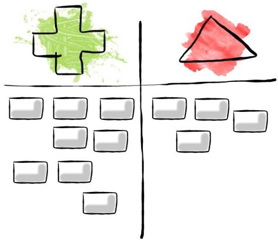

# Project Retrospective
## Week 4, Lesson 3

### Project Retrospective

A project retrospective provides "an opportunity for your team to reflect on what has occurred and to construct ways to become better going forward." [The Ultimate Guide to Agile Retrospectives](https://www.retrium.com/ultimate-guide-to-agile-retrospectives/retrospectives-101). 

The retrospective gives your team a chance to:

* Appreciate what you’ve accomplished
* Step back to reflect on your work as a team
* Propose improvements/share concerns
* Plan actions for the next steps of the project or for the next project

Prepare your retrospective by answering the following questions as a team:

* What worked well?
* What didn't go so well?
* What have you learned?
* What still puzzles you?

As a team, quickly brainstorm a list of things that went well during the project (**+**) and things you'd like to change (**∆**) for next time.

**Write up your list of ideas** in you team repository's slide, answering the following questions
<!-- **https://github.com/tnt-summer-academy/TeamXX-AppPrototype/wiki**  -->

- What worked well for us as a team during this project?
- What could we do differently to make the next project better?

### YourShare Project Presentation

Your team will have **10 minutes to present your work + 5 minutes to answer questions** during the session. 

- **Each Team member** shares some part of the project development work that they would like to showcase. 
- **One Team member** summarizes what your team learned from the retrospective.

### Guidelines to what to include in your presentation

Start the presentaion as if this is the first time anyone has heard of it. You can use a mix of slides and demos.

1. Introduce yourselves and introduce the team
2. Introduce YourShare
3. Slides showing the expected app flow (how one would use the app)
5. Share a live demo to your app flow (required)
6. Showcase/demonstrate indivual page work
7. Showcase of any development part the team would like to share (code details)
8. Summarize the team retrospective 
9. Time for questions
    1. Great opportunity to show off a particular part of the code
	
***EVERYONE has to do part of the presentation. You must say what you've contributed to the project***
 
#### What is expected to work:
1. Layout
2. Navigation (moving from page to page)
3. Some local state
    1. User sign up
    2. Add item
	
#### What is NOT expected:
1. No Database / persistent state
2. No uploading of pictures/images
