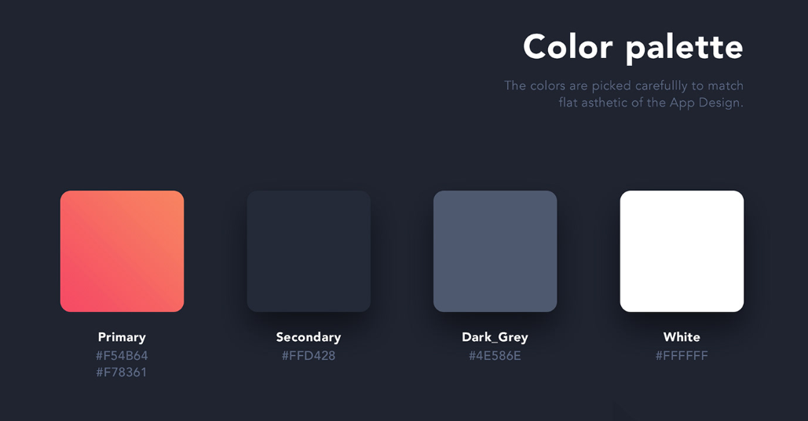
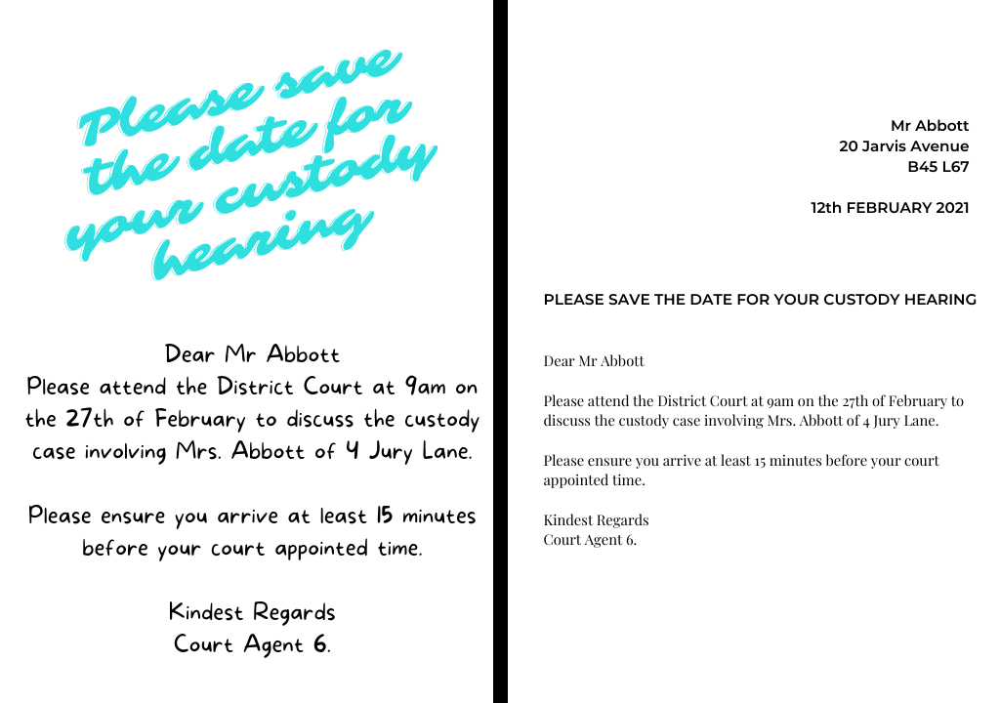

# Design with CSS
Web design is the art of creating visually captivating and user-friendly websites. It combines aesthetics, functionality, and seamless navigation to enhance user experiences. From layout to color choices, web design shapes how we interact with the digital world. In this stretch topic, we will dive into a few key topics of web design to help you better design your project. 

## Learning objectives
* TNTs will understand how to make design choices 
* TNTs will learn about web design theming 
* TNTs will learn how to effectively design their websites

## Time required and pace
* 5 minutes - Design Principles
* 20 minutes - Create your Website's Theme
* 10 minutes - Look for Inspiration 
* 5 minutes: Tips and Tricks on CSS Styling 

## Web Design Principles 
Understanding web design principles is crucial for creating effective and visually appealing websites. These principles guide designers in crafting user-friendly experiences that align with their brand and purpose of a site. Here are 8 key principles:

1. **Simplicity**: Strive for clarity and minimalism. Avoid unnecessary clutter and complexity, ensuring a clean and straightforward design.
2. **Consistency**: Maintain uniformity in fonts, colors, layout, and style across the entire website. Consistency enhances user familiarity and trust.
3. **Typography and Readability**: Choose legible fonts that match the website’s tone and purpose. Prioritize readability to engage users effectively.
4. **Responsive and Mobile-Friendly**: Design your site to adapt seamlessly to various screen sizes and devices. Mobile users constitute a significant portion of web traffic1.
5. **Color Palette and Imagery**: Select colors and images that complement each other and convey the desired message and mood.
6. **Fast Loading**: Optimize website speed and performance to reduce loading times. Users appreciate swift access to content.
7. **Easy Navigation**: Provide clear and intuitive navigation options. Well-organized menus guide users smoothly through the site.
8. **Effective Communication**: Use headings, subheadings, bullet points, and visual cues to convey essential information succinctly

Remember, adhering to these principles not only enhances usability but also influences how your website is perceived by visitors.

## Theming
Before diving into how our page will look, let's work on selecting a theme that will be used throughout the website. A well-chosen theme will ensure your website maintains a consistent look and feel. Spending a few minutes deciding on your theme now will save time and effort when creating your page. 

### Color
Your brand recognition and color go hand-in-hand. When you see yellow arches is synonymous with McDonalds. The right color palette will go a long way in conveying your message. There is no right choice, but here are some suggestions:
- Select 3-5 colors to be used throughout your page. We don't want a rainbow page with 20 different colors, but don't just pick neutral colors
- When picking your colors, you want to think about having a bold primary, secondary, and a few neutral colors. 
  - Having this high contrast (between bold and neutral colors) will allow you to provide visual emphasis on certain components of your page. 
  - Less is more. 

**Additional references:**
- color palette generator [colors.co](https://coolors.co/)
- A designer's perspective on picking color [dribble article](https://dribbble.com/stories/2018/12/19/choosing-colors-for-web-design-a-practical-ui-color-application-guide)
- color theory for web design [article link](https://elementor.com/blog/color-theory-web-design/)

### Font + Sizing 
The font chosen can make all the difference to both visual and website content. You might not be able to pinpoint the exactly what is wrong with the design, but your brain will tell you something isn't quiet right. Listen to your brain. But with design, there is no right way to go about it. But here are some tips: 
- don't use too many fonts. 1 or 2 fonts is enough, as you can add contrast and importance by changing the size and color of the text. 
- reflect on the personality, tone, and branding. How do you want users to feel when they see your site? Professional? Playful? Welcoming? 

In addition to selecting a font style, you will also want to consider sizing. The size can provide a visual hierarchy for users to organize the way they look at your site. Ensure there is consistency here! 

Types of units for sizing:  
- **Pixels**: the most common and versatile, but not good for responsive websites as they’re not scalable
- **EMs**: flexible and scalable unit which the browser translates into pixel values depending on the font size settings in your CSS
- **REMs**: flexible, scalable and always relative to the HTML element
- **Percent**: always relative to another value and suitable for responsive web designs

As seen in this example below, the left message is styled more playful and casual. You might not take the message as seriously compared to the right message. Same content, but different styles. The font and sizing has a big impact of how your user will perceive your message.

**Additional references:**
- font sizing uses [blog post](https://medium.com/@milansavov/pixels-vs-em-vs-rem-vs-percent-when-and-why-to-use-each-630c8246fa97)
- popular font library [google fonts](https://fonts.google.com/) 
- how do I select the right font? [google design guide](https://design.google/library/choosing-web-fonts-beginners-guide)

### Spacing 
Spacing is the breathing room that allows each element to shine on its own. At the same time, it adds to the aesthetic appeal and functionality of the design. When used correctly, it can reduce decision-making. Which allow users to more easily digest the information provided. There are multiple different ways to go about spacing. Here, we will go over the 2 most popular layout systems: Grid System and Flexbox. 

#### 8 point grid system
Following the 8-point grid creates a sense of order and structure. Elements don't just sit on the canvas — they align with purpose and intent by following the grid lines with precision. This grid system will help enhance readability by providing this consistency that allows users to focus on the content. 

The most recommended base unit is 8px because it makes scaling for a wide variety of devices easy and consistent. This is because most screen sizes are divisible by 8 and because 8 is itself an easily divisible number (8/2=4, 8/4=2). Having this base unit of 8 means that our sizing, padding, margins, etc. should all be an increment of 8 (ie: 8, 16, 24, etc) when possible. This creates a clear hierarchy, aligns elements neatly, and provides a consistent visual rhythm.

#### Flexbox
A one-dimensional CSS layout that is best suited to building layouts that involve aligning and distributing elements on a single line. Items can flex to fill additional space or shrink to fit into smaller places. 

**Additional references:**
- everything on CSS grid systems [blog post](https://medium.com/design-with-figma/everything-you-need-to-know-as-a-ui-designer-about-spacing-layout-grids-2bc269e12321)
- CSS Grid system guide [guide](https://css-tricks.com/snippets/css/complete-guide-grid/)
- flexbox guide [guide](https://css-tricks.com/snippets/css/a-guide-to-flexbox/)
- flexbox vs grid system [blog post](https://www.makeuseof.com/css-flexbox-grid-which/)

## Looking for Inspiration? 
If you find yourself unsure about where to start your design journey, rest assured that inspiration is everywhere! Begin by examining the websites and applications you interact with daily — such as Teams, Outlook, and Calendar — for valuable insights. Additionally, you can explore other creative projects. The act of seeking inspiration not only stimulates your creative faculties but also enhances your understanding of effective design principles.

You can find a collection of website inspiration here:
- [Dribble](https://dribbble.com/)
- [Behance](https://www.behance.net/)

## Tricks and Tips when styling with CSS 
Sometimes designing can be a daunting task and take a long time to get the page just right. Here are some suggestions tools to leverage to make your life a little easier. 

### Use Component libraries 
Component libraries  come with predefined styles and functionality that are made to be be ready-to-use. Take advantage of these to speed up development and focus on other aspects of the project instead of creating your own. UI library components are often cross-browser compatible as well! So no need to put extra effort into styling these components for smaller screen sizes. 

### Keep it simple and utilize general classes
- Use general classes and style CSS components (ie: h, h1, p, div) before using id's. 
- use the DRY (don't repeat yourself) method when defining styles. For example, don't have 2 definitions of font size in the same class. Define it once and stick with it. 

### Use the Inspector Tool on your Web Browser  
Stumped on why a component is not styled the way you envisioned? The inspector tool can help you identify what went wrong. This is a tool I recommend having open when designing your page so you can visualize what CSS styling is being applied to a component. [how to use inspector](https://www.freecodecamp.org/news/how-to-use-css-overview-in-chrome-developer-tools/)

## References used throughout the page
- [8 web design principles](https://wpastra.com/guides-and-tutorials/good-website-design/#:~:text=8%20website%20design%20principles%201%201.%20Simple%20is,7.%20Easy%20navigation%20...%208%208.%20Communication%20)
- color palette generator [colors.co](https://coolors.co/)
- popular font library [google fonts](https://fonts.google.com/) 
- CSS Grid system guide [guide](https://css-tricks.com/snippets/css/complete-guide-grid/)
- flexbox guide [guide](https://css-tricks.com/snippets/css/a-guide-to-flexbox/)