Placeholder for Firebase Auth

# Using Firebase Auth in a React App

## Learning objectives

* TNTs will understand the basics of authentication
* TNTs will be able to setup a third-party auth tool
* TNTs will be able to integrate a basic auth mechanism for their applications
* TNTs will be able to add a new user, sign-in, sign out, and observe Auth status information in their React Application

## Instructional session (120 minutes)

### Lesson Overview

1. Look at initializing the Auth service
   1. Let's look at Firebase Auth
   2. Let's look at various Firebase Auth providers
2. What *should* you use for Auth?
3. How do we access the authentication service from code?
   1. How to set up Firebase Auth
   2. Setting up your Firebase app project (separate from your code)
   3. Overview of our approach to using Firebase

### Let's look at Firebase:

1. [There's an example solution available in the Samples folder](https://github.com/tnt-summer-academy/Samples/tree/main/Week_5/firebase_auth); you'll need to update the FirebaseConfig in src/App.js with the info for your particular Firebase instance (otherwise you'll receive *400* errors for not having a valid API key)

2. [Sign up for Firebase on their website.](https://firebase.google.com/)
   (It's free)

3. Set up a Firebase project
   [Step-by-step guide](https://www.robinwieruch.de/firebase-tutorial)
   
   - If you already have a Firebase project you are using for another service, like databases or Firestore, you can reuse it
   - We highly encourage you to use the same Firebase project that is being used in your app prototypes
   - Alternatively, create a new one, pick a name, and say 'No' to Google Analytics for the time being

4. Next, the left-hand column open up the 'Build' tab and click on 'Auth'

5. Next, you'll need to add Firebase Auth by clicking on the 'Get Started' button in the picture:

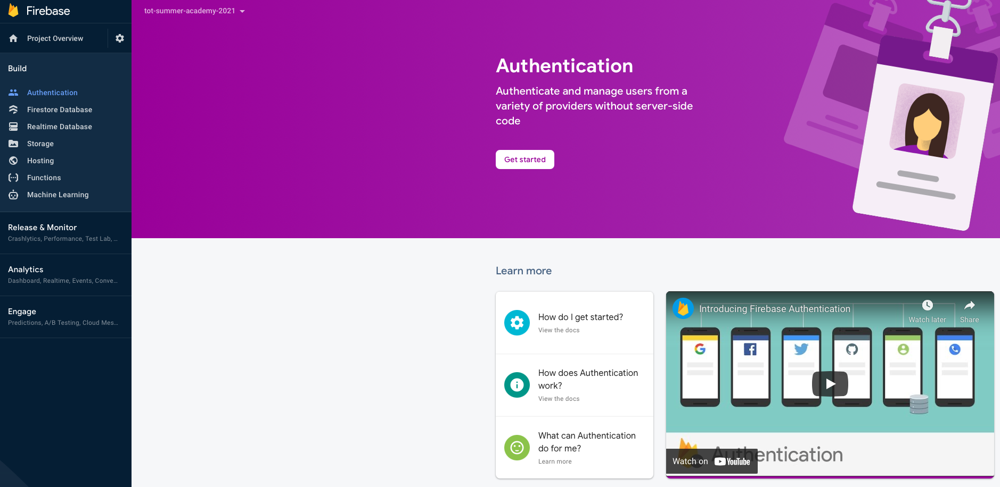

#### Exercise:

Try to add the Firebase Auth to your project

#### How to set up Firebase (and how to get your app's configuration info)

1. We'll need to create an 'app' on the Firebase website before we can have our program (our React web app) use the database.  There are multiple ways to find this, but we'll start by clicking on the Project Overview link in the top-left:
   

2. Notice that there's an option for iOS and another for Android - we'll use the web application option:
   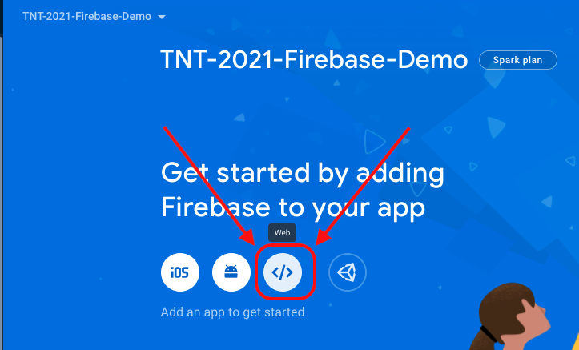

3. When Firebase asks make sure that you do give it a name but do NOT host your solution on Firebase

4. Once you've done that it'll show you a Wall of Code.  Copy it and paste it into a new file (just so you don't lose it on the clipboard)
   
   - If you need this code again you can find it in your Project Overview > Project Settings page:
     
   
   - On the 'General' tab (in the Project Overview > Project settings page) scroll down to the 'Your Apps' section, and you'll find that same info (clicking on the 'Config' button will even give you usable JavaScript/JavaScript):
     
     

### Auth Providers and Enabling Them

Once you've gotten the sample React app configured (by editting the App.js file in VSCode) you can open the page for Authentication in the Firebase website by clicking on the 'Home' button near the top of the left-most column, and then clicking on the 'Authentication' panel, as pictured here.  

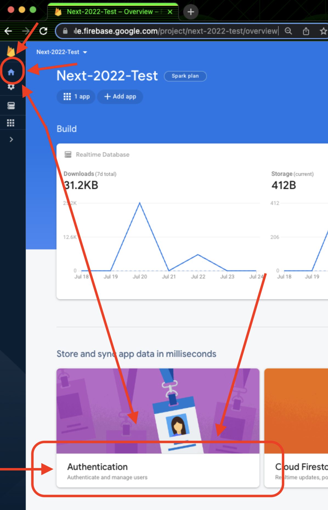

On the next page you can then click on the 'Get Started' button and it'll show you the list of authentication providers that you might use.  You can use a whole host of third-party sign-in options with Firebase Auth. Some notable ones:

- Microsoft
- Github
- Google
- Apple
- Facebook
- Twitter

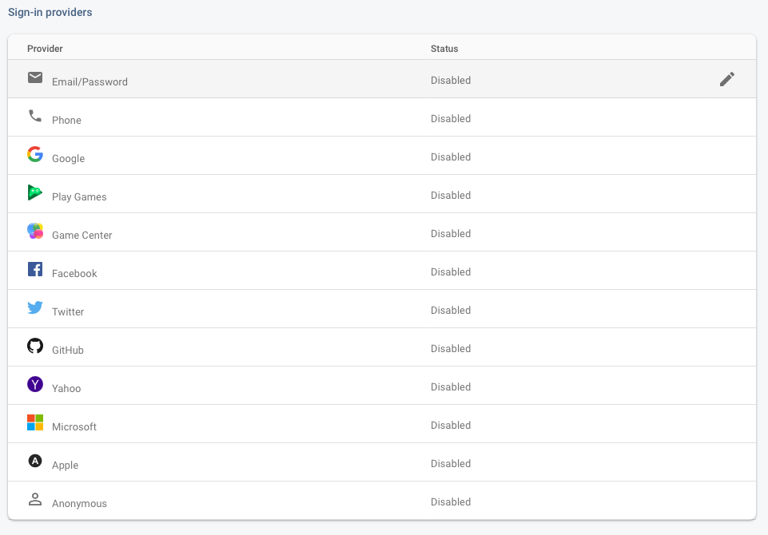

For the purposes of this outline, we will be sticking to *email/password authentication*. You may attempt to use a [third-party provider such as Microsoft](https://firebase.google.com/docs/auth/web/microsoft-oauth) or [Github](https://firebase.google.com/docs/auth/web/github-auth), but please keep in mind that this requires lots of additional setup and registration permissions. Therefore, we do not recommend adding any third-party sign-in options as part of any "in-scope" feature for a limited length project. In the future we may update this curriculum sheet to use sign up via phone and incorporate 2FA.

#### Enable a specific provider (email)

1. Click on the **Email/Password** provider from the list of sign-in providers

2. Toggle the switch to "Enable"
   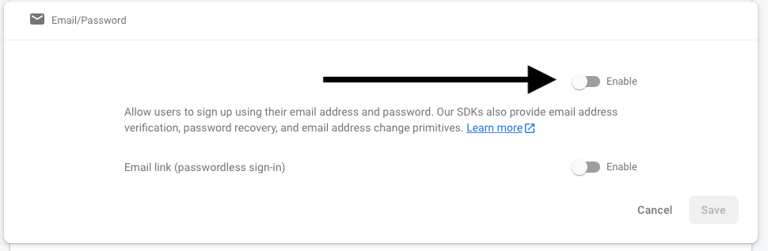

3. Click "Save"
   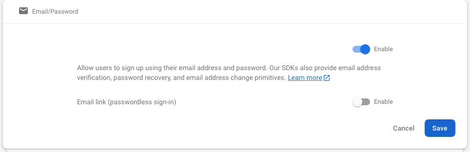

#### OAuth Consent Form

Even though this runs through an example app, you still need to complete an OAuth consent form in order to use Firebase Auth. Normally you would fill out and complete this thoroughly in order to publish your app and help the reviewers approve your application. However, we will be doing the bare minimum. This will allow us to use Auth for test purposes. If we were to publish this project to the web, we would need to completely fill out the OAuth consent form in order to pass the external review teams.

1. Head over to the Google Cloud Console. [Do an internet search to get there](https://www.bing.com/search?q=google%20cloud%20console&qs=n&form=QBRE&=%25eManage%20Your%20Search%20History%25E&sp=-1&pq=google%20cloud%20console&sc=6-20&sk=&cvid=05E08C7EFF62421AB9E47E5AFCDEDADD&ghsh=0&ghacc=0&ghpl=), since there is no immediate access from the Firebase portal.
2. Click *APIs and Services* from the menu
   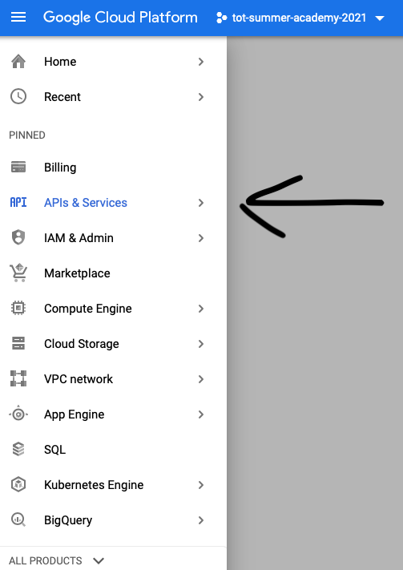
3. Once you've opened the "APIs and Services" panel you should make sure that you've got the correct app selected, as indicated at the top of the page.  If that's not the app you want (for example, if you created several Firebase projects and the one you're currently using isn't te one listed there) then you should click on the down-arrow next to the name of the app.
   
   1. Depending on how many Firebase projects (and what Google considers to be 'recent') you may benefit from clicking on the 'All' tab:
      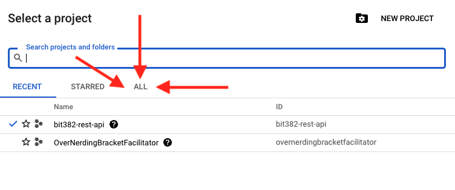
4. Configure your consent screen for the app
   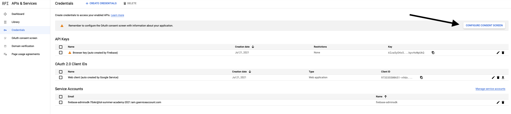
5. Select the user type *External* and save
   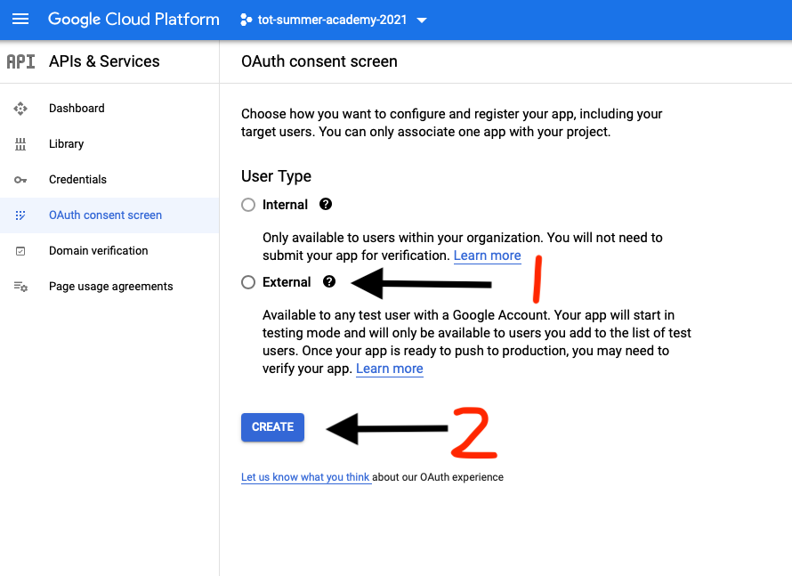
6. In the app registration screen, add your contact email to the required spots. Normally you would fill this out completely so when someone does "Sign In With...", they are shown who you are, what you want to access, your terms of service, and privacy policy. We can skip most of this since this isn't going to be published online, but in standard development using OAuth YOU MUST FILL THIS OUT COMPLETELY.
   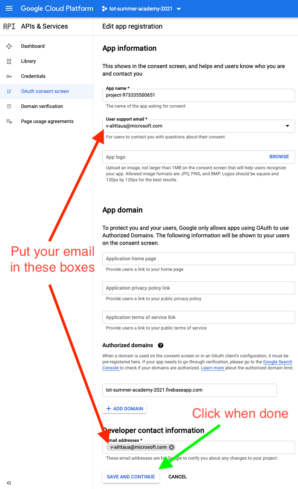
7. The scopes page is how you can configure access to particular data with a given token. For now, we can skip this.
   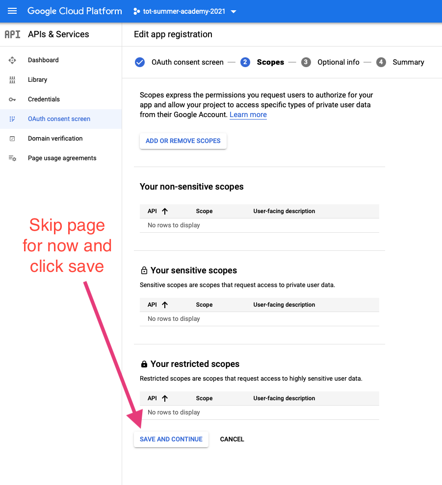
8. The additional email page is for OAuth reviewers to get more information about your use of OAuth before they approve or reject your use. We can skip filling this out since it doesn't apply to us, but if you were to fully integrate OAuth, you would normally be required to fill out all this information so your usage can easily pass review.
   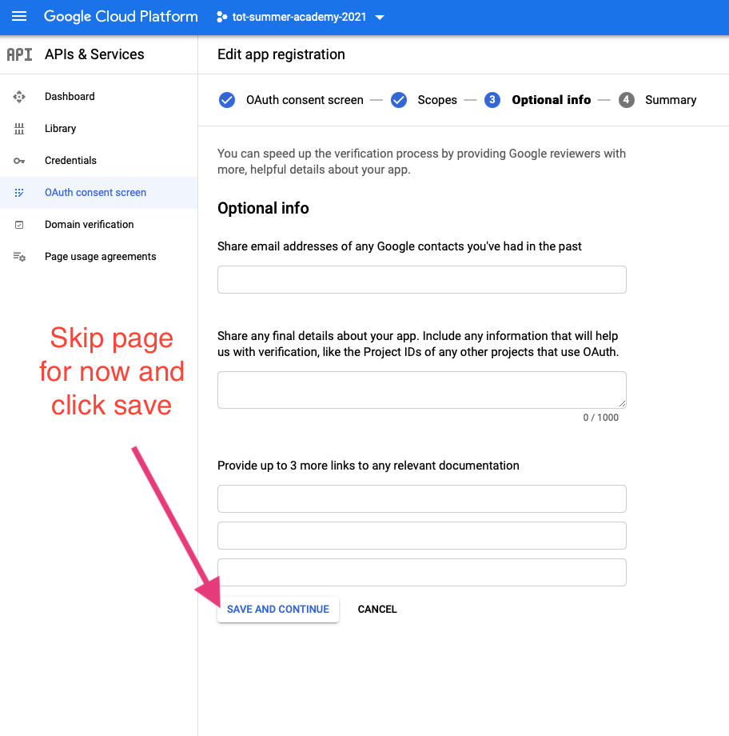
9. You will now see a summary page. You can now use Firebase Auth in your application!

### Trying out your React app

1. [Take a look at the sample app](https://github.com/tnt-summer-academy/Samples/tree/main/Week_3/firebase_auth)
2. Paste your Firebase app config (aka, your API keys) into the App.js file, replacing the placeholder.
3. Run the app.
4. Create an account. Once you do, you will now be signed in.
   1. NOTE: You must use an email address for the username, and a strong password.
   2. The code uses console.log to print out errors so you can see the results of *not* using these by showing the dev tools' console
5. Look under the users tab of the Firebase Auth service, you will now see the account there.  (If the page was already open *before* you created the new user account then you will need to refresh the page to see the change - to see the new user account)
6. If you press 'Sign Out' in the app, you will return to the sign in page.
7. Now, if you attempt to sign back in, you will be routed back to the welcome page.
8. To see that this Auth is actually working, stop running the React App and restart it. Your login credentials should be saved.

### Overview of the source code

Essentially: we collect up username (email address) and password using an on-page form.  Our JavaScript code must then call methods on Firebase to see if the username/password actually works to log in.  If it does then our code will decide to show the "Welcome" page and if the user's credentials (username/password) do not work then our code must instead decide to show the page that asks for the credentials.  NOTE: This does mean that if we code this up wrong our code might accidentally show the private Welcome page to someone who's not actually logged in, so be careful!

### Tour of the source code

1. Start w/ App.js
   - Note that we could/should put the authentication stuff into myFirebase, but instead we're going to set it up separately.
   - We're using React Router (Version 5) to decide what to show on the page
     - Route is the normal, anyone-can-see-this page.
     - PrivateRoute is a custom component that we created.  It will refuse to show the page UNLESS the user has logged in.  PrivateRoute knows whether you've logged in by asking the Firebase Authentication library/component.
   - onAuthStateChanged exists to tell React to re-render the page if we log in or log out.  We pass this to the two pages (CredentialsPage and WelcomePage) so that they can trigger a re-render.
     - NOTE: This means that each page must call our App.js/onAuthStateChanged whenever the user logs in / logs out / creates a new account / etc (in addition to actually using Firebase to log in / log out / etc)
2. Routes/PrivateRoute.js
   - If the Firebase Auth produces a user object then show the private page, otherwise redirect back to /
   - Let's see how the Auth class works
3. Auth/Auth.js
   - Call the Firebase methods to check if the user is authenticated (logged in) or not.
   - If the user has logged in then we then try to go to the `/welcome` page using the `src/History.js` file.
     - (This should probably be done elsewhere, so that could use these routines to log in and the rest of the app can figure out where the person should actually go)
   - (Remember that whoever calls these must call onAuthStateChange in order to get React to re-render the page afterwards)

# MISC

[Useful tutorial on React Context](https://www.robinwieruch.de/react-context)

[JavaScript and React Context](https://www.carlrippon.com/react-context-with-JavaScript-p1/)

The official docs:
https://firebase.google.com/docs/web/setup?authuser=0#node.js-apps
