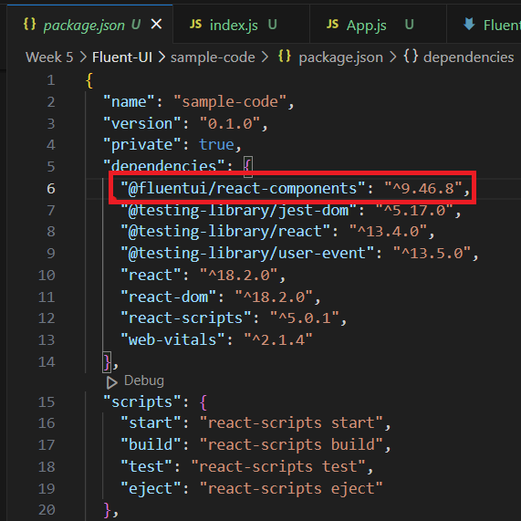

# CSS with Fluent UI 

A simplified way to do styling with a set of React based component libraries in production today! 
Here, we will go over how to use Fluent UI React Component library. It'll not only save time but help non-designers become designers! Using components that have been designed professionally. 

## Benefits of using Fluent UI
Styling without needing to think and having industry design principals without much hassle! 

following https://react.fluentui.dev/?path=/docs/concepts-developer-quick-start--page


## Learning objectives

* TNTs will understand how to utilize Fluent UI Components 
* TNTs will understand how to add additional styles to Fluent UI Components 
* TNTs will understand how to add designs into their own projects 

## Time required and pace

* 10 minutes - learn: Design Principles
* 30 minutes - create: mockups and wireframes on a non-code interface
* 10 minutes - explore: features of Fluent UI 
* 20 minutes - create: try to integrate into a React Project 
* 30 minutes - explore: possibilities of UI bootstrap
* 10 minutes - review, and investigate

total ~2 hours

## Design Principles 
Design is (in the UI/UX context) is the process of making digitial interfaces visually appealing, intuitive, and easy to navigate. Creating seamless and meaningful experiences while also making it visually appealing for your audience. The core principals of design include: 
1. Focusing on the User - what would the user want to see? Who is our target user? 
2. Consistency - this is where libraries, like fluent UI, come in handy! Color, Font, Size, spacing are other things to consider here.  
3. Hierarchy 
4. Context 
5. User in control
6. Accessibility 
7. Usability Testing

To learn more about design principles, feel free to look into these references:
src: https://99designs.com/blog/web-digital/ux-design-principles/ 


## Let's do a quick mock up of our project. Similiar to what you did in Week 2 
With some knowledge into design principles, let's apply it to a quick mockup. These mock-ups will help us brainstorm and get an idea of how our project will look! Using simple squares and shapes to This will help us get the creativity out quickly and get an idea of what we want our page to look like. 

Types of wireframing: 
- Low Fidelity - the most simple drawings that give you a general idea of the layout and vision of the page
- High Fidelity - a realistic layout of the page with details or buttons, icons, dropdowns, etc. Interactions of buttons can also be included here. 

Some questions to think about when creating the wireframe: 
- What components do we want to highlight?
- How will the page be laid out?
- What color theme do we want to use. We want to ensure consistency here. 
- what fonts do we want to use? 
- Do we want multiple pages? How will we navigate? will there be a nav bar or something else? 

Helpful wireframing references: 
- How to start wireframing [how-to-guide by Figma](https://www.figma.com/blog/how-to-wireframe/)
- want to create a high-fidelity wireframe? use figma! [figma](https://www.figma.com/)
- color palate picker [colors.co](https://coolors.co/)

## Getting Started with Fluent UI 
Let's start with a simple example of how to use the fluentUI framework (same steps apply for other bootstrap frameworks too). So once you get the gist of Fluent UI, feel free to explore and combine other components from different libraries together!

### 1. Install package into your react app, install using. 
 
```
# using npm
npm install @fluentui/react-components  

# OR with yarn
yarn add @fluentui/react-components
```

you can double check the package was installed in the `package.json` file. Example: 



### 2. Place a provider at the root of your react app 

Within your `index.js` file and add a `FluentProvider` around your app component. Your index.js file should look something like this.

``` JSX
import React from 'react';
import ReactDOM from 'react-dom';
import { FluentProvider, teamsLightTheme } from '@fluentui/react-components';

import App from './App';

ReactDOM.render(
  <FluentProvider theme={teamsLightTheme}>
    <App />
  </FluentProvider>,
  document.getElementById('root'),
);
```

### 3. Now you can use fluent UI Components in your project! 

Let's try adding a button 

- in the header, import the component you want. In our case, we will import the `Button` 

```JSX 
import { Button } from '@fluentui/react-components';
```

- we will now add it to our div (or wherever we want this button). Think of these components as \<div> blocks. 

```JSX
function App() {
  return (
    <div className="App">
      <Button appearance="primary">Get started</Button>
    </div>
  );
}
```

Now that you've got the button integrated, go ahead and try other components from this list: [fluent UI's list of components](https://react.fluentui.dev/?path=/docs/components-accordion--default) 

Or any other bootstrapping library. 

## Fluent UI Demo 
Check out `sample-code` project within this folder. 


## Additional References
* fluent UI documentation
  * [documentation](https://react.fluentui.dev/?path=/docs/concepts-introduction--page)
  * [quickstart installation guide](https://react.fluentui.dev/?path=/docs/concepts-developer-quick-start--page)
  * [list of components](https://react.fluentui.dev/?path=/docs/components-accordion--default)

**Other component libraries**
* Bootstrap, another component library [bootstrap](https://getbootstrap.com/)
* Material UI [get Started](https://mui.com/)