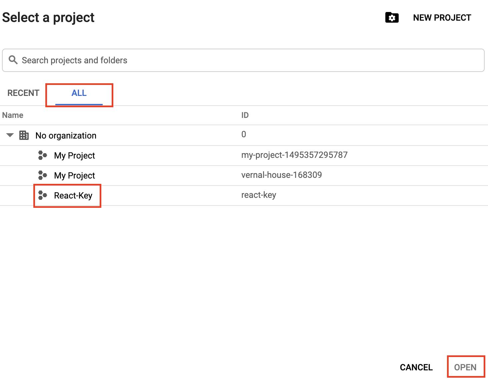
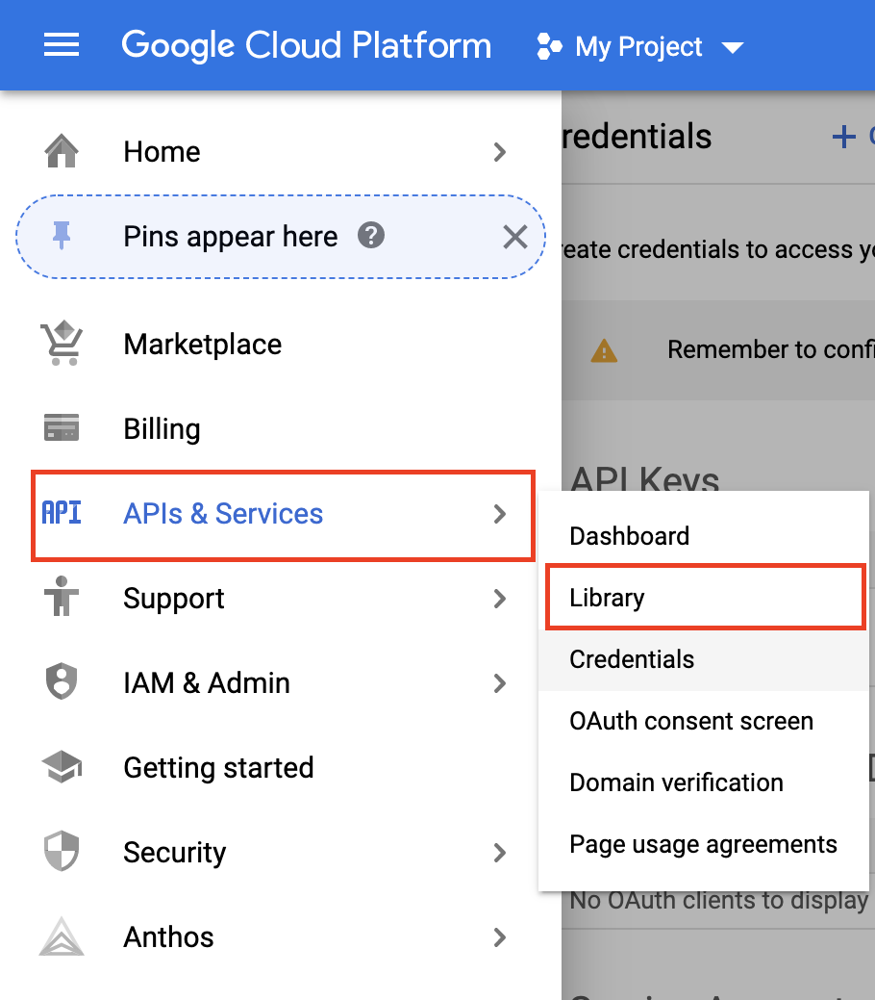
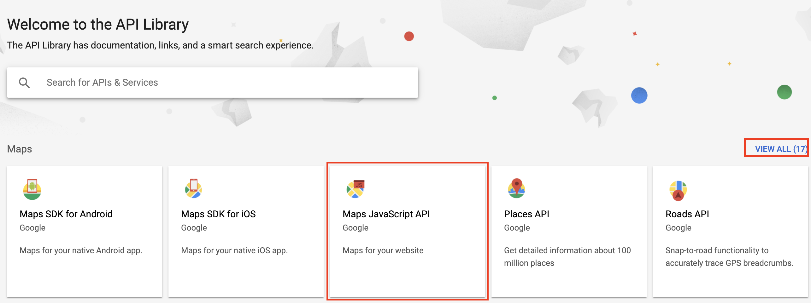
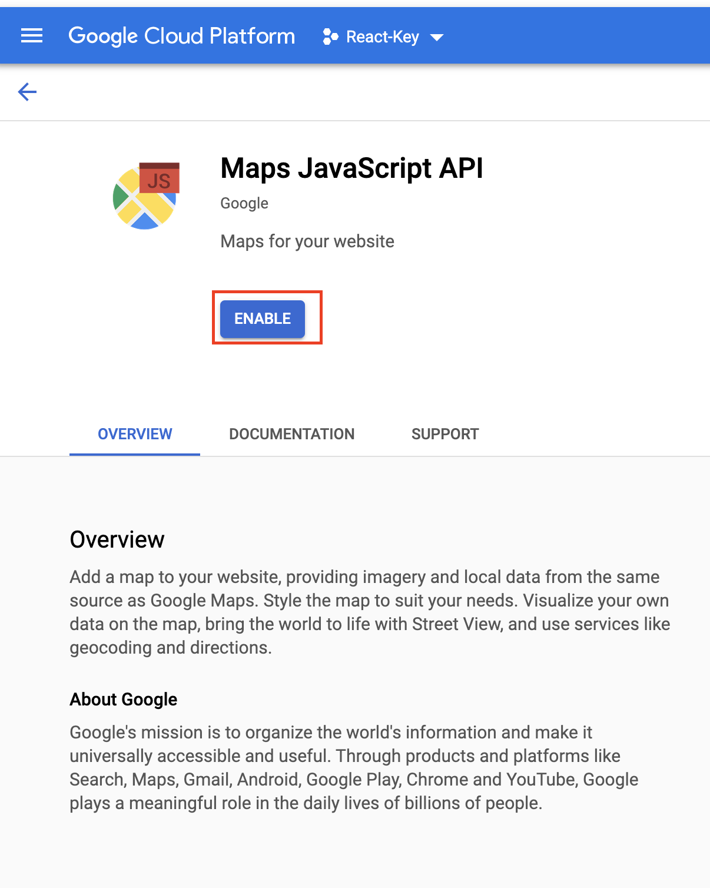
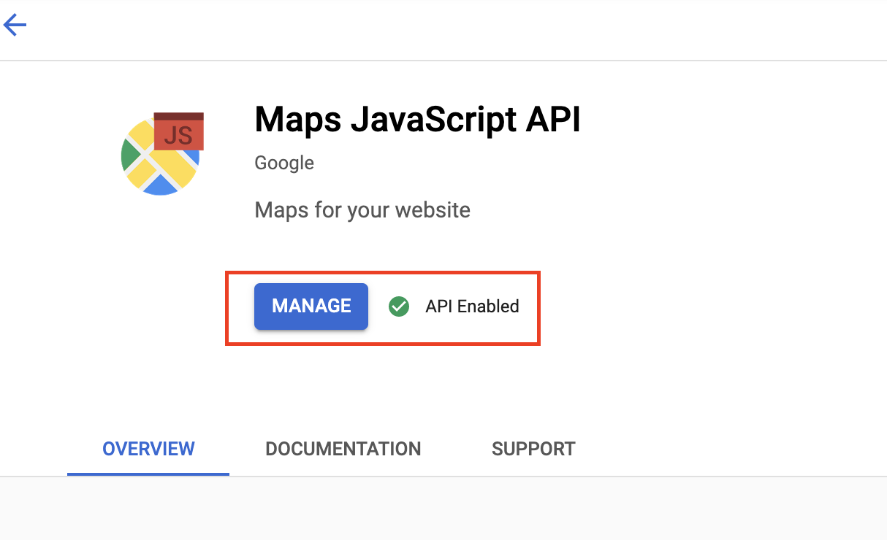
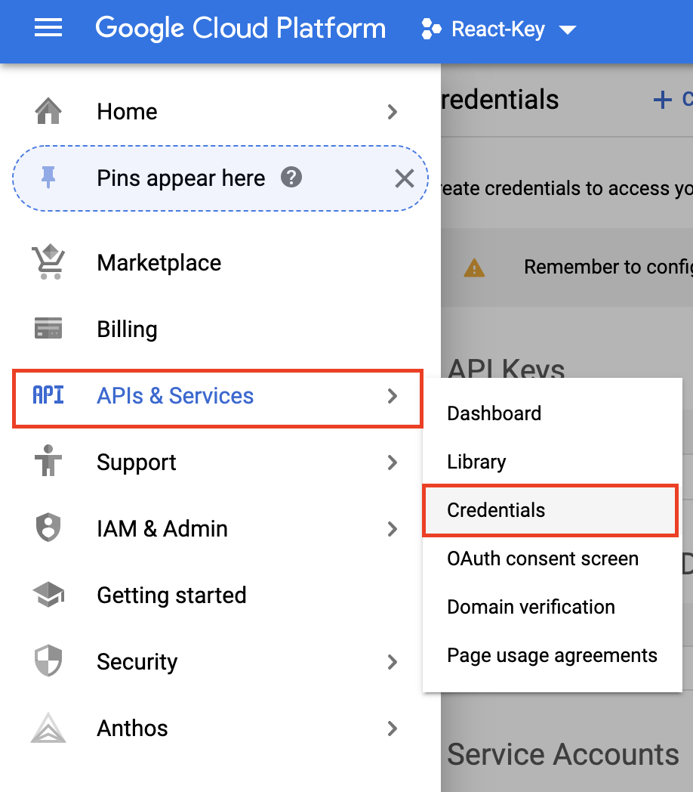
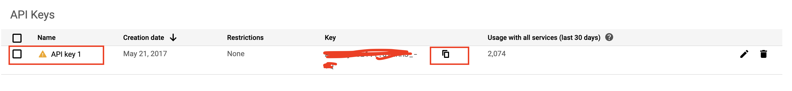

## Check your setup 

To get started with Google Maps Platform you need to:

1. Create a billing account
2. Create a project
3. Enable one or more APIs or SDKs
4. Get, add, and restrict an API key

To get started, click the *"Get Started"* button on the page [here](https://developers.google.com/maps/gmp-get-started#quickstart) and follow the guide to do the first 3 steps listed above.

After following the Get Started link, now check the steps screenshots.

After completing **Step 2** you can check your project list

**Step 3**: Now you should be ready to get, add and restrict an API key. For this session we will be using both, *Maps JavaScript API* and *Places*. Here's how you get the [JavaScript API](https://developers.google.com/maps/documentation/javascript/get-api-key) key

**Enable Maps JavaScript API**

1. Go to Library

2. Search and select Maps JavaScript API

3. Enable the Library

4. Library should be enabled now for your project key

* Now you can copy your API key to use in your code project.
Go to *APIs & Services*, then *Credentials*.

* All your project keys should be listed, click and copy the key

### Done, Go back

You can go back to main wiki page from [here](./googleMapsAPIs-javaScript/../GoogleMapsAndFullCalendar-js.md)