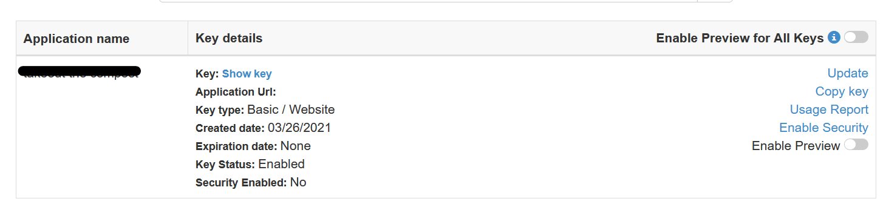

# Getting Started with bing maps

This project was bootstrapped with [Create React App](https://github.com/facebook/create-react-app).

## Setup

To get started with Bing maps, you will need to get an [get an API key](https://docs.microsoft.com/en-us/bingmaps/getting-started/bing-maps-dev-center-help/getting-a-bing-maps-key).

After signing up and logging in, click on "My account" -> "My keys" and then click to create new key. 

- Application name: any name
- Application Url: can leave blank
- Key type: Basic
- Application type: Dev/test

Click "Create". After creation, key should show up in "My keys". 

## Add the key

After obaining a key, go to index.html and add your key in the script tag:

``

Start the app by running `npm start` from the terminal. After compilation, you should see a map at localhost:3000.

## Map control API reference
After loading the above script, we now have access to the MapControl API from our javascript code. 

You will find the following classes helpful:
- [Map](https://learn.microsoft.com/en-us/bingmaps/v8-web-control/map-control-api/map-class)
- [Location](https://learn.microsoft.com/en-us/bingmaps/v8-web-control/map-control-api/location-class)
- [Pushpin](https://learn.microsoft.com/en-us/bingmaps/v8-web-control/map-control-api/pushpin-class)
- [Infobox](https://learn.microsoft.com/en-us/bingmaps/v8-web-control/map-control-api/infobox-class)
- [Events](https://learn.microsoft.com/en-us/bingmaps/v8-web-control/map-control-api/events-class)

## Add a map
Fill in the BingMap.init function to show a map on the page.

## Add pushpins
There is a sample dataset of various location in Seattle in places.json. Fill in the loadMarkers function to take in an array of data from places.json and add each location to the map.

## Add infoboxes

For each marker, add a box with information about the location, for example the name and address.

## Show infobox on click

Instead of having all the infoboxes show up at once, only show the infobox when the user clicks on the marker. You may want to define a separate onPinClick function.

## Extra challenges

If you have extra time, there are a lot of other ways to expand on the Bing Maps API. Here are some ideas:

### Style your pins
Right now, we are using the default pin, but there are a lot of ways we can style the pin.
- [Change the pin color](https://learn.microsoft.com/en-us/bingmaps/v8-web-control/map-control-concepts/pushpins/changing-the-color-of-the-default-pushpin)
- [Change the pin color when user hovers over it](https://learn.microsoft.com/en-us/bingmaps/v8-web-control/map-control-concepts/pushpins/pushpin-hover-style)
- [Use a custom image as the pin](https://learn.microsoft.com/en-us/bingmaps/v8-web-control/map-control-concepts/pushpins/custom-image-pushpin-example)

When there are a lot of pins, it can be hard to read. We can make pins that are close together be represented by a single pin with [clustering](https://learn.microsoft.com/en-us/bingmaps/v8-web-control/map-control-concepts/clustering-module-examples/basic-clustering-example). For a large dataset, uncomment `import lotsOfData from './data/Landmarks.json';` and replace `loadMarkers(data)` with `loadMarkers(lotsofData)`

### Style your info boxes
You can use html and css to [customize your infoboxes](https://learn.microsoft.com/en-us/bingmaps/v8-web-control/map-control-concepts/infoboxes/custom-html-infobox)

### Play with map options
Change the center of the map, the zoom level, the type of map.

### Make your own dataset
Use your own dataset. You can search online for pre-existing data or make your own. One problem you may find is that location data often comes in the form of an address (ie 123 Main St) instead of latitude, longitude pairs which is what the map is expecting. You can use [geocoding](https://learn.microsoft.com/en-us/bingmaps/v8-web-control/map-control-concepts/search-module-examples/basic-geocode-example) to translate an address into coordinates before plotting it on a map.